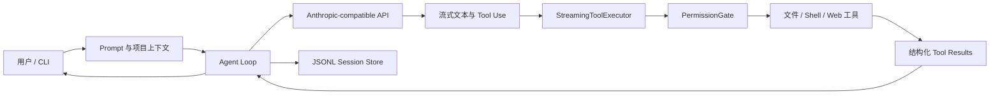

<div align="center">

# mo-code

**从零实现一个可运行、可解释，并重点研究安全边界的终端 Coding Agent。**

[](https://github.com/wenxuezj-design/mo-code/actions/workflows/ci.yml?query=branch%3Adev)
[](https://github.com/wenxuezj-design/mo-code/tags)
[](test)
[](https://nodejs.org/)
[](https://www.typescriptlang.org/)
[](https://pnpm.io/)
[](LICENSE)
[](https://github.com/wenxuezj-design/mo-code/commits/dev)

[快速开始](#快速开始) · [核心能力](#核心能力) · [架构](#系统架构) · [权限与安全](#权限与安全) · [实现笔记](#实现路线)

</div>

## 项目定位

mo-code 是一个用于学习和验证现代 Coding Agent 核心机制的实验项目。它不是对大模型 API 的简单封装，而是完整实现了从上下文构建、流式推理、工具调用和结果反馈，到会话恢复、权限裁决、路径边界与项目信任的执行闭环。

项目主要探索两个问题：

1. 大模型如何通过文件、Shell 和网络工具真正参与软件开发？
2. 当 Agent 获得本机操作能力后，如何建立可解释、可配置、可验证的安全边界？

相比直接使用成熟 Agent 框架，mo-code 刻意保留关键机制的实现细节，适合作为 Coding Agent 的学习样本、功能实验台和安全策略原型。

## 核心能力

### Agent 执行闭环

- 基于 Anthropic Messages API 的多轮 Agent Loop
- 动态组装 System Prompt、项目指令、Git 状态和运行环境
- 模型调用工具后自动回传 `tool_result` 并继续推理
- 支持 Extended Thinking、Prompt Caching 及使用量统计
- 支持兼容 Anthropic API 协议的模型服务

### 流式与并发

- 模型文本增量输出，并通过平滑写入降低终端抖动
- 流式解析工具调用，参数完整后即可提前启动安全工具
- 并发安全工具批量执行，副作用工具形成顺序屏障
- 使用同一个 `AbortSignal` 中断模型流、工具执行和权限等待
- 中断后补齐合法工具结果，避免保存不可恢复的消息历史

### 工具系统

| 工具 | 作用 | 可靠性设计 |
| --- | --- | --- |
| `read_file` | 读取文件并附带行号 | 记录文件状态，为后续安全编辑建立基线 |
| `write_file` | 创建或覆盖文件 | 已有文件必须先读取，检查并发修改 |
| `edit_file` | 精确替换局部内容 | 唯一匹配、引号容错、修改前状态校验 |
| `list_files` | 按 Glob 枚举文件 | 默认排除 `.git` 与 `node_modules` |
| `grep_search` | 基于 ripgrep 搜索代码 | 支持文件类型过滤与结构化结果 |
| `run_shell` | 执行 Shell 命令 | 超时、中断、语义识别和路径访问分析 |
| `web_fetch` | 获取网页正文 | 协议校验、长度限制和跨 Origin 重定向保护 |

### 会话与 CLI

- 交互式 REPL 与 `--print` 非交互任务
- `--resume` 恢复指定会话，`--continue` 恢复当前项目最近会话
- JSONL 增量持久化完整的文本、Thinking、工具调用和工具结果
- 自动清理进程中断留下的末尾残缺记录，并拒绝文件中间损坏
- 恢复会话授权，校验原始工作目录，避免跨项目误操作
- 支持会话删除、模型切换、Thinking 切换和权限模式切换

## 系统架构



核心模块保持职责分离：

| 模块 | 职责 |
| --- | --- |
| `src/agent` | 模型流、Agent Loop、平滑输出与流式工具调度 |
| `src/tools` | 工具注册、输入校验、执行和命令语义分析 |
| `src/permissions` | 权限模式、规则、授权记忆、路径边界与项目信任 |
| `src/cli` | 参数解析、REPL、权限交互、中断与会话入口 |
| `src/session.ts` | JSONL 会话创建、追加、恢复、排序和容错 |
| `src/system-prompt.ts` | 静态 Prompt、动态环境和项目规则组装 |

## 权限与安全

安全系统是 mo-code 的重点实现，而不是工具执行之外的附加判断。

### 统一权限门禁

每次工具调用在输入校验和实际执行之前进入 `PermissionGate`，依次综合：

- `allow`、`ask`、`deny` 显式规则
- `default`、`acceptEdits`、`plan`、`dontAsk`、`bypassPermissions` 五种模式
- 单次、会话和持久三种授权有效期
- 工具权限类别及 Shell 命令语义
- 文件系统访问目标和项目路径边界

### 防护边界

- 区分只读、修改和无法确定语义的 Shell 命令
- 同时检查符号链接位置与真实目标
- 保护 Git 元数据和 Agent 控制文件等关键路径
- 对无法静态确定的文件访问采取保守裁决
- 即使启用 `bypassPermissions`，仍保留 root/Home 递归删除熔断
- WebFetch 持久授权按 URL Origin 匹配，阻止权限随重定向扩散
- 项目获得信任前，忽略项目提供的 `allow` 和 `defaultMode` 权限扩张配置

> mo-code 当前实现的是应用层权限边界，不是操作系统级沙箱。设计取舍和已知限制记录在 [0.6 权限与安全实现笔记](<docs/notes/0.6 权限与安全实现笔记.md>) 中。

## 快速开始

### 环境要求

- Node.js 22+
- pnpm 10+
- ripgrep (`rg`)

macOS 可以使用 Homebrew 安装 ripgrep：

```bash
brew install ripgrep
```

### 安装与配置

```bash
git clone https://github.com/wenxuezj-design/mo-code.git
cd mo-code
pnpm install
cp .env.example .env
```

编辑 `.env`：

```dotenv
ANTHROPIC_API_KEY=<YOUR_API_KEY>
# 使用 Anthropic 官方服务时可删除 ANTHROPIC_BASE_URL
ANTHROPIC_BASE_URL=https://api.deepseek.com/anthropic
ANTHROPIC_MODEL=deepseek-v4-flash
```

### 运行

```bash
# 启动交互模式
pnpm cli

# 带初始任务进入交互模式
pnpm cli "分析当前项目结构"

# 执行单次非交互任务
pnpm cli --print "总结 README.md"

# 恢复当前项目最近的会话
pnpm cli --continue

# 开启 Extended Thinking
pnpm cli --thinking "分析这个测试失败的根因"
```

查看完整参数：

```bash
pnpm cli --help
```

交互模式内置 `/help`、`/status`、`/permission-mode`、`/thinking`、`/exit` 和 `/quit`。

## 权限配置

mo-code 按以下顺序加载配置：

1. 用户级：`~/.mo-code/settings.json`
2. 项目级：`<project>/.mo-code/settings.json`
3. 本地项目级：`<project>/.mo-code/settings.local.json`
4. 本次 CLI 显式传入的权限模式

示例：

```json
{
  "permissions": {
    "defaultMode": "default",
    "allow": [
      "read_file",
      "run_shell(pnpm test)"
    ],
    "ask": [
      "web_fetch(*)"
    ],
    "deny": [
      "read_file(.env)"
    ]
  }
}
```

本地持久授权会写入 `.mo-code/settings.local.json`，该文件默认不提交到 Git。

## 质量保障

当前代码库包含 **285 个自动化测试**，覆盖 Agent 流式循环、CLI、会话恢复、权限裁决、Shell 语义、路径边界、项目信任和全部内置工具。CI 在 Node.js 22 和 24 上执行锁文件安装、TypeScript 类型检查和完整测试集。

```bash
pnpm typecheck
pnpm test
```

项目同时维护 14 个 [Architecture Decision Records](docs/adr/)，记录安全语义、授权优先级和路径边界等关键决策，使实现行为可以从代码、测试和设计理由三方面交叉验证。

## 实现路线

| 版本 | 主题 | 主要内容 | 笔记 |
| --- | --- | --- | --- |
| 0.1 | Agent Loop | 多轮消息与工具调用闭环 | [实现笔记](<docs/notes/0.1 Agent Loop实现笔记.md>) |
| 0.2 | 工具系统 | 文件、搜索、Shell、Web 与安全编辑 | [实现笔记](<docs/notes/0.2 工具系统实现笔记.md>) |
| 0.3 | Prompt 工程 | System Prompt、项目指令与 Git 上下文 | [实现笔记](<docs/notes/0.3 System Prompt工程实现笔记.md>) |
| 0.4 | CLI 与会话 | REPL、JSONL、resume、continue | [实现笔记](<docs/notes/0.4 CLI 与会话 实现笔记.md>) |
| 0.5 | 流式执行 | Anthropic 接入、Thinking、缓存、并发和中断 | [实现笔记](<docs/notes/0.5 流式循环与后端接入实现笔记.md>) |
| 0.6 | 权限与安全 | 权限门禁、规则、路径边界与项目信任 | [实现笔记](<docs/notes/0.6 权限与安全实现笔记.md>) |

后续实验方向包括 Memory、Skills 和 Subagent。对应模块已经预留接口，但尚未作为已完成功能对外宣传。

## 项目原则与限制

- 目标是清晰复现 Coding Agent 的核心和重要机制，不追求完整复制任何商业产品。
- 权限系统属于应用层防护，不替代容器、虚拟机或操作系统沙箱。
- Shell 分析采用有限、保守的静态识别，不声称覆盖完整 Shell AST。
- 当前主要面向 Anthropic Messages API 及其兼容服务。
- 项目处于持续实验阶段，不建议直接用于包含敏感数据的生产环境。

## License

本项目基于 [MIT License](LICENSE) 开源。
