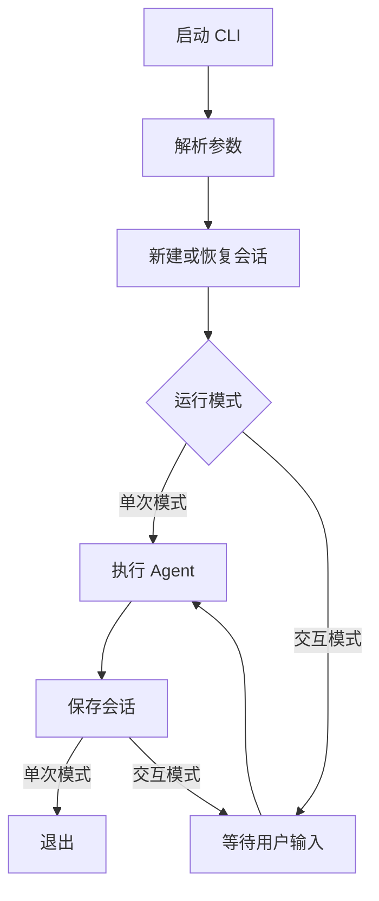
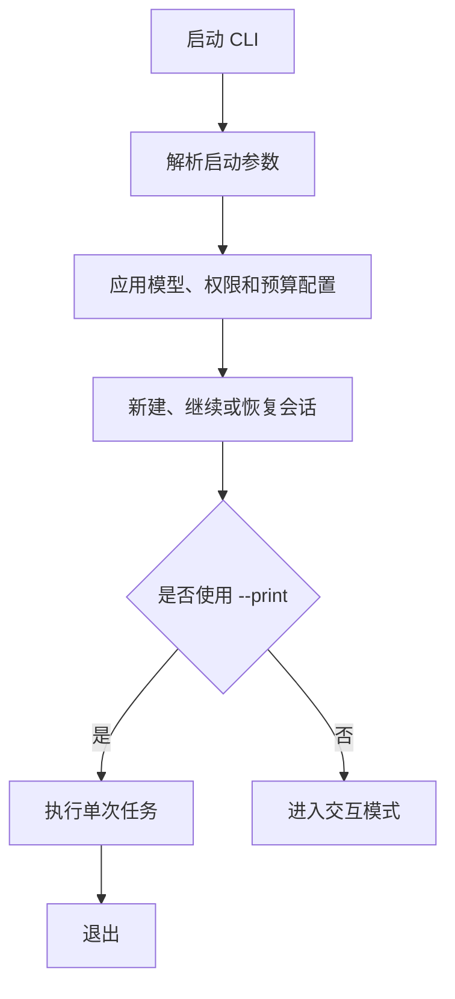
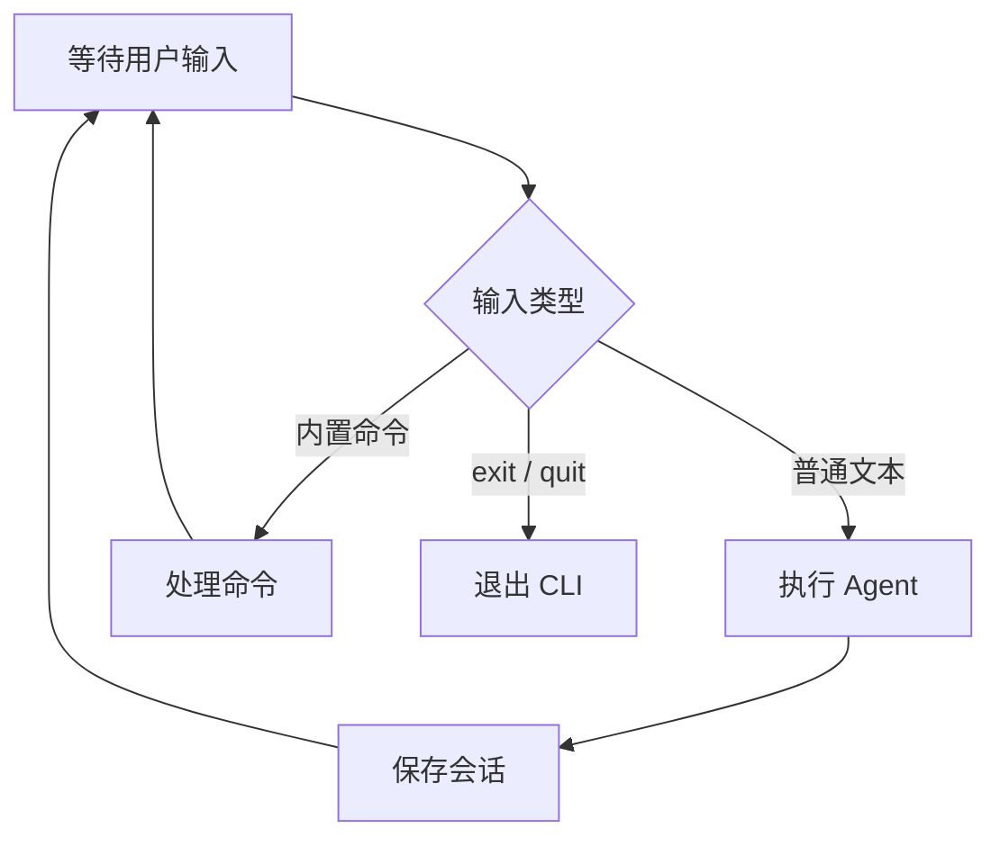

# 实现概述
目前已经实现了 Agent Loop、工具系统、System Prompt

这次我们实现 cli，核心流程图：



## 对齐来源

这张流程图不是 Claude Code 官方原图。它是以下资料的简化抽象：

- [CLI 与会话参考实现](../../.references/cc-from-scratch/04-cli-session.md)
  - CLI 先解析参数。
  - 单次模式执行一轮 Agent 后退出。
  - 交互模式持续读取用户输入。
  - 每轮结束后保存会话。
- [Claude Code CLI reference](https://code.claude.com/docs/en/cli-usage)
  - `claude` 启动交互模式。
  - `claude -p` 执行非交互任务后退出。
  - `--continue` 和 `--resume` 用于恢复会话。
- [Claude Code Manage sessions](https://code.claude.com/docs/en/sessions)
  - 会话会保存到本地。
  - 支持继续最近会话或恢复指定会话。

流程图只保留核心流程。命令处理、中断、权限和终端 UI 暂不展开。

# 1. Cli启动参数
命令格式：

```shell
mo-code [options] [prompt...]
```

目前支持的参数：
- `-h, --help` 显示命令格式和启动参数，然后退出
- `-v, --version` 显示当前版本，然后退出
- `[prompt...]` 启动后发送的初始 `prompt`
- `-p, --print` 进入非交互模式，执行完成后退出
- `-c, --continue` 继续当前项目最近的会话
- `-r, --resume <session>` 恢复指定ID或名称的会话
- `-m, --model <model>` 设置本次会话使用的模型
- `--permission-mode <mode>` 设置权限模式
- `--dangerously-skip-permissions` `bypassPermissions`的快捷参数
- `--mortis` 本项目自定义参数，目前是 `--dangerously-skip-permissions` 的别名
- `--effort <level>` 设置模型的推理强度
- `max-buget-use <amount>` 限制本次运行的最大费用



## help、version实现
太简单，不想占用文档空间，不做展示，可以看源码

## print实现
这个主要就是个分发的入口，不过接着这个说一下 `parseArgs`，这个蛮重要的：

```ts
type ParsedArgs = {
  help: boolean;
  version: boolean;
  print: boolean;
  prompt?: string;
};

// 解析当前已经支持的参数，之后这里还会扩充
export function parseArgs(args: string[]): ParsedArgs {
  let help = false;
  let version = false;
  let print = false;
  const positional: string[] = [];

  for (const arg of args) {
    if (arg === "--help" || arg === "-h") {
      help = true;
    } else if (arg === "--version" || arg === "-v") {
      version = true;
    } else if (arg === "--print" || arg === "-p") {
      print = true;
    } else {
      positional.push(arg);
    }
  }

  return {
    help,
    version,
    print,
    prompt: positional.length > 0 ? positional.join(" ") : undefined,
  };
}

export async function runCli(args = process.argv.slice(2)): Promise<void> {
  const parsed = parseArgs(args);

  // 对help、version的处理...
  
  const agent = new Agent();

  if (parsed.print) {
    if (parsed.prompt) await agent.chat(parsed.prompt);
    return;
  }

  await runRepl(agent, parsed.prompt); // 占位
}
```

# 2. REAL内置参数
目前实现的参数：
- `help` 显示支持的命令、参数和简单示例
- `/clear` 清空当前对话历史，旧会话仍然保存，可以恢复
- `/status` 显示会话ID、工作目录、模型和权限模式
- `/cost` 显示 token 的费用和统计
- `/compact` 压缩对话上下文，释放上下文空间
- `/plan` 切换 `plan` 模式
- `/exit` 保存当前对话并退出
- `/quit` `/exit`的别名

