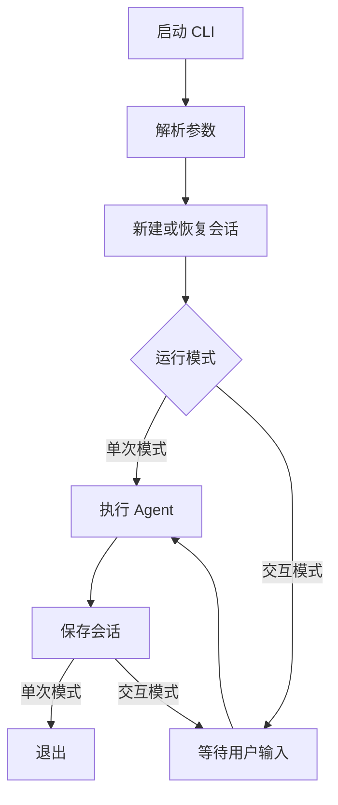
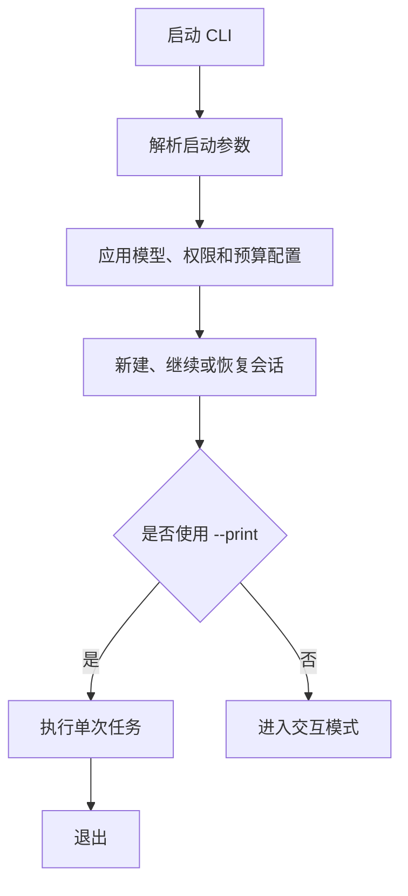
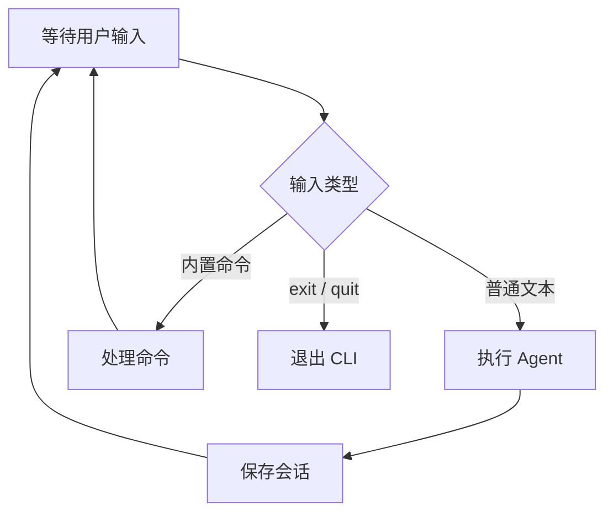

# 实现概述

在 Agent Loop、工具系统和 System Prompt 已经可以协同工作的基础上，这一阶段为 mo-code 补充 CLI 与会话能力。实现内容包括命令行参数解析、单次与交互两种运行模式、REPL 内置命令，以及会话的创建、JSONL 持久化、指定恢复、最近会话恢复、列表选择和删除，让 Agent 不再只能执行一次性任务，而是具备了可持续使用的命令行入口。

我们参考 Claude Code（下文简称 CC）的 CLI 和会话公开行为，并结合 `cc-from-scratch` 的简化实现梳理核心流程，但没有追求一次覆盖完整的会话管理能力。当前版本以简单易懂和核心链路可运行为优先，只保留必要的恢复、选择和删除功能；对话压缩、会话命名、Fork、Worktree 恢复、索引、归档和并发控制等能力留到后续独立实现。

这次我们实现 cli，核心流程图：



## 对齐来源

这张流程图不是 Claude Code 官方原图。它是以下资料的简化抽象：

- [CLI 与会话参考实现](../../.references/cc-from-scratch/04-cli-session.md)
  - CLI 先解析参数。
  - 单次模式执行一轮 Agent 后退出。
  - 交互模式持续读取用户输入。
  - 每轮结束后保存会话。
- [Claude Code CLI reference](https://code.claude.com/docs/en/cli-usage)
  - `claude` 启动交互模式。
  - `claude -p` 执行非交互任务后退出。
  - `--continue` 和 `--resume` 用于恢复会话。
- [Claude Code Manage sessions](https://code.claude.com/docs/en/sessions)
  - 会话会保存到本地。
  - 支持继续最近会话或恢复指定会话。

流程图只保留核心流程。命令处理、中断、权限和终端 UI 暂不展开。

# 1. Cli启动选项
命令格式：

```shell
mo-code [options] [prompt...]
```

mo-code预期初版支持的选项：
- `-h, --help` 显示命令格式和启动参数，然后退出
- `-v, --version` 显示当前版本，然后退出
- `[prompt...]` 启动后发送的初始 `prompt`
- `-p, --print` 进入非交互模式，执行完成后退出
- `-c, --continue` 继续当前项目最近的会话
- `-r, --resume <session>` 恢复指定ID或名称的会话
- `-m, --model <model>` 设置本次会话使用的模型
- `--delete-session [id]` mo-code 自定义指令，方便快捷删除

预期之后实现的：
- `--permission-mode <mode>` 设置权限模式
- `--dangerously-skip-permissions` `bypassPermissions`的快捷参数
- `--mortis` 本项目自定义参数，目前是 `--dangerously-skip-permissions` 的别名
- `--effort <level>` 设置模型的推理强度
- `max-buget-use <amount>` 限制本次运行的最大费用



## help、version实现
太简单，不想占用文档空间，不做展示，可以看源码

## print实现
这个主要就是个分发的入口，不过借着这个说一下 `parseArgs`，这个蛮重要的：

```ts
type ParsedArgs = {
  help: boolean;
  version: boolean;
  print: boolean;
  prompt?: string;
};

// 解析当前已经支持的参数，之后这里还会扩充
export function parseArgs(args: string[]): ParsedArgs {
  let help = false;
  let version = false;
  let print = false;
  const positional: string[] = [];

  for (const arg of args) {
    if (arg === "--help" || arg === "-h") {
      help = true;
    } else if (arg === "--version" || arg === "-v") {
      version = true;
    } else if (arg === "--print" || arg === "-p") {
      print = true;
    } else {
      positional.push(arg);
    }
  }

  return {
    help,
    version,
    print,
    prompt: positional.length > 0 ? positional.join(" ") : undefined,
  };
}

export async function runCli(args = process.argv.slice(2)): Promise<void> {
  const parsed = parseArgs(args);

  // 对help、version的处理...
  
  const agent = new Agent();

  if (parsed.print) {
    if (parsed.prompt) await agent.chat(parsed.prompt);
    return;
  }

  await runRepl(agent, parsed.prompt); // 占位
}
```

## model实现
比较简单，就是将参数解析出来，然后传入给 Agent 配置，推荐直接看代码

## 权限相关的命令
这些都留在后面实现，目前只是占个位：
- `--permission-mode <mode>` 设置权限模式
- `--dangerously-skip-permissions` `bypassPermissions`的快捷参数
- `--mortis` 本项目自定义参数，目前是 `--dangerously-skip-permissions` 的别名

## runRepl实现
我们实现一个简单的 runRepl，它是很多功能的基础，包括恢复对话的各种命令，以及各种交互内置命令：

```ts
import { createInterface } from "node:readline";

async function runRepl(agent: Agent, initialPrompt?: string): Promise<void> {
  if (initialPrompt) await agent.chat(initialPrompt);

  // 创建命令行输入接口
  // process.stdin 读取用户在终端输入的内容
  // process.stdout 向终端输出内容
  const rl = createInterface({ input: process.stdin, output: process.stdout }); 
  rl.setPrompt("> "); // 设置输入提示符
  rl.prompt(); // 把提示词输出到终端，提示用户可以输入

  for await (const line of rl) {
    const input = line.trim();
    if (input === "/exit" || input === "/quit") break;
    if (input) await agent.chat(input);
    rl.prompt();
  }

  rl.close();
}
```

这里可以简单做个测试：
```shell
node mock/mock-anthropic.mjs  # 得到mock服务地址

ANTHROPIC_BASE_URL=http://127.0.0.1:60007 pnpm run cli # 60007代表实际的mock服务地址
```

可以进行一些提问，最后使用 `/exit` 或 `/quit` 退出，这是我测试输出的结果：
```shell
> node --no-warnings --experimental-strip-types src/cli/main.ts

> Read greeting.txt

  -> read_file({"file_path":"greeting.txt"})
greeting.txt says:
Error reading file: ENOENT: no such file or directory, open 'greeting.txt'
> 再说一次
greeting.txt says:
Error reading file: ENOENT: no such file or directory, open 'greeting.txt'
> 再说一次
greeting.txt says:
Error reading file: ENOENT: no such file or directory, open 'greeting.txt'
> /exit
```

## ！会话存储
### 功能设计分批
这部分较为复杂，所以分多次实现。

相关官方文档：
- [Claude Code 会话文档](https://code.claude.com/docs/en/sessions)、
- [Claude Code 工作原理](https://code.claude.com/docs/en/how-claude-code-works)

### 第1批：创建和保存会话
第一批最终只实现以下能力：
1. 一个会话一个 JSON 文件。
2. 新会话生成 UUID。
3. 每轮 `agent.chat()` 完成后保存完整 messages。
4. 保存失败只显示警告，不中断当前对话。

首先实现会话存储相关（！很核心）：
- 定义数据结构
- `createSession` 创建Session数据
- `saveSession` 将Session数据存储到指定路径

```ts
import { randomUUID } from "node:crypto";
import { mkdirSync, writeFileSync } from "node:fs";
import { homedir } from "node:os";
import { join } from "node:path";

import type { Message } from "./agent-loop.ts";

export type SessionData = {
  version: 1;
  id: string;
  cwd: string;
  model: string;
  createdAt: string;
  updatedAt: string;
  messages: Message[];
};

const SESSION_DIR = join(homedir(), ".mo-code", "sessions");

export function createSession(cwd: string, model: string): SessionData {
  const now = new Date().toISOString();

  return {
    version: 1,
    id: randomUUID(),
    cwd,
    model,
    createdAt: now,
    updatedAt: now,
    messages: [],
  };
}

export function saveSession(session: SessionData): void {
  session.updatedAt = new Date().toISOString();
  mkdirSync(SESSION_DIR, { recursive: true }); // 递归创建缺失的父目录
  writeFileSync(
    join(SESSION_DIR, `${session.id}.json`),
    `${JSON.stringify(session, null, 2)}\n`,
    "utf-8",
  );
}
```

保存数据示例：
```json
{
  "version": 1,
  "id": "550e8400-e29b-41d4-a716-446655440000",
  "cwd": "/Users/name/project",
  "model": "mock",
  "createdAt": "2026-07-14T10:00:00.000Z",
  "updatedAt": "2026-07-14T10:05:00.000Z",
  "messages": [
    {
      "role": "user",
      "content": [
        {
          "type": "text",
          "text": "<system-reminder>项目上下文（示例中省略）</system-reminder>"
        },
        {
          "type": "text",
          "text": "读取 greeting.txt"
        }
      ]
    },
    {
      "role": "assistant",
      "content": [
        {
          "type": "tool_use",
          "id": "tool-1",
          "name": "read_file",
          "input": {
            "file_path": "greeting.txt"
          }
        }
      ]
    },
    {
      "role": "user",
      "content": [
        {
          "type": "tool_result",
          "tool_use_id": "tool-1",
          "content": "hello"
        }
      ]
    },
    {
      "role": "assistant",
      "content": [
        {
          "type": "text",
          "text": "greeting.txt 的内容是：hello"
        }
      ]
    }
  ]
}
```
在 `Agent` 类里面添加两个方法：

```ts
getMessages(): Message[] {
    return structuredClone(this.messages); // 返回深拷贝，避免外部修改 Agent 内部的消息历史
  }

getModel(): string {
  return this.model;
}
```

然后创建两个方法：
- saveAgentSession：获取到 agent 的 messages 信息，然后将其存储起来，包括失败兜底
- chatAndSave：先执行chat，再执行save

```ts
function saveAgentSession(agent: Agent, session: SessionData): void {
  session.messages = agent.getMessages();

  try {
    saveSession(session);
  } catch (error) {
    const message = error instanceof Error ? error.message : String(error);
    process.stderr.write(`Warning: 会话保存失败: ${message}\n`);
  }
}

async function chatAndSave(agent: Agent, session: SessionData, input: string): Promise<void> {
  await agent.chat(input);
  saveAgentSession(agent, session);
}
```

然后将 单次模式 和 交互模式 的 agent.chat 都换成 chatAndSave

更新 `runCli()`（涉及对话的部分） ：

```ts
const agent = new Agent({ model: parsed.model });
const session = createSession(process.cwd(), agent.getModel());

if (parsed.print) {
  if (parsed.prompt) {
    await chatAndSave(agent, session, parsed.prompt);
  }
  return;
}

await runRepl(agent, session, parsed.prompt);
```

更新 `runRepl()`：

```ts
async function runRepl(
  agent: Agent,
  session: SessionData,
  initialPrompt?: string,
): Promise<void> {
  if (initialPrompt) await chatAndSave(agent, session, initialPrompt);

  const rl = createInterface({ input: process.stdin, output: process.stdout });
  rl.setPrompt("> ");
  rl.prompt();

  for await (const line of rl) {
    const input = line.trim();
    if (input === "/exit" || input === "/quit") break;
    if (input) await chatAndSave(agent, session, input);
    rl.prompt();
  }

  rl.close();
}
```

总结：
1. 定义 Session 数据结构、生成数据方法、保存数据方法
2. `agent` 实现 `getMessages`、`getModel` 方法
3. 实现 `saveAgentSession`、`chatAndSave`
4. 将单次和交互模式下的 `chat` 改为 `chatAndSave`

### 第2批：resume
我们还是先从 session 开始，加一个 `loadSession` 方法：
1. 校验ID格式
2. 读取文件数据
3. 解析文件数据
4. 如果任意一步出错，会兜底报对应的错误

```ts
const SESSION_ID_PATTERN = /^[0-9a-f]{8}-[0-9a-f]{4}-[0-9a-f]{4}-[0-9a-f]{4}-[0-9a-f]{12}$/i;

export function loadSession(id: string): SessionData {
  if (!SESSION_ID_PATTERN.test(id)) {
    throw new Error(`无效的会话 ID: ${id}`);
  }

  let json: string;
  try {
    json = readFileSync(join(SESSION_DIR, `${id}.json`), "utf-8");
  } catch (error) {
    if ((error as NodeJS.ErrnoException).code === "ENOENT") {
      throw new Error(`找不到会话: ${id}`);
    }
    throw error;
  }

  try {
    return JSON.parse(json) as SessionData;
  } catch {
    throw new Error(`会话文件已损坏: ${id}`);
  }
}
```

在 `Agent` 类里面加个方法：

```ts
restoreMessages(messages: Message[]): void {
  this.messages = structuredClone(messages);
}
```

然后更新 `cli.ts`：
- `praseArgs`：将 `sessionId` 设置到 `resume` 字段上
- `runCli`
  - 加载 Session 数据，失败则报错
  - 安全检查：session 所在目录是否是当前工作目录
  - 生成新的Agent，将 Messages 重置为当前加载的数据
  - 在以上过程中如果失败，则创建新 Agent，设置初始化 Session

```ts
type ParsedArgs = {
  // 省略其他参数的处理 ...
  resume?: string;
};

export function parseArgs(args: string[]): ParsedArgs {
  // 省略其他参数的处理 ...
  let resume: string | undefined;
  const positional: string[] = [];

  for (let i = 0; i < args.length; i++) {
    const arg = args[i];
    // 省略其他参数的处理 ...
    } else if (arg === "--resume" || arg === "-r") {
      const sessionId = args[++i];
      // 没有 sessionId 或 sessionId 以 - 开头都是异常情况
      // 这里的 - 是因为cli选项通常以 -- 或 - 开头，要排除掉这种情况
      if (!sessionId || sessionId.startsWith("-")) {
        throw new Error(`${arg} 需要会话 ID`);
      }
      resume = sessionId;
    } else {
      positional.push(arg);
    }
  }

  return {
    // 省略其他参数的处理 ...
    resume,
  };
}

export async function runCli(args = process.argv.slice(2)): Promise<void> {
  // 省略之前的实现...

  let agent: Agent;
  let session: SessionData;

  if (parsed.resume) {
    try {
      session = loadSession(parsed.resume);
    } catch (error) {
      reportCliError(error);
      return;
    }

    // 当前版本要求回到原工作目录，避免旧会话上下文操作到其他项目。
    // Claude Code 对同仓库 worktree 有更灵活的处理，后续再扩展。
    if (session.cwd !== process.cwd()) {
      process.stderr.write(
        `Error: 会话 ${session.id} 属于另一个工作目录\n`
        + `  会话目录: ${session.cwd}\n`
        + `  当前目录: ${process.cwd()}\n`
        + `请切换到会话目录后重新运行 mo-code --resume ${session.id}\n`,
      );
      process.exitCode = 1;
      return;
    }

    agent = new Agent({ model: parsed.model ?? session.model });
    agent.restoreMessages(session.messages);
    session.model = agent.getModel();
  } else {
    agent = new Agent({ model: parsed.model });
    session = createSession(process.cwd(), agent.getModel());
  }

  // 省略之前的实现...
}
```

总结：
1. 添加 `loadSession` 方法
2. `Agent` 添加 `restoreMessages` 方法
3. `parseArgs` 添加 `resume` 参数设置
4. `runCli` 添加对 `resume` 参数处理

### 第3批：continue
同样，先加 `findLatestSession`：
1. 读取 `SESSION_DIR`，获取所有的文件名，失败就报错（如果目录或文件不存在，则跳过）
2. 循环获取到的文件名，读取对应的文件
  1. 如果文件不是以 `.json` 为后缀，或者不符合 `id` 格式，则 `continue`（不加入 `skippedFiles`）
  2. 读取 `session`，如果 `session.cwd` 不是当前 `cwd`，则 `continue`
  3. 如果 `session.updatedAt` 不是 `string` 类型，则跳过
  4. 比对 `latestSession` 和 `session` 的 `updatedAt`，更新 `lastetSession`
  3. 在这个过程中，读取失败的文件会被加到 `skippedFiles`

```ts
export type LatestSessionResult = {
  session?: SessionData;
  skippedFiles: string[];
};

export function findLatestSession(cwd: string): LatestSessionResult {
  let filenames: string[];
  try {
    filenames = readdirSync(SESSION_DIR);
  } catch (error) {
    if ((error as NodeJS.ErrnoException).code === "ENOENT") { // 文件或目录不存在。
      return { session: undefined, skippedFiles: [] }; // 没找到最近会话，也没有损坏文件被跳过
    }
    throw error;
  }

  let latestSession: SessionData | undefined;
  const skippedFiles: string[] = [];

  for (const filename of filenames) {
    if (!filename.endsWith(".json")) continue;

    const id = filename.slice(0, -".json".length);
    if (!SESSION_ID_PATTERN.test(id)) continue;

    let session: SessionData;
    try {
      session = loadSession(id);
    } catch {
      skippedFiles.push(filename);
      continue;
    }

    if (session.cwd !== cwd) continue;
    if (typeof session.updatedAt !== "string") {
      skippedFiles.push(filename);
      continue;
    }

    // updatedAt 由 Date.toISOString() 生成，同一格式的字符串可直接比较先后。
    if (!latestSession || session.updatedAt > latestSession.updatedAt) {
      latestSession = session;
    }
  }

  return { session: latestSession, skippedFiles };
}
```

然后改一下 `cli`
- `parseArgs` : 设置 `continueSession` ，如果 `--continu`e 和 `--resume` 同时存在则报错
- `runCli`
  - 如果需要恢复会话，且没有 `resume`，则走 `findLatestSession` 获取 `session`
  - 其他安全检查、会话加载、失败兜底逻辑不变

```ts
type ParsedArgs = {
  // 省略其他参数的处理 ...
  continueSession: boolean;
};

export function parseArgs(args: string[]): ParsedArgs {
  // 省略其他参数的处理 ...
  let continueSession = false;

  for (let i = 0; i < args.length; i++) {
    const arg = args[i];
    // 省略其他参数的处理 ...
    } else if (arg === "--continue" || arg === "-c") {
      continueSession = true;
    } 
    // 省略其他参数的处理 ...
  }
  
  if (continueSession && resume) {
    throw new Error("--continue 和 --resume 不能同时使用");
  }

  return {
    // 省略其他参数的处理 ...
    continueSession,
  };
}

export async function runCli(args = process.argv.slice(2)): Promise<void> {
  // 省略之前的实现...

  // 注意这里，是在原来 resume 的处理部分做的更新
   if (parsed.resume || parsed.continueSession) {
    try {
      if (parsed.resume) {
        session = loadSession(parsed.resume);
      } else {
        const result = findLatestSession(process.cwd());
        for (const filename of result.skippedFiles) {
          process.stderr.write(`Warning: 跳过损坏的会话文件: ${filename}\n`);
        }
        if (!result.session) {
          throw new Error("当前目录没有可恢复的会话");
        }
        session = result.session;
      }
    } catch (error) {
      reportCliError(error);
      return;
    }

    // 省略之前的实现...
  }

  // 省略之前的实现...
}
```

总结：
1. 实现 `findLatestSession`
2. 设置 `continueSession` 参数，进行 `--continue`、`--resume` 冲突检测
3. 修改会话恢复的逻辑，若没有 `resume` 参数，走 `findLatestSession` 恢复会话

### 第 4 批：JSONL
这里 **把换行符作为一条 JSONL 记录的提交标记**：末行没有以换行符结束时，即使其中的 JSON 文本看起来完整，也统一视为尚未写完并截断。

在了解实现之前，先说明几个东西。

第一个，JSONL 是什么？

JSONL 全称是 `JSON Line`

普通的 JSON 是整个文件只有一个 `JSON` 对象：

```json
{
  "id": "session-1",
  "messages": [
    { "role": "user", "content": "你好" },
    { "role": "assistant", "content": "你好" }
  ]
}
```

JSONL 是每一行都是一个独立的 `JSON` 对象：

```jsonl
{"type":"session","id":"session-1","model":"mock"}
{"type":"turn","timestamp":"...","messages":[{"role":"user","content":"你好"},{"role":"assistant","content":"你好"}]}
{"type":"turn","timestamp":"...","messages":[{"role":"user","content":"继续"},{"role":"assistant","content":"好的"}]}
```

实际上它不是一种新技术或新语法，本质就是一种约定，一种基于 JSON 的数据组织约定

它的特性就是 “一行保存一条完整的JSON记录“，所以每一行都可以单独解析。

第二个，为什么要用 JSONL 替代完整 JSON？因为现在 JSON 每次都要写入全部消息历史，区别：

| | 完整 JSON | JSONL |
|---|---|---|
| 保存方式 | 覆盖整个文件 | 只追加新记录 |
| 单次写入量 | 全部历史 | 本轮新增内容 |
| 写入中断 | 可能损坏整个文件 | 通常只影响最后一行 |
| 恢复方式 | 解析一个大对象 | 逐行读取并拼接 |
| 修改旧历史 | 容易 | 不适合直接修改 |
| 文件增长 | 最终只保留当前状态 | 会保留追加记录 |

第三个，cluade code 也使用 JSONL 吗？

是的，官方文档说明，会话保存在： `~/.claude/projects/<project>/<session-id>.jsonl`

并且每条消息、工具调用、工具结果或元数据分别作为 JSONL 记录保存。[Claude Code 会话文档](https://code.claude.com/docs/en/sessions)、[Claude Code 工作原理](https://code.claude.com/docs/en/how-claude-code-works)

第四个，我们和cc的JSONL使用有什么不同？
1. cc使用事件级 JSONL，一条消息或工具事件记录一条记录
2. 我们暂时使用较简单的JSONL，一个完整轮次实现一条记录，我们的粒度粗一些，更容易理解（事件级 JSONL 的主要难点不是追加文件，而是定义稳定的事件协议，并保证任何中断位置都能重放出合法、不会重复产生副作用的 Agent 状态。）

和前面一样，同样是先改 `session`：
- 类型变化，之前只有 `SessionData`，现在新增了 `SessionRecord` 和 `TurnRecord`
- `saveSession` 方法改为 `appendSessionTurn`
  - 生成 `timestamp`、`turn`、`filePath`
  - 强制创建 `SESSION_DIR`
  - 检查 `filePath` 对应的文件是否存在，如果不存在，初始化 `session` 数据并 `push`
  - 将 `turn` 添加到 `records`
  - 将 `records` 的数据每一条 JSON 化追加到文件中
- 修改 `loadSession` 方法
  - 检查 `id` 是否合法
  - 尝试读取文件，失败就报错
  - 修复异常数据：如果 `content` 内容存在，且结果不以 `0x0a`，则需要修复
    - 检查最后一次 `0x0a` 出现的位置
    - 如果一次都不存在，则文件异常直接报错
    - 将文件和内存数据从 最后一次出现的位置截断，丢弃异常的数据
  - 序列化解析出 `records` 数据，分为 `session` 和 `turns`
  - 检查 `session` 和 `turns` 数据是否合法
  - 组合成 `SessionData` 数据（和原来保持一致）

```ts
type SessionRecord = {
  type: "session";
  version: 1;
  id: string;
  cwd: string;
  model: string;
  createdAt: string;
};

type TurnRecord = {
  type: "turn";
  timestamp: string;
  model: string;
  messages: Message[];
};

// 将 saveSession 改为 appendSessionTurn
export function appendSessionTurn(session: SessionData, messages: Message[]): void {
  const timestamp = new Date().toISOString();
  const turn: TurnRecord = {
    type: "turn",
    timestamp,
    model: session.model,
    messages,
  };
  const filePath = join(SESSION_DIR, `${session.id}.jsonl`);

  mkdirSync(SESSION_DIR, { recursive: true });
  const records: Array<SessionRecord | TurnRecord> = [];
  // 文件不存在，先追加 session 记录，这里很重要，我们记录的第一条数据永远是 SessionRecord，后续数据是 TurnRecord
  if (!existsSync(filePath)) {
    records.push({
      type: "session",
      version: session.version,
      id: session.id,
      cwd: session.cwd,
      model: session.model,
      createdAt: session.createdAt,
    });
  }
  records.push(turn);

  appendFileSync(
    filePath,
    `${records.map((record) => JSON.stringify(record)).join("\n")}\n`,
    "utf-8",
  );
  session.updatedAt = timestamp;
}

// 修改 loadSession 方法
export function loadSession(id: string): SessionData {
  if (!SESSION_ID_PATTERN.test(id)) {
    throw new Error(`无效的会话 ID: ${id}`);
  }

  const filePath = join(SESSION_DIR, `${id}.jsonl`);
  let contents: Buffer;
  try {
    contents = readFileSync(filePath);
  } catch (error) {
    if ((error as NodeJS.ErrnoException).code === "ENOENT") {
      throw new Error(`找不到会话: ${id}`);
    }
    throw error;
  }

  // 换行符是完整记录的提交标记。进程中断留下的末尾残缺行可以安全丢弃，
  // 同时截掉它，避免恢复会话后追加的新 turn 把残缺行变成文件中间损坏。
  // -- 0x0a 是换行符 \n 的字节值：
  // 0x 表示十六进制，0a 等于十进制 10，在 ASCII/UTF-8 中，10 代表换行符 LF
  // 这里 contents 是 Buffer，通过下标取得的是数字，所以需要和 0x0a 比较
  // ！修复异常数据
  if (contents.length > 0 && contents[contents.length - 1] !== 0x0a) {
    const lastNewline = contents.lastIndexOf(0x0a);
    if (lastNewline < 0) {
      throw new Error(`会话文件已损坏: ${id}`);
    }
    truncateSync(filePath, lastNewline + 1);
    contents = contents.subarray(0, lastNewline + 1);
  }

  let records: unknown[];
  try {
    const lines = contents.toString("utf-8").split("\n");
    lines.pop();
    records = lines.map((line) => JSON.parse(line) as unknown);
  } catch {
    throw new Error(`会话文件已损坏: ${id}`);
  }

  const [header, ...turns] = records;
  if (!isSessionRecord(header, id) || !turns.every(isTurnRecord)) {
    throw new Error(`会话文件已损坏: ${id}`);
  }

 // 获取最后一轮的数据，默认用最后一轮的子段配置，如果不存在则使用header的初始设置
  const lastTurn = turns.at(-1); 
 
  return {
    version: header.version,
    id: header.id,
    cwd: header.cwd,
    model: lastTurn?.model ?? header.model,
    createdAt: header.createdAt,
    updatedAt: lastTurn?.timestamp ?? header.createdAt,
    messages: turns.flatMap((turn) => turn.messages),
  };
}

// findLatestSession 主要是将 .json 的后缀改为 .jsonl，这就不展示了

// 新增了 isSessionRecord、isTurnRecord、isMessage、isContentBlock、isRecord 这几个方法，比较简单，这里不做展示
```

然后是 cli：
- saveAgentSession 改为 saveAgentTurn 
  - 从 messages 里截取处这一轮的消息数组
  - 更新 session 的 messages 和 model（其中，model 会更新到 sessionRecord 里面，而 messages 是运行时使用的，JSONL里面是通过每一轮存储的 messages）
  - 调用 appendSessionTurn 追加
- chatAndSave：将 saveAgentSession 更新成 saveAgentTurn

```ts
// 将原来的 saveAgentSession 方法换成 saveAgentTurn
function saveAgentTurn(agent: Agent, session: SessionData): void {
  const messages = agent.getMessages();
  // session.messages 保存的是上一次成功完成 chat 时的快照，用它切出本轮新增消息。
  const turnMessages = messages.slice(session.messages.length);
  session.messages = messages;
  session.model = agent.getModel();

  try {
    appendSessionTurn(session, turnMessages);
  } catch (error) {
    const message = error instanceof Error ? error.message : String(error);
    process.stderr.write(`Warning: 会话保存失败: ${message}\n`);
  }
}

async function chatAndSave(agent: Agent, session: SessionData, input: string): Promise<void> {
  await agent.chat(input);
  saveAgentTurn(agent, session); // 将原来的 saveAgentSession 方法换成 saveAgentTurn
}
```

### 第 5 批：会话列表与选择恢复

会话列表和数字编号选择器的改动都比较小，因此合并实现。 `listSessions(cwd)` 同时供 `--continue` 和无 ID 的 `--resume` 复用。

`session.ts` 修改：
- `listSessions`，获取 `sessionListReulst`，`sessions` 根据时间倒序排序，时间先的在前
- `findLatestSession`，接口不变，只是实现换成了 `listSessions`

```ts
export type SessionListResult = {
  sessions: SessionData[];
  skippedFiles: string[];
};

export function listSessions(cwd: string): SessionListResult {
  // 太麻烦不展示这里的源码了，基于原来的 findLatestSession 做的实现
  // 从 SESSION_DIR 读取相关文件，然后处理得到排序后的 SessionListResult 数组
}

// 由原来的实现，改为从 listSessions(cwd) 获取当前目录下的 sessions 数组，然后返回第一项内容
export function findLatestSession(cwd: string): LatestSessionResult {
  const { sessions, skippedFiles } = listSessions(cwd);
  return { session: sessions[0], skippedFiles };
}
```

`cli.ts` 的调整：
- `parseArgs`：原本是通过 `resume` 设置 `sessionId`，现在改成了 `resume` 存储 boolean 状态， `resumeId` 存储 `sessionId`
- 对 `--resume` 和 `--contine` 参数进行相关处理
  - 有 `resumeId` 直接尝试恢复
  - 没有 `resumeId`，有 `resume` 状态，调用 `selectSession` 让用户选择
  - 都没有，则获取当前目录下的最后一轮记录，进行恢复
- 说一下这里定义的几个方法
  - `reportSkippedSessionFiles` 输出跳过的 `SessionFiles` 信息
  - `selectSession`：用户进行 `session` 的交互
  - `getSessionPreview`：展示可以恢复的 `session` 数据预览

```ts
export function parseArgs(args: string[]): ParsedArgs {
  // 增加了新参数 resumeId 的处理，这里不再展示
}

// 根据session数据生成对应的预览展示信息
function getSessionPreview(session: SessionData): string {
  const firstUserMessage = session.messages.find((message) => message.role === "user");
  if (!firstUserMessage) return "(无消息)";

  let text: string;
  if (typeof firstUserMessage.content === "string") {
    text = firstUserMessage.content;
  } else {
    // 第一条用户消息可能先放项目上下文，最后一个 text block 才是用户输入。
    const lastTextBlock = [...firstUserMessage.content]
      .reverse()
      .find((block) => block.type === "text");
    text = lastTextBlock?.type === "text" ? lastTextBlock.text : "";
  }

  const preview = text.replace(/\s+/g, " ").trim();
  if (!preview) return "(无文本)";
  return preview.length > 60 ? `${preview.slice(0, 57)}...` : preview;
}

// 输入 --resume，却没有 resumeId 时提示用户，让用户进行选择
async function selectSession(sessions: SessionData[]): Promise<SessionData | undefined> {
  process.stdout.write("可恢复的会话:\n\n");
  sessions.forEach((session, index) => {
    process.stdout.write(
      `${index + 1}. ${session.updatedAt} | ${session.model} | ${getSessionPreview(session)}\n`,
    );
  });

  const rl = createInterface({ input: process.stdin, output: process.stdout });
  const prompt = `请选择会话 [1-${sessions.length}]，输入 q 取消: `;
  rl.setPrompt(prompt);
  rl.prompt();

  try {
    for await (const line of rl) {
      const input = line.trim();
      if (input.toLowerCase() === "q") {
        process.stdout.write("已取消\n");
        return undefined;
      }

      if (/^[1-9]\d*$/.test(input)) {
        const selected = sessions[Number(input) - 1];
        if (selected) return selected;
      }

      process.stdout.write(
        `请输入 1 到 ${sessions.length} 之间的编号，或输入 q 取消\n`,
      );
      rl.prompt();
    }
    return undefined;
  } finally {
    rl.close();
  }
}

// 如果有跳过的损坏文件，则输出相应的提示信息
function reportSkippedSessionFiles(filenames: string[]): void {
  for (const filename of filenames) {
    process.stderr.write(`Warning: 跳过损坏的会话文件: ${filename}\n`);
  }
}

export async function runCli(args = process.argv.slice(2)): Promise<void> {
  // 省略之前的实现...

  // 注意这里，是在原来部分做的更新
   if (parsed.resume || parsed.continueSession) {
    try {
      if (parsed.resumeId !== undefined) {
        session = loadSession(parsed.resumeId);
      } else if (parsed.resume) {
        const result = listSessions(process.cwd());
        reportSkippedSessionFiles(result.skippedFiles);
        if (result.sessions.length === 0) {
          throw new Error("当前目录没有可恢复的会话");
        }
        const selectedSession = await selectSession(result.sessions);
        if (!selectedSession) return;
        session = selectedSession;
      } else {
        const result = findLatestSession(process.cwd());
        reportSkippedSessionFiles(result.skippedFiles);
        if (!result.session) {
          throw new Error("当前目录没有可恢复的会话");
        }
        session = result.session;
      }
    } catch (error) {
      reportCliError(error);
      return;
    }

    // 省略之前的实现...
  }

  // 省略之前的实现...
}
```

### 第 6 批：删除会话
随着实现不断推进，我发现会话管理很容易扩展出越来越多的功能，整体复杂度也会随之增加。作为一个从零实现的基础版本，这里的重点应该是跑通核心流程，并尽量保持简单易懂，而不是一次补齐所有功能。

因此，从这一批开始不再继续扩展非必要的会话管理能力，只保留删除会话功能作为收尾。

删除会话的核心逻辑并不复杂，但完整实现仍然涉及参数解析、会话选择、删除确认和错误处理，代码量并不算少。考虑到目前的笔记已经比较长，这里不再展示具体代码，如有需要可以直接查看源码。

至此，本版的会话管理部分就全部完成了。

#### 与 Claude Code 的差异

需要说明的是，Claude Code CLI 当前并没有提供 `--delete-session` 参数，`/resume` 会话选择器也不支持直接删除会话。

Claude Code 的本地会话通常通过以下方式清理：

- 等待超过 `cleanupPeriodDays` 后自动清理，默认保留 30 天。
- 手动删除 `~/.claude/projects/<project>/<session-id>.jsonl`。
- 使用 `claude project purge [path]` 删除某个项目的全部本地数据。这个命令不只删除会话，还会一并删除任务、调试日志和文件编辑历史等数据。
- 在 Claude Code Web 或 VS Code 中，可以通过界面删除单个会话。

因此，mo-code 的 `--delete-session` 并不是对 Claude Code CLI 行为的复刻，而是为了避免用户手动查找和删除 JSONL 文件而提供的一项简化能力。

第一版支持以下两种使用方式：

```bash
# 从当前项目的会话列表中选择
mo-code --delete-session

# 根据会话 ID 删除
mo-code --delete-session <session-id>
```

删除前必须输入 `y` 或 `yes` 确认，其他输入均会取消操作。删除过程只移除对应的 JSONL 文件，不会创建 Agent，也不会向模型发送请求。

相关官方文档：

- [Claude Code 会话管理](https://code.claude.com/docs/en/sessions)
- [Claude Code CLI 参考](https://code.claude.com/docs/en/cli-usage)
- [Claude Code 本地数据目录](https://code.claude.com/docs/en/claude-directory)

### 关于压缩
会放到独立的上下文管理章节做。

原因主要有三个：
- 压缩属于 Agent 上下文管理，不属于会话存储。
- 当前 API 响应还没有完整的 token usage，暂时很难准确判断什么时候自动压缩。
- 流式输出、错误恢复等功能还会调整 Agent Loop，现在实现容易返工。

### 其他要做的
会话命名、fork对话、worktree 恢复、索引、归档、日志物理压缩、并发锁——这些比较复杂，而且不核心，之后在做

# 2. REPL 内置命令
> Read–Eval–Print Loop <br/>
> 即：读取—执行—输出—循环

目前已经实现的命令：
- `/exit`：退出交互模式。此前成功完成的每轮对话都已经保存。
- `/quit`：`/exit` 的别名。
- `/help`：显示当前支持的 REPL 内置命令。
- `/status`：显示当前会话 ID、工作目录和模型等信息。

依赖其他模块、暂时不在本节实现的命令：

- `/clear`：需要先确定清空上下文后的会话存储行为。
- `/cost`：依赖 token usage 和费用统计。
- `/compact`：放到独立的上下文管理章节实现。
- `/plan`：依赖权限模式和 Agent 行为切换。



## `help`、`status` 实现
```ts
const REPL_HELP_TEXT = `REPL 内置命令:
  /help          显示这份帮助
  /status        显示当前会话状态
  /exit, /quit   退出交互模式
`;

async function runRepl(
  agent: Agent,
  session: SessionData,
  initialPrompt?: string,
): Promise<void> {
  if (initialPrompt) await chatAndSave(agent, session, initialPrompt);

  const rl = createInterface({ input: process.stdin, output: process.stdout });
  rl.setPrompt("> ");
  rl.prompt();

  for await (const line of rl) {
    const input = line.trim();
    if (input === "/exit" || input === "/quit") break;
    if (input === "/help") {
      process.stdout.write(REPL_HELP_TEXT);
    } else if (input === "/status") {
      process.stdout.write(
        `会话 ID: ${session.id}\n`
        + `工作目录: ${session.cwd}\n`
        + `模型: ${agent.getModel()}\n`,
      );
    } else if (input) {
      await chatAndSave(agent, session, input);
    }
    rl.prompt();
  }

  rl.close();
}
```
