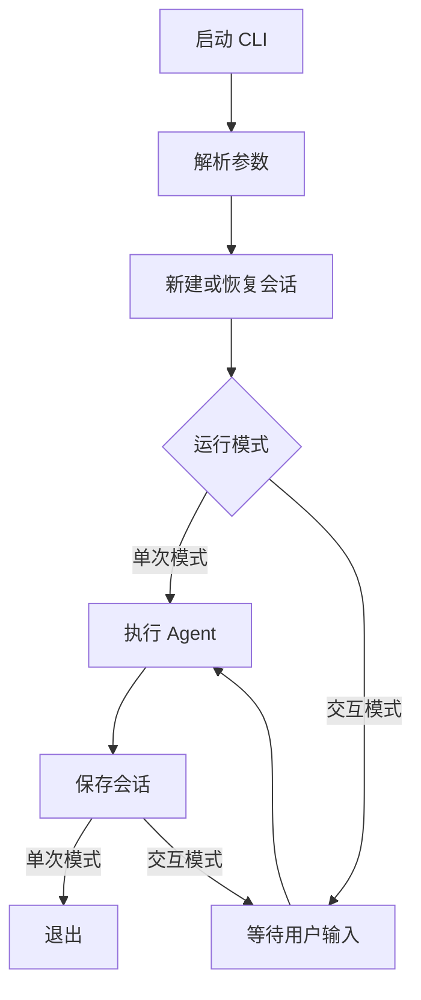
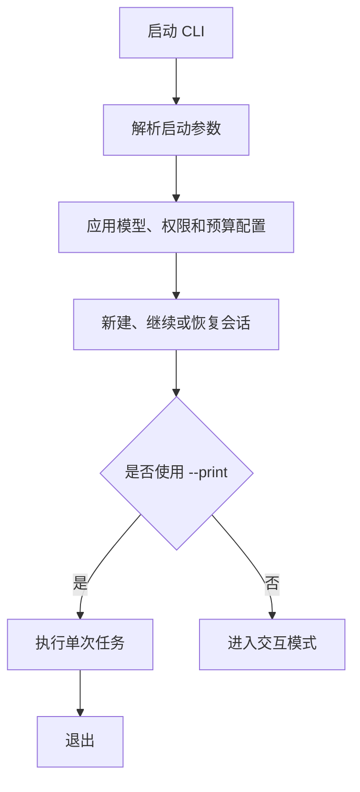
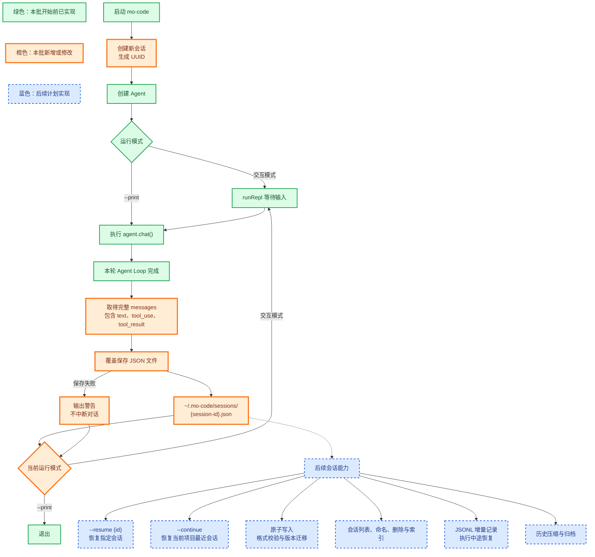
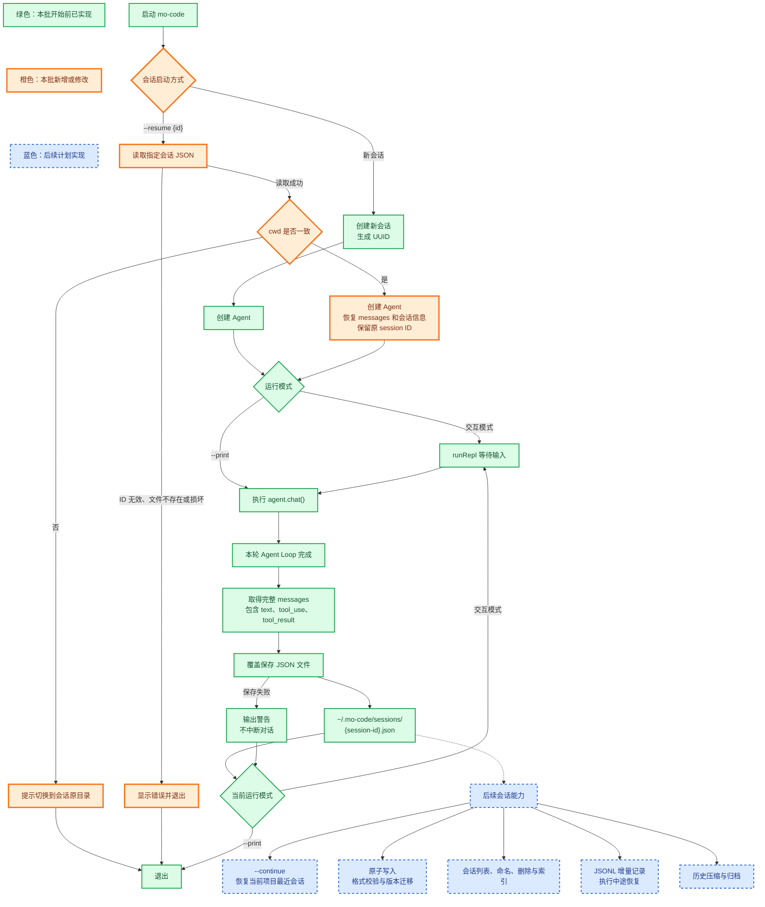
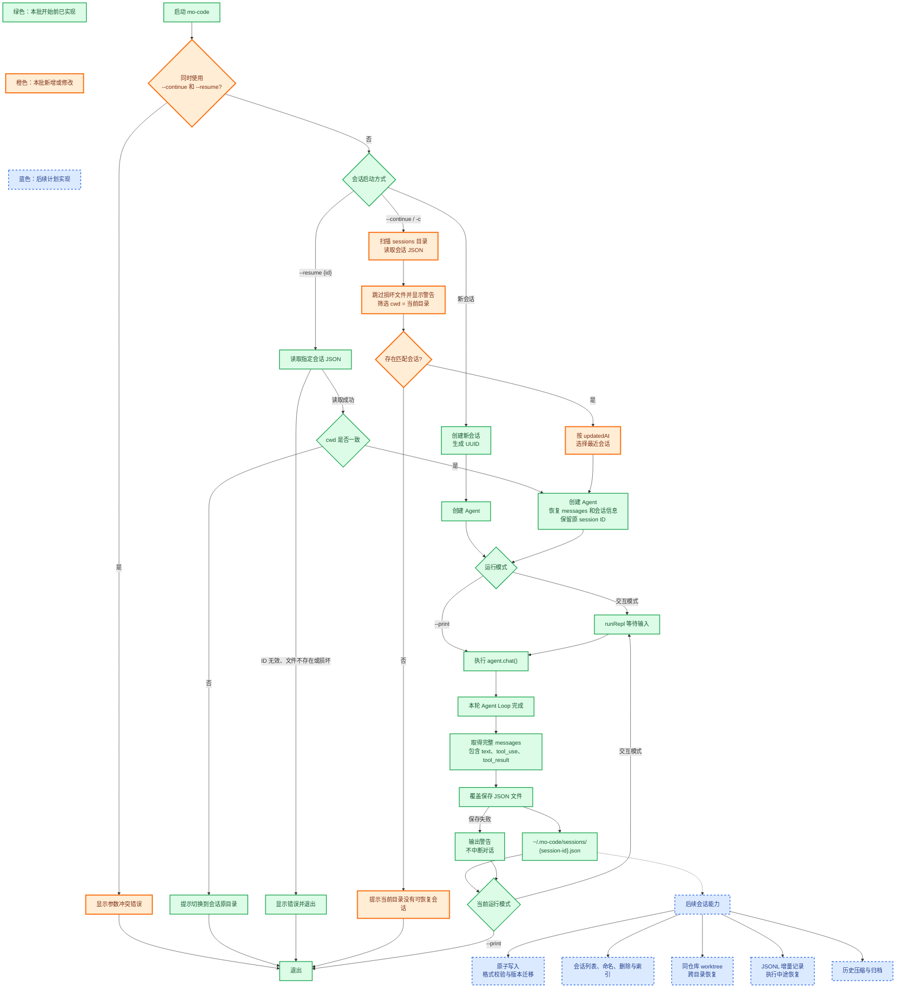
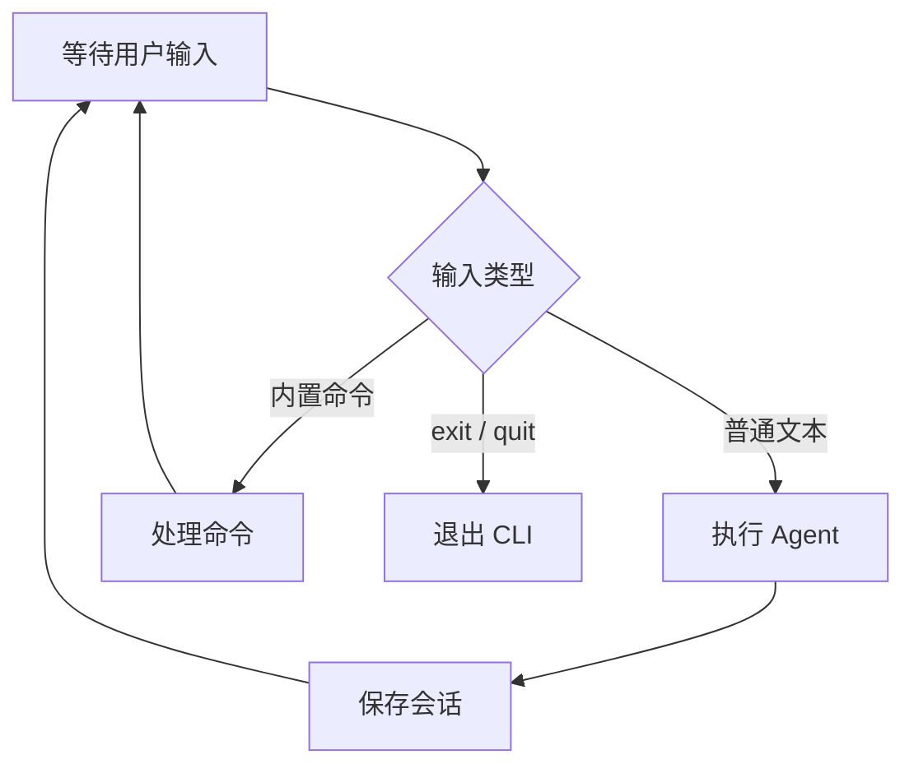

# 实现概述
目前已经实现了 Agent Loop、工具系统、System Prompt

这次我们实现 cli，核心流程图：



## 对齐来源

这张流程图不是 Claude Code 官方原图。它是以下资料的简化抽象：

- [CLI 与会话参考实现](../../.references/cc-from-scratch/04-cli-session.md)
  - CLI 先解析参数。
  - 单次模式执行一轮 Agent 后退出。
  - 交互模式持续读取用户输入。
  - 每轮结束后保存会话。
- [Claude Code CLI reference](https://code.claude.com/docs/en/cli-usage)
  - `claude` 启动交互模式。
  - `claude -p` 执行非交互任务后退出。
  - `--continue` 和 `--resume` 用于恢复会话。
- [Claude Code Manage sessions](https://code.claude.com/docs/en/sessions)
  - 会话会保存到本地。
  - 支持继续最近会话或恢复指定会话。

流程图只保留核心流程。命令处理、中断、权限和终端 UI 暂不展开。

# 1. Cli启动参数
命令格式：

```shell
mo-code [options] [prompt...]
```

mo-code预期初版支持的参数：
- `-h, --help` 显示命令格式和启动参数，然后退出
- `-v, --version` 显示当前版本，然后退出
- `[prompt...]` 启动后发送的初始 `prompt`
- `-p, --print` 进入非交互模式，执行完成后退出
- `-c, --continue` 继续当前项目最近的会话
- `-r, --resume <session>` 恢复指定ID或名称的会话
- `-m, --model <model>` 设置本次会话使用的模型
- `--permission-mode <mode>` 设置权限模式
- `--dangerously-skip-permissions` `bypassPermissions`的快捷参数
- `--mortis` 本项目自定义参数，目前是 `--dangerously-skip-permissions` 的别名
- `--effort <level>` 设置模型的推理强度
- `max-buget-use <amount>` 限制本次运行的最大费用



## help、version实现
太简单，不想占用文档空间，不做展示，可以看源码

## print实现
这个主要就是个分发的入口，不过借着这个说一下 `parseArgs`，这个蛮重要的：

```ts
type ParsedArgs = {
  help: boolean;
  version: boolean;
  print: boolean;
  prompt?: string;
};

// 解析当前已经支持的参数，之后这里还会扩充
export function parseArgs(args: string[]): ParsedArgs {
  let help = false;
  let version = false;
  let print = false;
  const positional: string[] = [];

  for (const arg of args) {
    if (arg === "--help" || arg === "-h") {
      help = true;
    } else if (arg === "--version" || arg === "-v") {
      version = true;
    } else if (arg === "--print" || arg === "-p") {
      print = true;
    } else {
      positional.push(arg);
    }
  }

  return {
    help,
    version,
    print,
    prompt: positional.length > 0 ? positional.join(" ") : undefined,
  };
}

export async function runCli(args = process.argv.slice(2)): Promise<void> {
  const parsed = parseArgs(args);

  // 对help、version的处理...
  
  const agent = new Agent();

  if (parsed.print) {
    if (parsed.prompt) await agent.chat(parsed.prompt);
    return;
  }

  await runRepl(agent, parsed.prompt); // 占位
}
```

## model实现
比较简单，就是将参数解析出来，然后传入给 Agent 配置，推荐直接看代码

## 权限相关的命令
这些都留在后面实现，目前只是占个位：
- `--permission-mode <mode>` 设置权限模式
- `--dangerously-skip-permissions` `bypassPermissions`的快捷参数
- `--mortis` 本项目自定义参数，目前是 `--dangerously-skip-permissions` 的别名

## runRepl实现
我们实现一个简单的 runRepl，它是很多功能的基础，包括恢复对话的各种命令，以及各种交互内置命令：

```ts
import { createInterface } from "node:readline";

async function runRepl(agent: Agent, initialPrompt?: string): Promise<void> {
  if (initialPrompt) await agent.chat(initialPrompt);

  // 创建命令行输入接口
  // process.stdin 读取用户在终端输入的内容
  // process.stdout 向终端输出内容
  const rl = createInterface({ input: process.stdin, output: process.stdout }); 
  rl.setPrompt("> "); // 设置输入提示符
  rl.prompt(); // 把提示词输出到终端，提示用户可以输入

  for await (const line of rl) {
    const input = line.trim();
    if (input === "/exit" || input === "/quit") break;
    if (input) await agent.chat(input);
    rl.prompt();
  }

  rl.close();
}
```

这里可以简单做个测试：
```shell
node mock/mock-anthropic.mjs  # 得到mock服务地址

ANTHROPIC_BASE_URL=http://127.0.0.1:60007 pnpm run cli # 60007代表实际的mock服务地址
```

可以进行一些提问，最后使用 `/exit` 或 `/quit` 退出，这是我测试输出的结果：
```shell
> node --no-warnings --experimental-strip-types src/cli.ts

> Read greeting.txt

  -> read_file({"file_path":"greeting.txt"})
greeting.txt says:
Error reading file: ENOENT: no such file or directory, open 'greeting.txt'
> 再说一次
greeting.txt says:
Error reading file: ENOENT: no such file or directory, open 'greeting.txt'
> 再说一次
greeting.txt says:
Error reading file: ENOENT: no such file or directory, open 'greeting.txt'
> /exit
```

## ！会话存储
### 功能设计分批
这部分很复杂，所以会分多次实现。

相关官方文档：
- [Claude Code 会话文档](https://code.claude.com/docs/en/sessions)、
- [Claude Code 工作原理](https://code.claude.com/docs/en/how-claude-code-works)

### 第1批
第1批完成时的流程：



第一批最终只实现以下能力：
1. 一个会话一个 JSON 文件。
2. 新会话生成 UUID。
3. 每轮 `agent.chat()` 完成后保存完整 messages。
4. 保存失败只显示警告，不中断当前对话。

首先实现会话存储相关（！很核心）：
- 定义数据结构
- `createSession`
- `saveSession`

```ts
import { randomUUID } from "node:crypto";
import { mkdirSync, writeFileSync } from "node:fs";
import { homedir } from "node:os";
import { join } from "node:path";

import type { Message } from "./agent-loop.ts";

export type SessionData = {
  version: 1;
  id: string;
  cwd: string;
  model: string;
  createdAt: string;
  updatedAt: string;
  messages: Message[];
};

const SESSION_DIR = join(homedir(), ".mo-code", "sessions");

export function createSession(cwd: string, model: string): SessionData {
  const now = new Date().toISOString();

  return {
    version: 1,
    id: randomUUID(),
    cwd,
    model,
    createdAt: now,
    updatedAt: now,
    messages: [],
  };
}

export function saveSession(session: SessionData): void {
  session.updatedAt = new Date().toISOString();
  mkdirSync(SESSION_DIR, { recursive: true }); // 递归创建缺失的父目录
  writeFileSync(
    join(SESSION_DIR, `${session.id}.json`),
    `${JSON.stringify(session, null, 2)}\n`,
    "utf-8",
  );
}
```

保存数据示例：
```json
{
  "version": 1,
  "id": "550e8400-e29b-41d4-a716-446655440000",
  "cwd": "/Users/name/project",
  "model": "mock",
  "createdAt": "2026-07-14T10:00:00.000Z",
  "updatedAt": "2026-07-14T10:05:00.000Z",
  "messages": [
    {
      "role": "user",
      "content": [
        {
          "type": "text",
          "text": "<system-reminder>项目上下文（示例中省略）</system-reminder>"
        },
        {
          "type": "text",
          "text": "读取 greeting.txt"
        }
      ]
    },
    {
      "role": "assistant",
      "content": [
        {
          "type": "tool_use",
          "id": "tool-1",
          "name": "read_file",
          "input": {
            "file_path": "greeting.txt"
          }
        }
      ]
    },
    {
      "role": "user",
      "content": [
        {
          "type": "tool_result",
          "tool_use_id": "tool-1",
          "content": "hello"
        }
      ]
    },
    {
      "role": "assistant",
      "content": [
        {
          "type": "text",
          "text": "greeting.txt 的内容是：hello"
        }
      ]
    }
  ]
}
```
在 `Agent` 类里面添加两个方法：

```ts
getMessages(): Message[] {
    return structuredClone(this.messages); // 返回深拷贝，避免外部修改 Agent 内部的消息历史
  }

getModel(): string {
  return this.model;
}
```

然后创建两个方法

```ts
function saveAgentSession(agent: Agent, session: SessionData): void {
  session.messages = agent.getMessages();

  try {
    saveSession(session);
  } catch (error) {
    const message = error instanceof Error ? error.message : String(error);
    process.stderr.write(`Warning: 会话保存失败: ${message}\n`);
  }
}

async function chatAndSave(agent: Agent, session: SessionData, input: string): Promise<void> {
  await agent.chat(input);
  saveAgentSession(agent, session);
}
```

更新 `runCli()`（涉及对话的部分） ：

```ts
const agent = new Agent({ model: parsed.model });
const session = createSession(process.cwd(), agent.getModel());

if (parsed.print) {
  if (parsed.prompt) {
    await chatAndSave(agent, session, parsed.prompt);
  }
  return;
}

await runRepl(agent, session, parsed.prompt);
```

更新 `runRepl()`：

```ts
async function runRepl(
  agent: Agent,
  session: SessionData,
  initialPrompt?: string,
): Promise<void> {
  if (initialPrompt) await chatAndSave(agent, session, initialPrompt);

  const rl = createInterface({ input: process.stdin, output: process.stdout });
  rl.setPrompt("> ");
  rl.prompt();

  for await (const line of rl) {
    const input = line.trim();
    if (input === "/exit" || input === "/quit") break;
    if (input) await chatAndSave(agent, session, input);
    rl.prompt();
  }

  rl.close();
}
```

## 第2批
第2批完成时的流程图



我们还是先从 session 开始，加一个 `loadSession` 方法：

```ts
const SESSION_ID_PATTERN = /^[0-9a-f]{8}-[0-9a-f]{4}-[0-9a-f]{4}-[0-9a-f]{4}-[0-9a-f]{12}$/i;

export function loadSession(id: string): SessionData {
  if (!SESSION_ID_PATTERN.test(id)) {
    throw new Error(`无效的会话 ID: ${id}`);
  }

  let json: string;
  try {
    json = readFileSync(join(SESSION_DIR, `${id}.json`), "utf-8");
  } catch (error) {
    if ((error as NodeJS.ErrnoException).code === "ENOENT") {
      throw new Error(`找不到会话: ${id}`);
    }
    throw error;
  }

  try {
    return JSON.parse(json) as SessionData;
  } catch {
    throw new Error(`会话文件已损坏: ${id}`);
  }
}
```

在 `Agent` 类里面加个方法：

```ts
restoreMessages(messages: Message[]): void {
  this.messages = structuredClone(messages);
}
```

然后改一下 `cli`

```ts
type ParsedArgs = {
  // 省略其他参数的处理 ...
  resume?: string;
};

export function parseArgs(args: string[]): ParsedArgs {
  // 省略其他参数的处理 ...
  let resume: string | undefined;
  const positional: string[] = [];

  for (let i = 0; i < args.length; i++) {
    const arg = args[i];
    // 省略其他参数的处理 ...
    } else if (arg === "--resume" || arg === "-r") {
      const sessionId = args[++i];
      if (!sessionId || sessionId.startsWith("-")) {
        throw new Error(`${arg} 需要会话 ID`);
      }
      resume = sessionId;
    } else {
      positional.push(arg);
    }
  }

  return {
    // 省略其他参数的处理 ...
    resume,
  };
}

export async function runCli(args = process.argv.slice(2)): Promise<void> {
  // 省略之前的实现...

  let agent: Agent;
  let session: SessionData;

  if (parsed.resume) {
    try {
      session = loadSession(parsed.resume);
    } catch (error) {
      reportCliError(error);
      return;
    }

    // 当前版本要求回到原工作目录，避免旧会话上下文操作到其他项目。
    // Claude Code 对同仓库 worktree 有更灵活的处理，后续再扩展。
    if (session.cwd !== process.cwd()) {
      process.stderr.write(
        `Error: 会话 ${session.id} 属于另一个工作目录\n`
        + `  会话目录: ${session.cwd}\n`
        + `  当前目录: ${process.cwd()}\n`
        + `请切换到会话目录后重新运行 mo-code --resume ${session.id}\n`,
      );
      process.exitCode = 1;
      return;
    }

    agent = new Agent({ model: parsed.model ?? session.model });
    agent.restoreMessages(session.messages);
    session.model = agent.getModel();
  } else {
    agent = new Agent({ model: parsed.model });
    session = createSession(process.cwd(), agent.getModel());
  }

  // 省略之前的实现...
}

```

## 第3批
第3批完成时的流程图



同样，先加 `findLatestSession`：

```ts
export type LatestSessionResult = {
  session?: SessionData;
  skippedFiles: string[];
};

export function findLatestSession(cwd: string): LatestSessionResult {
  let filenames: string[];
  try {
    filenames = readdirSync(SESSION_DIR);
  } catch (error) {
    if ((error as NodeJS.ErrnoException).code === "ENOENT") { // 文件或目录不存在。
      return { session: undefined, skippedFiles: [] }; // 没找到最近会话，也没有损坏文件被跳过
    }
    throw error;
  }

  let latestSession: SessionData | undefined;
  const skippedFiles: string[] = [];

  for (const filename of filenames) {
    if (!filename.endsWith(".json")) continue;

    const id = filename.slice(0, -".json".length);
    if (!SESSION_ID_PATTERN.test(id)) continue;

    let session: SessionData;
    try {
      session = loadSession(id);
    } catch {
      skippedFiles.push(filename);
      continue;
    }

    if (session.cwd !== cwd) continue;
    if (typeof session.updatedAt !== "string") {
      skippedFiles.push(filename);
      continue;
    }

    // updatedAt 由 Date.toISOString() 生成，同一格式的字符串可直接比较先后。
    if (!latestSession || session.updatedAt > latestSession.updatedAt) {
      latestSession = session;
    }
  }

  return { session: latestSession, skippedFiles };
}
```

然后改一下 `cli`

```ts
type ParsedArgs = {
  // 省略其他参数的处理 ...
  continueSession: boolean;
};

export function parseArgs(args: string[]): ParsedArgs {
  // 省略其他参数的处理 ...
  let continueSession = false;

  for (let i = 0; i < args.length; i++) {
    const arg = args[i];
    // 省略其他参数的处理 ...
    } else if (arg === "--continue" || arg === "-c") {
      continueSession = true;
    } 
    // 省略其他参数的处理 ...
  }
  
  if (continueSession && resume) {
    throw new Error("--continue 和 --resume 不能同时使用");
  }

  return {
    // 省略其他参数的处理 ...
    continueSession,
  };
}

export async function runCli(args = process.argv.slice(2)): Promise<void> {
  // 省略之前的实现...

  // 注意这里，是在原来 resume 的处理部分做的更新
   if (parsed.resume || parsed.continueSession) {
    try {
      if (parsed.resume) {
        session = loadSession(parsed.resume);
      } else {
        const result = findLatestSession(process.cwd());
        for (const filename of result.skippedFiles) {
          process.stderr.write(`Warning: 跳过损坏的会话文件: ${filename}\n`);
        }
        if (!result.session) {
          throw new Error("当前目录没有可恢复的会话");
        }
        session = result.session;
      }
    } catch (error) {
      reportCliError(error);
      return;
    }

    // 省略之前的实现...
  }

  // 省略之前的实现...
}

```

# 2. REAL内置参数
目前实现的参数：
- `help` 显示支持的命令、参数和简单示例
- `/clear` 清空当前对话历史，旧会话仍然保存，可以恢复
- `/status` 显示会话ID、工作目录、模型和权限模式
- `/cost` 显示 token 的费用和统计
- `/compact` 压缩对话上下文，释放上下文空间
- `/plan` 切换 `plan` 模式
- `/exit` 保存当前对话并退出
- `/quit` `/exit`的别名


