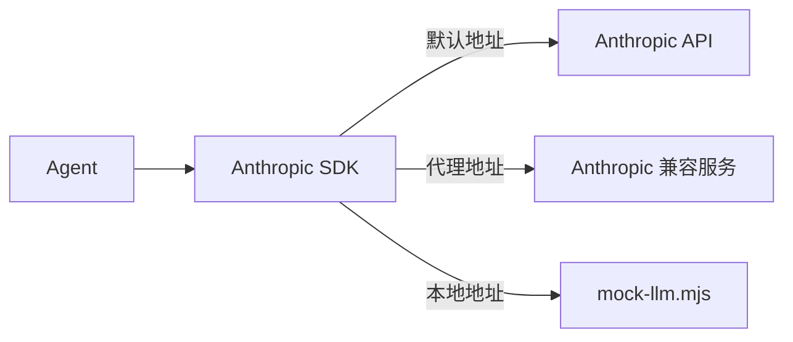

# 本期变更说明
1. 基于 0.4 的反思，本期将控制文档篇幅，重点说明核心设计和关键流程，非核心异常分支与扩展能力不再逐项展开

# 目标
1. 实现 Anthropic 后端
2. 实现文本流式输出
3. 实现工具调用的流式解析
4. 实现流式工具提前执行
5. 实现并行工具执行
6. 实现 Extended Thinking
7. 支持中断当前生成

# 1. Anthropic 后端

0.4 使用手写的 `AnthropicLikeClient` 请求本地 Mock。本期将它替换为官方 `@anthropic-ai/sdk`，真实服务与 Mock 统一经过官方 SDK，只通过 `baseURL` 切换请求目标：



## SDK 与官方类型

安装 SDK：

```shell
pnpm add @anthropic-ai/sdk
```

消息、内容块和工具调用直接使用 SDK 类型，不再维护一套不完整的重复定义：

```ts
import Anthropic from "@anthropic-ai/sdk";

export type Message = Anthropic.MessageParam;
export type ContentBlock = Anthropic.ContentBlockParam;
```

Agent 直接持有 SDK 客户端。当前只有一个真实后端，不提前抽象 Provider 层：

```ts
const MODEL = "claude-sonnet-4-6";

this.client = new Anthropic({
  apiKey: options.apiKey ?? process.env.ANTHROPIC_API_KEY,
  // 只使用项目显式配置的 API Key，避免同时发送环境中继承的 Claude Code Token。
  authToken: null,
  baseURL: options.baseURL ?? process.env.ANTHROPIC_BASE_URL,
});

this.model = options.model ?? process.env.ANTHROPIC_MODEL ?? MODEL;
```

SDK 默认请求 Anthropic，也可以通过 `ANTHROPIC_BASE_URL` 连接实现了 Messages API 的兼容服务。官方 SDK 的安装、鉴权和 `messages.create()` 用法见 [Anthropic TypeScript SDK](https://platform.claude.com/docs/en/cli-sdks-libraries/sdks/typescript)。

## 调用 Messages API

这一阶段只把现有非流式调用迁移到官方 SDK，Agent Loop 不变：

```ts
const reply = await this.client.messages.create({
  model: this.model,
  max_tokens: 4096,
  system: this.systemPrompt,
  tools: toolDefinitions,
  messages: this.messages,
});
```

模型返回 `tool_use` 后，Agent 仍执行本地工具并把 `tool_result` 追加到消息历史，直到模型不再调用工具。

## 使用兼容服务

无法直接使用 Anthropic API 时，可以连接 Anthropic 格式的代理服务。例如 AIHubMix：

```shell
export ANTHROPIC_API_KEY="<AIHUBMIX_API_KEY>"
export ANTHROPIC_BASE_URL="https://aihubmix.com"
export ANTHROPIC_MODEL="claude-sonnet-4-6"
```

或使用 DeepSeek 的 Anthropic 兼容接口：

```shell
export ANTHROPIC_API_KEY="<DEEPSEEK_API_KEY>"
export ANTHROPIC_BASE_URL="https://api.deepseek.com/anthropic"
export ANTHROPIC_MODEL="deepseek-v4-pro"
```

两者都可以通过官方 Anthropic SDK 调用；兼容范围分别见 [AIHubMix Anthropic API 兼容说明](https://docs.aihubmix.com/cn/api/Anthropic-Compatible)和 [DeepSeek Anthropic API](https://api-docs.deepseek.com/guides/anthropic_api)。

## 唯一 Mock 路径

项目只保留 `mock/mock-llm.mjs` 这一种 Mock。启动服务：

```shell
node mock/mock-llm.mjs
```

然后把官方 SDK 指向它：

```shell
ANTHROPIC_API_KEY=mock \
ANTHROPIC_BASE_URL=http://127.0.0.1:<实际端口> \
ANTHROPIC_MODEL=mock \
pnpm run cli -- "读取 greeting.txt"
```

单元测试和 CLI 测试同样使用这条路径，不再保留手写客户端或测试专用 HTTP 实现。

本节只完成官方 SDK 与 Anthropic Messages API 的接入。文本流式输出在下一节实现，流式工具调用和中断将在后续目标中实现。

# 2. 文本流式输出

非流式调用必须等待完整响应后才能显示文本。本阶段把 Agent 的模型调用统一改为 `messages.stream()`，收到文本分片后立即写入终端：

```ts
private async callAnthropicStream(): Promise<Anthropic.Message> {
  let hasText = false;
  const stream = this.client.messages.stream({
    model: this.model,
    max_tokens: 4096,
    system: this.systemPrompt,
    tools: toolDefinitions,
    messages: this.messages,
  });

  stream.on("text", (text) => {
    hasText = true;
    process.stdout.write(text);
  });

  const reply = await stream.finalMessage();
  if (hasText) process.stdout.write("\n");
  return reply;
}
```

这里同时使用流和完整消息：

- `text` 事件负责即时输出，不做缓冲、渲染或额外抽象。
- `finalMessage()` 把 SSE 事件恢复成完整的 `Anthropic.Message`，后续历史保存和工具调用逻辑保持不变。
- 只有实际输出过文本才在流结束后补换行，纯工具响应不会产生空行。
- 工具调用后的下一次模型请求也经过同一个流式方法。

因此，会话中仍然只保存完整的 Anthropic 消息，Session 结构无需改变。流中途失败时，已经显示的文本保留，但残缺的 assistant 消息不会写入历史。

## Mock 与验证

唯一的 `mock/mock-llm.mjs` 根据请求中的 `stream: true` 返回 Anthropic SSE，并把文本拆成多个 `content_block_delta`；非流式请求仍返回原来的 JSON。这样 Agent、Mock 和真实服务都经过官方 SDK 的同一条流式路径。

自动测试使用 Mock 验证文本分片、换行、完整消息恢复、工具调用和失败行为。真实 DeepSeek 验收则通过 `.env` 中的配置手动执行，不进入默认测试，避免测试依赖网络或消耗额度。

本节只实现文本的即时输出。`input_json_delta` 的主动解析、工具提前执行、并行工具、Extended Thinking 和中断仍由后续目标实现。
