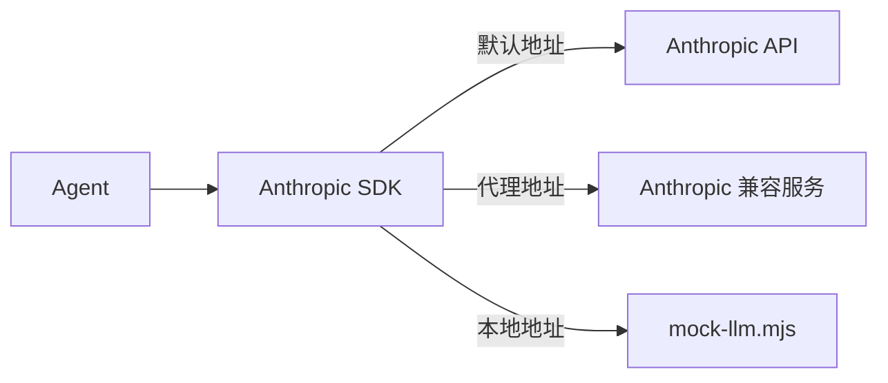

# 本期变更说明
1. 基于 0.4 的反思，本期将控制文档篇幅，重点说明核心设计和关键流程，非核心异常分支与扩展能力不再逐项展开

# 目标
1. 实现 Anthropic 后端
2. 实现文本流式输出
3. 实现工具调用的流式解析
4. 实现流式工具提前与并行执行
5. 实现 Extended Thinking
6. 支持中断当前生成
7. 实现 Prompt Caching

# 1. Anthropic 后端

0.4 使用手写的 `AnthropicLikeClient` 请求本地 Mock。本期将它替换为官方 `@anthropic-ai/sdk`，真实服务与 Mock 统一经过官方 SDK，只通过 `baseURL` 切换请求目标：



## SDK 与官方类型

安装 SDK：

```shell
pnpm add @anthropic-ai/sdk
```

消息、内容块和工具调用直接使用 SDK 类型，不再维护一套不完整的重复定义：

```ts
import Anthropic from "@anthropic-ai/sdk";

export type Message = Anthropic.MessageParam;
export type ContentBlock = Anthropic.ContentBlockParam;
```

Agent 直接持有 SDK 客户端。当前只有一个真实后端，不提前抽象 Provider 层：

```ts
const MODEL = "claude-sonnet-4-6";

this.client = new Anthropic({
  apiKey: options.apiKey ?? process.env.ANTHROPIC_API_KEY,
  // 只使用项目显式配置的 API Key，避免同时发送环境中继承的 Claude Code Token。
  authToken: null,
  baseURL: options.baseURL ?? process.env.ANTHROPIC_BASE_URL,
});

this.model = options.model ?? process.env.ANTHROPIC_MODEL ?? MODEL;
```

SDK 默认请求 Anthropic，也可以通过 `ANTHROPIC_BASE_URL` 连接实现了 Messages API 的兼容服务。官方 SDK 的安装、鉴权和 `messages.create()` 用法见 [Anthropic TypeScript SDK](https://platform.claude.com/docs/en/cli-sdks-libraries/sdks/typescript)。

## 调用 Messages API

这一阶段只把现有非流式调用迁移到官方 SDK，Agent Loop 不变：

```ts
const reply = await this.client.messages.create({
  model: this.model,
  max_tokens: 4096,
  system: this.systemPrompt,
  tools: toolDefinitions,
  messages: this.messages,
});
```

模型返回 `tool_use` 后，Agent 仍执行本地工具并把 `tool_result` 追加到消息历史，直到模型不再调用工具。

## 使用兼容服务

无法直接使用 Anthropic API 时，可以连接 Anthropic 格式的代理服务。例如 AIHubMix：

```shell
export ANTHROPIC_API_KEY="<AIHUBMIX_API_KEY>"
export ANTHROPIC_BASE_URL="https://aihubmix.com"
export ANTHROPIC_MODEL="claude-sonnet-4-6"
```

或使用 DeepSeek 的 Anthropic 兼容接口：

```shell
export ANTHROPIC_API_KEY="<DEEPSEEK_API_KEY>"
export ANTHROPIC_BASE_URL="https://api.deepseek.com/anthropic"
export ANTHROPIC_MODEL="deepseek-v4-pro"
```

两者都可以通过官方 Anthropic SDK 调用；兼容范围分别见 [AIHubMix Anthropic API 兼容说明](https://docs.aihubmix.com/cn/api/Anthropic-Compatible)和 [DeepSeek Anthropic API](https://api-docs.deepseek.com/guides/anthropic_api)。

## 唯一 Mock 路径

项目只保留 `mock/mock-llm.mjs` 这一种 Mock。启动服务：

```shell
node mock/mock-llm.mjs
```

然后把官方 SDK 指向它：

```shell
ANTHROPIC_API_KEY=mock \
ANTHROPIC_BASE_URL=http://127.0.0.1:<实际端口> \
ANTHROPIC_MODEL=mock \
pnpm run cli -- "读取 greeting.txt"
```

单元测试和 CLI 测试同样使用这条路径，不再保留手写客户端或测试专用 HTTP 实现。

本节只完成官方 SDK 与 Anthropic Messages API 的接入。文本流式输出在下一节实现，流式工具调用和中断将在后续目标中实现。

# 2. 文本流式输出

非流式调用必须等待完整响应后才能显示文本。本阶段把 Agent 的模型调用统一改为 `messages.stream()`。兼容服务返回的分片可能突发到达，因此文本先进入一个很小的平滑队列，再以每 10ms 一个字符的节奏写入终端：

```ts
private async callAnthropicStream(): Promise<Anthropic.Message> {
  const writer = new SmoothTextWriter();
  const stream = this.client.messages.stream({
    model: this.model,
    max_tokens: 4096,
    system: this.systemPrompt,
    tools: toolDefinitions,
    messages: this.messages,
  });

  stream.on("text", (text) => {
    writer.write(text);
  });

  let reply: Anthropic.Message;
  try {
    reply = await stream.finalMessage(); // 将 SSE 事件恢复完整的 `Anthropic.Message` ，给其他环节使用，避免流式渲染造成影响
  } finally {
    await writer.finish();
  }

  if (writer.hasText) process.stdout.write("\n"); // 有文本输出，那么在后面补一个空行，纯工具行不会有这个空行
  return reply;
}
```

这里同时使用流和完整消息：

- `text` 事件只负责把字符加入 `SmoothTextWriter`，不关心服务端原始分片大小。
- `SmoothTextWriter` 每 10ms 输出一个 Unicode 字符，让突发到达的分片平滑显示。
- 流结束后先排空队列再返回，避免回答尾部丢失；代价是可能增加少量显示延迟。
- `finalMessage()` 把 SSE 事件恢复成完整的 `Anthropic.Message`，后续历史保存和工具调用逻辑保持不变。
- 只有实际输出过文本才在流结束后补换行，纯工具响应不会产生空行。
- 工具调用后的下一次模型请求也经过同一个流式方法。

因此，会话中仍然只保存完整的 Anthropic 消息，Session 结构无需改变。流中途失败时，已经显示的文本保留，但残缺的 assistant 消息不会写入历史。

## `SmoothTextWrite`
```ts
class SmoothTextWriter {
  private characters: string[] = [];
  private timer: ReturnType<typeof setTimeout> | undefined;
  private ended = false;
  private resolveDrained!: () => void;
  private drained: Promise<void>;
  hasText = false;

  constructor() {
    this.drained = new Promise((resolve) => {
      this.resolveDrained = resolve;
    });
  }

  write(text: string): void {
    const characters = Array.from(text);
    if (characters.length === 0) return;

    this.hasText = true;
    this.characters.push(...characters);
    this.pump();
  }

  finish(): Promise<void> {
    this.ended = true;
    this.resolveIfDrained();
    return this.drained;
  }

  private pump(): void {
    if (this.timer || this.characters.length === 0) return;

    process.stdout.write(this.characters.shift()!); // 从 characters 数组中不断取出文字显示
    this.timer = setTimeout(() => {
      this.timer = undefined;
      this.pump();
      this.resolveIfDrained();
    }, SMOOTH_OUTPUT_INTERVAL_MS); // 按固定时间间隔开始下一次 pump
  }

  // 判断是否达成终止条件，所有数据输出完成，此时将 promise 改为完成态
  private resolveIfDrained(): void {
    if (this.ended && !this.timer && this.characters.length === 0) {
      this.resolveDrained();
    }
  }
}
```

## 效果验证
```bash
pnpm run cli -- --print "请用中文写一段约 300 字的 TypeScript 简介"
```

# 3. 工具调用的流式解析

`finalMessage()` 可以还原完整工具调用，但只能在整条响应结束后返回。为了给下一阶段的工具提前执行提供入口，本阶段在单个 `tool_use` block 完成时立即产生通知。

Anthropic 工具参数会经过 `content_block_start`、多个 `input_json_delta` 和 `content_block_stop` 到达。

官方 SDK 已经负责累积并解析这些参数，所以这里直接使用 `streamEvent` 提供的消息快照，不再手动拼接 JSON：

```ts
private async callAnthropicStream(
  onToolBlockComplete?: (block: Anthropic.ToolUseBlock) => void,
): Promise<Anthropic.Message> {
  // ...
  stream.on("streamEvent", (event, snapshot) => {
    // 这个判断很关键，我们只在完整解析之后才去取到所有的工具
    // 1. message_start —— 空消息
    // 2. content_block_start ——开始阶段
    // 3. content_block_delta ——增量阶段
    // 4. content_block_stop ——完整Block，input已经被SDK解析
    // 5. message_delta ——和工具参数无关
    // 6. message_stop ——整条消息响应结束，这个时候处理就迟了，无法为提前执行做准备
    if (event.type !== "content_block_stop") return;

    const block = snapshot.content[event.index];
    // content 是一个数组，里面有多个内容块，但 content_block 就是具体的内容块，一次只会是一种类型，比如说 文字或工具，不会同时有多个工具
    if (block?.type === "tool_use") {
      onToolBlockComplete?.(block);
    }
  });
  // ...
}
```

Agent Loop 使用流中收集的工具块作为唯一执行来源：

```ts
const toolUses: Anthropic.ToolUseBlock[] = [];
const reply = await this.callAnthropicStream((block) => {
  toolUses.push(block);
});

this.messages.push({ role: "assistant", content: reply.content });

for (const toolUse of toolUses) {
  // 当前仍然等完整响应结束后才执行
}
```

这里区分了两个用途：

- `content_block_stop` 快照负责得到当前轮需要执行的完整工具调用。
- `finalMessage()` 负责保存完整 assistant 历史。

不再从 `reply.content` 二次提取工具，也不增加协议兼容兜底，避免形成两条执行路径。当前只处理普通 `tool_use`；文本、Thinking 和服务端工具块不会触发回调。

Mock 会把每个工具参数拆成多个 `input_json_delta`，并用同一响应中的多个工具块验证参数还原和顺序。真实 DeepSeek 验收同样可以在一条响应中解析两个工具调用并返回两个对应的 `tool_result`。

本节只完成解析和收集，工具仍在整个模型响应结束后执行。下一节再利用同一个完成回调启动工具提前执行。

# 4. 流式工具提前与并行执行

工具参数在 `content_block_stop` 时已经完整，不需要继续等待整条响应。为了利用这段流式窗口，本阶段让无副作用工具立即启动，并让多个读取任务自然并行。

## 工具自描述与顺序屏障

并发安全性属于工具自身的行为契约，而不是 Agent Loop 维护的工具名白名单。`Tool` 使用函数属性描述这一能力，同一个工具以后也可以根据输入采用不同判断：

```ts
type Tool = ToolDef & {
  execute: ToolHandler;
  validateInput?: ToolValidator;
  isConcurrencySafe?: (input: Record<string, unknown>) => boolean;
};
```

只读工具在自己的定义中声明：

```ts
export const readFileTool: Tool = {
  name: "read_file",
  isConcurrencySafe: () => true,
  // ...
};
```

执行器通过工具系统查询，不直接了解具体工具：

```ts
export function isToolConcurrencySafe(
  name: string,
  input: Record<string, unknown>,
): boolean {
  return toolMap.get(name)?.isConcurrencySafe?.(input) ?? false;
}
```

未声明和未知工具默认返回 `false`。当前 `read_file`、`list_files`、`grep_search`、`web_fetch` 声明为并发安全；`write_file`、`edit_file` 和 `run_shell` 可能产生副作用，因此不会提前执行，并且会形成顺序屏障。例如：

```text
read A → write B → read C → read D
```

实际调度为：

```text
[read A 提前执行] → [write B 顺序执行] → [read C || read D 并行执行]
```

这样既不会让 `read C` 越过写操作读到旧内容，也能让连续的安全工具并行。

## StreamingToolExecutor
### 调用
调度逻辑集中在 `StreamingToolExecutor`，Agent Loop 只负责把完整工具块交给它：

```ts
const toolExecutor = new StreamingToolExecutor({
  readFileState: this.readFileState,
});

const reply = await this.callAnthropicStream((block) => {
  toolExecutor.accept(block);
});

this.messages.push({ role: "assistant", content: reply.content });

const results = await toolExecutor.finish();
if (results.length === 0) return;

this.messages.push({ role: "user", content: results });
```

执行器分为两个阶段：

- `accept(block)` 按生成顺序记录工具。第一个屏障前的安全工具立即启动，并把 Promise 保存到 `earlyExecutions`。
- `finish()` 复用已经启动的 Promise；剩余连续安全工具通过 `Promise.all` 执行，副作用工具逐个执行。

提前执行以 `tool_use.id` 为键：

```ts
this.earlyExecutions.set(block.id, this.executeBlock(block));
```

因此同一个工具名可以被调用多次，而且流结束后只会等待原 Promise，不会重复执行。即使并行任务完成顺序不同，最终 `tool_result` 仍按原始工具块顺序生成，保持与 `tool_use_id` 的对应关系。

工具开始执行时不立即打印日志，避免和仍在平滑输出的文本相互穿插；流结束后再按原始顺序显示工具调用。

当前工具会把文件不存在、命令失败和请求超时等预期错误转换成普通结果交还模型。若模型流中断，已经启动的安全工具可能自行运行到结束，但结果不会写入历史；统一取消模型和工具任务留到第 6 项实现。

自动测试使用可控 Promise 验证了以下行为：

- 安全工具在完整模型消息返回前启动。
- 多个安全工具同时运行。
- 副作用工具阻止后续工具越过屏障。
- 并行任务完成顺序不会改变结果顺序。
- 每个 `tool_use.id` 只执行一次。

### 定义
```ts
type ToolExecutor = (
  name: string,
  input: Record<string, unknown>,
  context: ToolContext,
) => Promise<string>;

export class StreamingToolExecutor {
  private toolUses: Anthropic.ToolUseBlock[] = [];
  private earlyExecutions = new Map<string, Promise<string>>(); // 将需要执行的Promise通过Map存储起来，方便快速通过id获取使用
  private reachedExecutionBarrier = false;
  private context: ToolContext;
  private execute: ToolExecutor;

  constructor(
    context: ToolContext,
    execute: ToolExecutor = executeTool, // 默认使用原来的执行器
  ) {
    this.context = context;
    this.execute = execute;
  }

  accept(block: Anthropic.ToolUseBlock): void {
    this.toolUses.push(block);

    if (!this.isConcurrencySafe(block)) {
      this.reachedExecutionBarrier = true; // 到达安全屏障
      return;
    }

    if (!this.reachedExecutionBarrier) {
      // 注意这里，我们已经提前执行了，只是将Promise对象存储进Map，方便后续取用
      this.earlyExecutions.set(block.id, this.executeBlock(block)); // 没有到达安全屏障前可以连续执行
    }
  }

  async finish(): Promise<Anthropic.ToolResultBlockParam[]> {
    const results: Anthropic.ToolResultBlockParam[] = [];
    let index = 0;

    while (index < this.toolUses.length) {
      const toolUse = this.toolUses[index];
      const earlyExecution = this.earlyExecutions.get(toolUse.id);

      if (earlyExecution) {
        this.logToolUse(toolUse);
        // 注意这里的 await earlyExecution ， Promise方法之前已经执行了，我们现在只是等待获取它的执行结果，这里保存的不是方法，而是Promise对象
        results.push(this.toToolResult(toolUse, await earlyExecution)); 
        index++;
        continue;
      }

      if (!this.isConcurrencySafe(toolUse)) {
        this.logToolUse(toolUse);
        // 注意这里，非并发方法我们会等待执行，直到完成
        results.push(this.toToolResult(toolUse, await this.executeBlock(toolUse)));
        index++;
        continue;
      }

      const batch: Anthropic.ToolUseBlock[] = [];
      // 没有提前执行 且 并发安全的工具会放到 batch 数组里，等会并发一起执行
      // 按这个条件，要么工具都执行完成了，要么碰到安全屏障，此时会停止
      // 另外需要注意一点的是 提前执行的工具不会放到批量执行里，避免重复执行
      while (
        index < this.toolUses.length
        && this.isConcurrencySafe(this.toolUses[index])
        && !this.earlyExecutions.has(this.toolUses[index].id)
      ) {
        batch.push(this.toolUses[index]);
        index++;
      }

      for (const toolUse of batch) this.logToolUse(toolUse);
      // 批量执行
      const outputs = await Promise.all(batch.map((toolUse) => this.executeBlock(toolUse)));
      results.push(
        ...batch.map((toolUse, batchIndex) => this.toToolResult(toolUse, outputs[batchIndex])),
      );
    }

    return results;
  }

  private isConcurrencySafe(block: Anthropic.ToolUseBlock): boolean {
    return isToolConcurrencySafe(
      block.name,
      block.input as Record<string, unknown>,
    );
  }

  private executeBlock(block: Anthropic.ToolUseBlock): Promise<string> {
    return this.execute(
      block.name,
      block.input as Record<string, unknown>,
      this.context,
    );
  }

  private logToolUse(block: Anthropic.ToolUseBlock): void {
    console.log(`  -> ${block.name}(${JSON.stringify(block.input)})`);
  }

  private toToolResult(
    block: Anthropic.ToolUseBlock,
    output: string,
  ): Anthropic.ToolResultBlockParam {
    return {
      type: "tool_result",
      tool_use_id: block.id,
      content: output,
    };
  }
}
```

### 为什么要区分 提前执行和批量执行？
为什么除了区分工具能否并发，还要区分提前执行和批量执行？

工具只分为可并发和不可并发两类；“提前执行”和“批量执行”只是执行时机不同。

`accept()` 在流式响应中收到完整工具块时调用，可并发工具可以立即启动。`finish()` 在响应结束后调用，负责等待已提前启动的任务，并执行因顺序屏障而尚未启动的工具。

如果所有工具都放到 `finish()` 才执行，就会失去工具执行与模型生成并行带来的性能收益。

# 5. Extended Thinking

本功能分两阶段实现：

- 5.1 单次模式通过启动参数开启 Thinking
- 5.2 交互模式通过命令动态切换 Thinking

## 5.1 单次 Thinking

使用 `--thinking` 显式开启：

```shell
pnpm run cli -- --thinking --print "分析 package.json 中最值得改进的地方"
```

Agent 只保留开启和关闭两种配置，不引入更多推理强度档位：

```ts
const MAX_OUTPUT_TOKENS = 64_000;
const THINKING_BUDGET_TOKENS = 32_000;

const thinking: Anthropic.ThinkingConfigParam = this.thinkingEnabled
  ? {
      type: "enabled",
      budget_tokens: THINKING_BUDGET_TOKENS,
      display: "omitted",
    }
  : { type: "disabled" };
```

未传 `--thinking` 时会显式发送 `disabled`；传入后会发送 `enabled`。较大的输出上限和思考预算让该功能能处理实际任务，兼容服务不支持预算控制时可以忽略 `budget_tokens`。

### 只显示状态，不显示思考内容

每次开始模型请求时，CLI 向 `stderr` 输出：

```text
Thinking...
```

请求中的 `display: "omitted"` 表示接口不返回可读的思考正文，但仍会返回需要原样保存和回传的 Thinking 内容块及签名。最终答案继续通过 `stdout` 流式输出。这里参考 Claude Code 的交互方式：默认只提示模型正在思考，不把完整思考过程铺到终端。

状态写入 `stderr` 还有一个好处：在 `--print` 模式下，调用方可以只读取 `stdout`，得到干净的最终结果。

### 完整保留 Thinking 历史

“不显示”不等于“丢弃”。使用 `omitted` 时，接口返回的 Thinking 块中 `thinking` 是空字符串，但 `signature` 仍包含加密后的完整思考信息。API 会用它恢复推理上下文，并验证这个块确实由模型生成且没有被修改：

```ts
{
  type: "thinking",
  thinking: "",
  signature: "WaUjzkypQ2mUEVM36O2Txu...",
}
```

这里使用随机特征串表示截断后的签名示例；真实值必须使用 API 返回的完整 `signature`，不能手动构造。

服务端安全系统还可能自动返回 `redacted_thinking`，表示某段思考因安全原因被隐藏：

```ts
{
  type: "redacted_thinking",
  data: "EmwKAhgBEgyN8pQ7xV4m...",
}
```

它不需要也不能由客户端配置，`data` 同样是不可解析的加密数据，只需原样保存并回传。

客户端不解析或修改 `signature`，只需把 API 实际返回的 `thinking`、`signature`、`redacted_thinking` 与普通文本、工具块一起保存在消息历史和会话文件中：

```ts
this.messages.push({
  role: "assistant",
  content: reply.content,
});
```

当 Thinking 后面存在工具调用时，下一轮请求会原样传回完整的 assistant 内容块。这样既保持内容块顺序，也满足 Anthropic 对 Thinking 签名连续性的要求，不需要为工具循环单独拼装另一份消息。

### 验证范围

Mock 按照 `omitted` 的响应生成空 `thinking` 块和 `signature_delta`，用于验证完整块会进入下一轮工具请求，并能随会话保存和恢复。真实 DeepSeek Anthropic 兼容接口也验证了 `--thinking`、`display: "omitted"` 和当前预算配置可以正常完成请求。

## 5.2 交互式 Thinking

交互模式使用 `/thinking` 切换后续请求的 Thinking 状态：

```text
> /thinking
Thinking: 开启
> 分析当前项目结构
Thinking...
...
> /thinking
Thinking: 关闭
```

Agent 提供最小的状态接口，REPL 负责切换和显示：

```ts
isThinkingEnabled(): boolean {
  return this.thinkingEnabled;
}

setThinkingEnabled(enabled: boolean): void {
  this.thinkingEnabled = enabled;
}
```

`/status` 会显示当前状态，`/help` 会列出 `/thinking`。启动时传入 `--thinking`，交互模式的初始状态就是开启；否则默认关闭。

REPL 会等待当前 `runTurn()` 完成后才读取下一条命令，因此 `/thinking` 只可能在两轮请求之间执行，不会在同一轮工具调用循环中改变 Thinking 模式。

Thinking 是当前进程的运行状态，不写入 Session。恢复旧会话时若要继续开启，需要再次传入 `--thinking`，也可以进入交互模式后执行 `/thinking`。

DeepSeek Thinking 的兼容行为可参考 [DeepSeek Thinking Mode](https://api-docs.deepseek.com/guides/thinking_mode/)，Anthropic Thinking 的消息约束可参考 [Extended Thinking](https://platform.claude.com/docs/en/about-claude/models/extended-thinking-models)。

# 6. 中断当前生成

本阶段把 `Ctrl+C` 定义为中断整个当前 Agent 轮次，而不只是断开一次模型请求。一轮可能包含模型生成、工具执行和再次生成，三者必须共享同一个取消信号：

```text
Ctrl+C
  └─ Agent AbortController
       ├─ Anthropic SDK stream
       └─ ToolContext.signal
            ├─ web_fetch
            └─ run_shell
```

## 代码实现链路

### 1. CLI 把 `SIGINT` 转成 `agent.abort()`

CLI 不直接操作模型流或工具，只负责监听 Node.js 的 `SIGINT`。处理中按下 `Ctrl+C` 时调用 `agent.abort()`；空闲时则使用计数实现“按两次退出”：

```ts
const handleSigint = () => {
  if (agent.isProcessing()) {
    agent.abort();
    sigintCount = 0;
    return;
  }

  sigintCount++;
  if (sigintCount >= 2) rl?.close();
};
```

单次模式同样临时注册这个监听器，等 `runTurn()` 结束后移除，避免信号处理函数泄漏到后续流程：

```ts
process.on("SIGINT", handleSigint);
try {
  const result = await runTurn(agent, session, input);
  if (result === "interrupted") process.exitCode = 130;
} finally {
  process.off("SIGINT", handleSigint);
}
```

目前在 `runRepl` 和 `runPrintTurn` 中都注册了对应的 `handleSigint`

### 2. `Agent.chat()` 为一整轮创建唯一的取消信号

每次进入 `chat()` 都创建新的 `AbortController`。

控制器不只是用来中止模型请求，而是覆盖当前轮次中，即 “模型 → 工具 → 再次请求模型” 这整个循环：

```ts
const controller = new AbortController();
const { signal } = controller;
this.abortController = controller;

try {
  while (true) {
    if (signal.aborted) return "interrupted";
    // 请求模型、执行工具、继续循环
  }
} finally {
  this.abortController = undefined;
}
```

`isProcessing()` 通过控制器是否存在判断当前是否正在处理，`abort()` 只需要中止这一个控制器。

这里想表达的意思是，通过 `isProcessing` 来区分现在是否有正在中止的任务，因为我们希望连续触发两次中止就立刻退出cli，所以需要有这个状态

```ts
isProcessing(): boolean {
  return this.abortController !== undefined;
}

abort(): void {
  this.abortController?.abort();
}
```

这样 CLI 不需要知道当前是在模型生成阶段还是工具执行阶段。

### 3. 同一个 Signal 同时传给 SDK 和工具

模型请求通过 Anthropic SDK 的第二个参数接收 Signal：

```ts
const stream = this.client.messages.stream(params, { signal });
```

创建工具执行器时，又把同一个 Signal 放入 `ToolContext`：

```ts
const toolExecutor = new StreamingToolExecutor({
  readFileState: this.readFileState,
  signal,
});
```

所有工具统一从 `context.signal` 读取取消状态。`executeTool()` 在校验前后各检查一次，确保中断后不再启动新的工具：

```ts
context.signal?.throwIfAborted();
const validation = await tool.validateInput?.(input, context);
context.signal?.throwIfAborted();
return tool.execute(input, context);
```

真正包含异步等待的工具还需要主动接入 Signal：

- `run_shell` 从 `execSync` 改为 `exec`，将 `signal` 传给 Node.js 子进程 API，中断时终止命令。
- `web_fetch` 使用自己的 `AbortController` 处理 30 秒超时，同时监听父 Signal；任意一方取消都会终止 `fetch`。
- 文件读写等同步工具不能在执行到一半时停止，但完成后不会再启动后续工具。

### 4. 分别处理“模型流中断”和“工具执行中断”

模型流只有 `finalMessage()` 成功返回后才算完整，才会写入 `messages`：

```ts
try {
  reply = await this.callAnthropicStream(signal, onToolBlockComplete);
} catch (error) {
  if (!signal.aborted) throw error;
  await toolExecutor.settle();
  return "interrupted";
}

this.messages.push({ role: "assistant", content: reply.content });
```

1. 因此模型正在生成时按下 `Ctrl+C`，SDK 抛出中断错误，残缺的 assistant 响应不会进入历史。
2. 已经通过流事件提前启动的工具仍通过 `settle()` 等待收尾，避免后台 Promise 失去管理，
3. 但由于对应的 assistant 消息本身不完整，它们的结果也不会写入消息历史；
4. 工具已经产生的副作用仍然存在。

关于 `settle()`：

```ts
// 等待已经提前启动的工具完成，但是不保存信息
// 注意，工具已经通过 controller.abort() 中止，这里负责等待停止的过程彻底结束（无论是完成还是中断，都要处理Promise，不能放任 Promise 在后台运行）
// 比如说我们同时进行多项任务，有的已经完成，有的正在进行，无论执行结果如何，都要收集结果
// 这个阶段的工具只有这两种情况，然后看后面循环执行的部分，还有多一种情况：尚未启动，这种不会执行，工具执行结果会替换为包含 content: "Interrupted by user." 的对象，表示用户主动中止
async settle(): Promise<void> {
    await Promise.all(this.earlyExecutions.values());
  }
```

如果 `finalMessage()` 已经返回，说明包含 `tool_use` 的 assistant 消息是完整的。此时 `StreamingToolExecutor.finish()` 必须为每个工具调用生成一个结果：

```ts
type ToolExecutionOutcome =
  | { status: "completed"; output: string }
  | { status: "interrupted" };
```

`executeBlock()` 将 Signal 导致的执行失败转换成 `interrupted`；`finish()` 仍按原始 `tool_use` 顺序遍历：

- 已经完成的工具使用真实输出。
- 正在运行的工具等待其中断，然后生成错误结果。
- 尚未启动的工具检测到 `signal.aborted` 后不再执行，直接生成错误结果。

中断结果保持 Anthropic 要求的 `tool_use` / `tool_result` 配对：

```ts
{
  type: "tool_result",
  tool_use_id: toolUse.id,
  content: "Interrupted by user.",
  is_error: true,
}
```

结果加入历史后，`chat()` 检查 Signal 并返回，不再发起下一次模型请求：

```ts
const results = await toolExecutor.finish();
if (results.length > 0) {
  this.messages.push({ role: "user", content: results });
}

if (signal.aborted) return "interrupted";
```

### 5. 终止平滑输出并保存合法历史

模型的 `text` 事件不会直接一次性写出，而是先进入 `SmoothTextWriter` 的字符队列。Signal 触发时调用 `writer.abort()`，清空尚未展示的字符和定时器；已经写到终端的文本无法撤回，尚未写出的部分则不会在中断后继续出现。

`Agent.chat()` 用返回值区分正常完成和用户中断：

```ts
type ChatResult = "completed" | "interrupted";
```

`runTurn()` 无论得到哪种结果都会调用 `saveAgentTurn()`。保存内容取自 Agent 当前的合法消息：

- 模型生成阶段中断：保存用户 Prompt，不保存残缺 assistant 响应。
- 工具执行阶段中断：**保存完整 assistant 响应，以及与所有 `tool_use` 配对的真实或中断结果**。

这些消息继续追加到 Session JSONL，因此之后可以使用 `--resume` 恢复。工具已经产生的文件修改等副作用不会自动撤销。

## 最终 CLI 行为

交互模式下：

```text
处理中 Ctrl+C   → 中断当前轮次，显示 (interrupted)，返回输入提示
空闲第一次 Ctrl+C → 提示再次按下可退出
空闲第二次 Ctrl+C → 退出 CLI
输入任意内容       → 重置退出计数
```

`--print` 没有后续输入提示，因此中断后保存合法历史、向 `stderr` 输出 `(interrupted)`，并以状态码 `130` 退出，方便脚本区分成功和用户取消。

## 与 Claude Code 的范围差异

Claude Code 的中断语义同样是保留已经完成的工作；中断不等于撤销，恢复代码或对话需要另外使用 `/rewind`。Claude Code 同时支持 `Esc` 和 `Ctrl+C` 中断，而本项目为了快速复现核心机制，只实现标准 `SIGINT` 对应的 `Ctrl+C`，暂不实现原始终端按键解析和 checkpoint/rewind。

> checkpoint 是在每轮操作前保存一个可以恢复的状态，Rewind 则是回到之前保存的状态

相关行为可参考 [Claude Code 交互模式](https://code.claude.com/docs/en/interactive-mode)和 [Checkpointing](https://code.claude.com/docs/en/checkpointing)。

# 7. Prompt Caching

Prompt Caching 缓存的是模型服务端处理过的 Prompt 前缀，不是本地 Session，也不是模型回答。客户端每次仍然发送完整的 `tools`、`system` 和 `messages`，服务端识别相同前缀后复用其内部计算结果，从而减少重复处理的时间和费用。

```text
mo-code 发送完整请求和 cache_control
                  ↓
模型服务端查找或创建 Prompt 前缀缓存
                  ↓
模型仍然重新生成本次回答
```

## 两层缓存断点

0.3 已经在静态 System Prompt 上放置了一个显式断点：

```ts
{
  type: "text",
  text: buildStaticSystemPrompt(staticPrompt),
  cache_control: { type: "ephemeral" },
}
```

Anthropic 按 `tools → system → messages` 组装 Prompt，因此这个断点会覆盖工具定义和静态 System Prompt。动态环境上下文位于断点之后，不会因为工作目录或 Git 状态变化而破坏这段稳定前缀。

本阶段又在 Messages API 请求顶层启用官方自动缓存：

```ts
const stream = this.client.messages.stream(
  {
    model: this.model,
    max_tokens: MAX_OUTPUT_TOKENS,
    cache_control: { type: "ephemeral" },
    system: this.systemPrompt,
    tools: toolDefinitions,
    messages: this.messages,
  },
  { signal },
);
```

顶层 `cache_control` 会让 Anthropic 自动选择请求中最后一个可缓存内容块，并随着对话历史增长向后移动。最终形成两个用途不同的断点：

```text
tools
→ 静态 System Prompt [显式稳定断点]
→ 动态 System Prompt
→ 历史消息
→ 当前最后一个可缓存块 [官方自动滚动断点]
```

- 稳定断点用于跨请求复用工具定义和静态规则。
- 自动滚动断点用于复用同一会话中不断增长的历史消息。

两处都使用 `ephemeral` 的默认 5 分钟 TTL。本期不增加 1 小时 TTL、CLI 参数或环境变量，也不会为了达到服务端的最小缓存 token 数而填充无意义 Prompt。

## 顶层自动缓存如何工作

请求顶层的 `cache_control` 不是某个具体消息块的缓存标记，而是开启服务端自动放置断点的指令。Anthropic 收到请求后，会按照 `tools → system → messages` 的完整顺序，从末尾向前寻找最后一个可以缓存的内容块，并把本次自动断点放在那里。

```text
请求 1

[tools → system → User 1] [自动断点]
 └─ 首次未命中，处理并写入前缀缓存 P1
```

下一轮客户端仍然发送完整历史，但自动断点会移动到新的末尾：

```text
请求 2

[已缓存前缀 P1：tools → system → User 1]
→ Assistant 1 → User 2 [自动断点]
  └─ 处理新增部分并扩展缓存
```

服务端先寻找与已有缓存完全一致的最长前缀。命中后复用旧前缀的处理结果，只处理后面新增的 Assistant 1 和 User 2，再为增长后的前缀创建或刷新缓存。因此“滚动”不是移动或修改旧缓存，而是每次把自动断点放到当前末尾，并尽量以前一轮缓存为起点继续向后扩展。

工具循环也是相同机制：

```text
模型请求 A：历史消息 → 用户任务 [自动断点]
模型请求 B：历史消息 → 用户任务 → tool_use → tool_result [自动断点]
```

请求 B 可以复用请求 A 已处理的前缀，只增量处理新产生的工具调用和工具结果。

服务端选择断点时还会处理这些边界：

- Thinking 块不能直接作为显式缓存断点，自动机制会寻找附近可缓存的内容块。
- 空文本等不可缓存内容不会被选为断点。
- 服务端会在断点之前的回看窗口中寻找可复用前缀；当前官方规则最多回看 20 个内容块。
- 前缀必须完全一致。工具定义、System Prompt 或较早消息发生变化时，变化位置之后的缓存无法命中。
- 自动断点会占用一个缓存断点名额；当前请求最多允许四个断点，现有静态显式断点和自动断点分别占用一个。

现有静态显式断点提供了更小但更稳定的前缀。当动态环境或消息历史变化导致自动断点无法命中较长缓存时，工具定义和静态 System Prompt 仍有机会从这个稳定断点读取。

## 为什么客户端不实现滚动算法

本项目并不是没有实现 Prompt Caching，而是没有在客户端手写“选择最后一个内容块并添加断点”的算法：

```text
客户端负责
├─ 在请求顶层开启自动缓存
├─ 提供稳定的 Prompt 结构
└─ 读取 Usage 验证缓存结果

Anthropic 服务端负责
├─ 选择最后一个可缓存块
├─ 查找可复用的最长前缀
├─ 创建、读取和刷新缓存
└─ 随对话增长推进自动断点
```

即使客户端手动给消息块添加 `cache_control`，真正的缓存创建和读取仍然发生在模型服务端。当前官方 API 已经内置了滚动断点的选择机制，SDK `0.113.0` 也提供对应类型，因此客户端只需要发送：

```ts
cache_control: { type: "ephemeral" }
```

这样 `this.messages` 无须复制或修改，缓存元数据也不会进入 Agent 历史和 Session JSONL；Thinking 等内容块的选择边界则由服务端维护。

## 累计缓存 Usage

只有请求带有 `cache_control` 不能证明服务端真正命中了缓存，因此每次 `finalMessage()` 成功返回后，Agent 都读取响应中的两个字段：

```ts
this.promptCacheUsage.creationInputTokens +=
  reply.usage.cache_creation_input_tokens ?? 0;
this.promptCacheUsage.readInputTokens +=
  reply.usage.cache_read_input_tokens ?? 0;
```

- `cache_creation_input_tokens`：本次写入缓存的 Prompt token。
- `cache_read_input_tokens`：本次从已有缓存读取的 Prompt token。

一轮工具循环可能请求模型多次，每个完整响应的数值都会累计。没有形成完整响应的中断请求没有最终 Usage，不参与统计。兼容服务不返回这些字段时按 `0` 处理，不据此声称缓存已经生效。

`getPromptCacheUsage()` 返回统计副本，交互模式的 `/status` 负责展示：

```text
Prompt Cache 写入: 1200 tokens
Prompt Cache 读取: 3400 tokens
```

这是当前 Agent 进程的观测数据，不写入 Session；恢复会话或重新启动进程后从 `0` 开始，也不作为完整账单或费用统计。

## 兼容服务与验证

所有后端统一发送 Anthropic 官方字段，不根据 `baseURL` 硬编码服务商分支。兼容服务可以执行、忽略或拒绝缓存字段，实际结果以该服务的响应为准。

当前 DeepSeek Anthropic 兼容地址已经做过两轮真实请求验证：

- 顶层 `cache_control` 被正常接收，请求没有产生兼容错误。
- `/status` 观察到非零的 `Prompt Cache 读取`，当前服务会返回缓存读取统计。

Mock 测试不伪造真实的服务端缓存算法，只验证：

- 每次模型请求都包含顶层自动缓存配置。
- 多次模型响应的写入和读取 token 正确累计。
- 缓存 Usage 不进入消息历史和 Session。
- `/status` 能展示累计结果。

Anthropic 当前的自动缓存、显式断点、TTL 和最低 token 要求可参考 [Prompt Caching](https://platform.claude.com/docs/en/build-with-claude/prompt-caching)。
