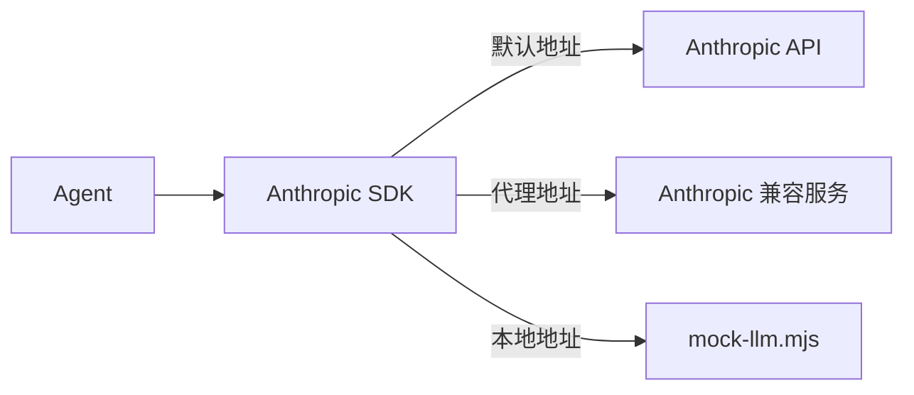

# 本期变更说明
1. 基于 0.4 的反思，本期将控制文档篇幅，重点说明核心设计和关键流程，非核心异常分支与扩展能力不再逐项展开

# 目标
1. 实现 Anthropic 后端
2. 实现文本流式输出
3. 实现工具调用的流式解析
4. 实现流式工具提前与并行执行
5. 实现 Extended Thinking
6. 支持中断当前生成
7. 实现 Prompt Caching

# 1. Anthropic 后端

0.4 使用手写的 `AnthropicLikeClient` 请求本地 Mock。本期将它替换为官方 `@anthropic-ai/sdk`，真实服务与 Mock 统一经过官方 SDK，只通过 `baseURL` 切换请求目标：



## SDK 与官方类型

安装 SDK：

```shell
pnpm add @anthropic-ai/sdk
```

消息、内容块和工具调用直接使用 SDK 类型，不再维护一套不完整的重复定义：

```ts
import Anthropic from "@anthropic-ai/sdk";

export type Message = Anthropic.MessageParam;
export type ContentBlock = Anthropic.ContentBlockParam;
```

Agent 直接持有 SDK 客户端。当前只有一个真实后端，不提前抽象 Provider 层：

```ts
const MODEL = "claude-sonnet-4-6";

this.client = new Anthropic({
  apiKey: options.apiKey ?? process.env.ANTHROPIC_API_KEY,
  // 只使用项目显式配置的 API Key，避免同时发送环境中继承的 Claude Code Token。
  authToken: null,
  baseURL: options.baseURL ?? process.env.ANTHROPIC_BASE_URL,
});

this.model = options.model ?? process.env.ANTHROPIC_MODEL ?? MODEL;
```

SDK 默认请求 Anthropic，也可以通过 `ANTHROPIC_BASE_URL` 连接实现了 Messages API 的兼容服务。官方 SDK 的安装、鉴权和 `messages.create()` 用法见 [Anthropic TypeScript SDK](https://platform.claude.com/docs/en/cli-sdks-libraries/sdks/typescript)。

## 调用 Messages API

这一阶段只把现有非流式调用迁移到官方 SDK，Agent Loop 不变：

```ts
const reply = await this.client.messages.create({
  model: this.model,
  max_tokens: 4096,
  system: this.systemPrompt,
  tools: toolDefinitions,
  messages: this.messages,
});
```

模型返回 `tool_use` 后，Agent 仍执行本地工具并把 `tool_result` 追加到消息历史，直到模型不再调用工具。

## 使用兼容服务

无法直接使用 Anthropic API 时，可以连接 Anthropic 格式的代理服务。例如 AIHubMix：

```shell
export ANTHROPIC_API_KEY="<AIHUBMIX_API_KEY>"
export ANTHROPIC_BASE_URL="https://aihubmix.com"
export ANTHROPIC_MODEL="claude-sonnet-4-6"
```

或使用 DeepSeek 的 Anthropic 兼容接口：

```shell
export ANTHROPIC_API_KEY="<DEEPSEEK_API_KEY>"
export ANTHROPIC_BASE_URL="https://api.deepseek.com/anthropic"
export ANTHROPIC_MODEL="deepseek-v4-pro"
```

两者都可以通过官方 Anthropic SDK 调用；兼容范围分别见 [AIHubMix Anthropic API 兼容说明](https://docs.aihubmix.com/cn/api/Anthropic-Compatible)和 [DeepSeek Anthropic API](https://api-docs.deepseek.com/guides/anthropic_api)。

## 唯一 Mock 路径

项目只保留 `mock/mock-llm.mjs` 这一种 Mock。启动服务：

```shell
node mock/mock-llm.mjs
```

然后把官方 SDK 指向它：

```shell
ANTHROPIC_API_KEY=mock \
ANTHROPIC_BASE_URL=http://127.0.0.1:<实际端口> \
ANTHROPIC_MODEL=mock \
pnpm run cli -- "读取 greeting.txt"
```

单元测试和 CLI 测试同样使用这条路径，不再保留手写客户端或测试专用 HTTP 实现。

本节只完成官方 SDK 与 Anthropic Messages API 的接入。文本流式输出在下一节实现，流式工具调用和中断将在后续目标中实现。

# 2. 文本流式输出

非流式调用必须等待完整响应后才能显示文本。本阶段把 Agent 的模型调用统一改为 `messages.stream()`。兼容服务返回的分片可能突发到达，因此文本先进入一个很小的平滑队列，再以每 10ms 一个字符的节奏写入终端：

```ts
private async callAnthropicStream(): Promise<Anthropic.Message> {
  const writer = new SmoothTextWriter();
  const stream = this.client.messages.stream({
    model: this.model,
    max_tokens: 4096,
    system: this.systemPrompt,
    tools: toolDefinitions,
    messages: this.messages,
  });

  stream.on("text", (text) => {
    writer.write(text);
  });

  let reply: Anthropic.Message;
  try {
    reply = await stream.finalMessage(); // 将 SSE 事件恢复完整的 `Anthropic.Message` ，给其他环节使用，避免流式渲染造成影响
  } finally {
    await writer.finish();
  }

  if (writer.hasText) process.stdout.write("\n"); // 有文本输出，那么在后面补一个空行，纯工具行不会有这个空行
  return reply;
}
```

这里同时使用流和完整消息：

- `text` 事件只负责把字符加入 `SmoothTextWriter`，不关心服务端原始分片大小。
- `SmoothTextWriter` 每 10ms 输出一个 Unicode 字符，让突发到达的分片平滑显示。
- 流结束后先排空队列再返回，避免回答尾部丢失；代价是可能增加少量显示延迟。
- `finalMessage()` 把 SSE 事件恢复成完整的 `Anthropic.Message`，后续历史保存和工具调用逻辑保持不变。
- 只有实际输出过文本才在流结束后补换行，纯工具响应不会产生空行。
- 工具调用后的下一次模型请求也经过同一个流式方法。

因此，会话中仍然只保存完整的 Anthropic 消息，Session 结构无需改变。流中途失败时，已经显示的文本保留，但残缺的 assistant 消息不会写入历史。

## `SmoothTextWrite`
```ts
class SmoothTextWriter {
  private characters: string[] = [];
  private timer: ReturnType<typeof setTimeout> | undefined;
  private ended = false;
  private resolveDrained!: () => void;
  private drained: Promise<void>;
  hasText = false;

  constructor() {
    this.drained = new Promise((resolve) => {
      this.resolveDrained = resolve;
    });
  }

  write(text: string): void {
    const characters = Array.from(text);
    if (characters.length === 0) return;

    this.hasText = true;
    this.characters.push(...characters);
    this.pump();
  }

  finish(): Promise<void> {
    this.ended = true;
    this.resolveIfDrained();
    return this.drained;
  }

  private pump(): void {
    if (this.timer || this.characters.length === 0) return;

    process.stdout.write(this.characters.shift()!); // 从 characters 数组中不断取出文字显示
    this.timer = setTimeout(() => {
      this.timer = undefined;
      this.pump();
      this.resolveIfDrained();
    }, SMOOTH_OUTPUT_INTERVAL_MS); // 按固定时间间隔开始下一次 pump
  }

  // 判断是否达成终止条件，所有数据输出完成，此时将 promise 改为完成态
  private resolveIfDrained(): void {
    if (this.ended && !this.timer && this.characters.length === 0) {
      this.resolveDrained();
    }
  }
}
```

## 效果验证
```bash
pnpm run cli -- --print "请用中文写一段约 300 字的 TypeScript 简介"
```

# 3. 工具调用的流式解析

`finalMessage()` 可以还原完整工具调用，但只能在整条响应结束后返回。为了给下一阶段的工具提前执行提供入口，本阶段在单个 `tool_use` block 完成时立即产生通知。

Anthropic 工具参数会经过 `content_block_start`、多个 `input_json_delta` 和 `content_block_stop` 到达。

官方 SDK 已经负责累积并解析这些参数，所以这里直接使用 `streamEvent` 提供的消息快照，不再手动拼接 JSON：

```ts
private async callAnthropicStream(
  onToolBlockComplete?: (block: Anthropic.ToolUseBlock) => void,
): Promise<Anthropic.Message> {
  // ...
  stream.on("streamEvent", (event, snapshot) => {
    // 这个判断很关键，我们只在完整解析之后才去取到所有的工具
    // 1. message_start —— 空消息
    // 2. content_block_start ——开始阶段
    // 3. content_block_delta ——增量阶段
    // 4. content_block_stop ——完整Block，input已经被SDK解析
    // 5. message_delta ——和工具参数无关
    // 6. message_stop ——整条消息响应结束，这个时候处理就迟了，无法为提前执行做准备
    if (event.type !== "content_block_stop") return;

    const block = snapshot.content[event.index];
    // content 是一个数组，里面有多个内容块，但 content_block 就是具体的内容块，一次只会是一种类型，比如说 文字或工具，不会同时有多个工具
    if (block?.type === "tool_use") {
      onToolBlockComplete?.(block);
    }
  });
  // ...
}
```

Agent Loop 使用流中收集的工具块作为唯一执行来源：

```ts
const toolUses: Anthropic.ToolUseBlock[] = [];
const reply = await this.callAnthropicStream((block) => {
  toolUses.push(block);
});

this.messages.push({ role: "assistant", content: reply.content });

for (const toolUse of toolUses) {
  // 当前仍然等完整响应结束后才执行
}
```

这里区分了两个用途：

- `content_block_stop` 快照负责得到当前轮需要执行的完整工具调用。
- `finalMessage()` 负责保存完整 assistant 历史。

不再从 `reply.content` 二次提取工具，也不增加协议兼容兜底，避免形成两条执行路径。当前只处理普通 `tool_use`；文本、Thinking 和服务端工具块不会触发回调。

Mock 会把每个工具参数拆成多个 `input_json_delta`，并用同一响应中的多个工具块验证参数还原和顺序。真实 DeepSeek 验收同样可以在一条响应中解析两个工具调用并返回两个对应的 `tool_result`。

本节只完成解析和收集，工具仍在整个模型响应结束后执行。下一节再利用同一个完成回调启动工具提前执行。

# 4. 流式工具提前与并行执行

工具参数在 `content_block_stop` 时已经完整，不需要继续等待整条响应。为了利用这段流式窗口，本阶段让无副作用工具立即启动，并让多个读取任务自然并行。

## 工具自描述与顺序屏障

并发安全性属于工具自身的行为契约，而不是 Agent Loop 维护的工具名白名单。`Tool` 使用函数属性描述这一能力，同一个工具以后也可以根据输入采用不同判断：

```ts
type Tool = ToolDef & {
  execute: ToolHandler;
  validateInput?: ToolValidator;
  isConcurrencySafe?: (input: Record<string, unknown>) => boolean;
};
```

只读工具在自己的定义中声明：

```ts
export const readFileTool: Tool = {
  name: "read_file",
  isConcurrencySafe: () => true,
  // ...
};
```

执行器通过工具系统查询，不直接了解具体工具：

```ts
export function isToolConcurrencySafe(
  name: string,
  input: Record<string, unknown>,
): boolean {
  return toolMap.get(name)?.isConcurrencySafe?.(input) ?? false;
}
```

未声明和未知工具默认返回 `false`。当前 `read_file`、`list_files`、`grep_search`、`web_fetch` 声明为并发安全；`write_file`、`edit_file` 和 `run_shell` 可能产生副作用，因此不会提前执行，并且会形成顺序屏障。例如：

```text
read A → write B → read C → read D
```

实际调度为：

```text
[read A 提前执行] → [write B 顺序执行] → [read C || read D 并行执行]
```

这样既不会让 `read C` 越过写操作读到旧内容，也能让连续的安全工具并行。

## StreamingToolExecutor
### 调用
调度逻辑集中在 `StreamingToolExecutor`，Agent Loop 只负责把完整工具块交给它：

```ts
const toolExecutor = new StreamingToolExecutor({
  readFileState: this.readFileState,
});

const reply = await this.callAnthropicStream((block) => {
  toolExecutor.accept(block);
});

this.messages.push({ role: "assistant", content: reply.content });

const results = await toolExecutor.finish();
if (results.length === 0) return;

this.messages.push({ role: "user", content: results });
```

执行器分为两个阶段：

- `accept(block)` 按生成顺序记录工具。第一个屏障前的安全工具立即启动，并把 Promise 保存到 `earlyExecutions`。
- `finish()` 复用已经启动的 Promise；剩余连续安全工具通过 `Promise.all` 执行，副作用工具逐个执行。

提前执行以 `tool_use.id` 为键：

```ts
this.earlyExecutions.set(block.id, this.executeBlock(block));
```

因此同一个工具名可以被调用多次，而且流结束后只会等待原 Promise，不会重复执行。即使并行任务完成顺序不同，最终 `tool_result` 仍按原始工具块顺序生成，保持与 `tool_use_id` 的对应关系。

工具开始执行时不立即打印日志，避免和仍在平滑输出的文本相互穿插；流结束后再按原始顺序显示工具调用。

当前工具会把文件不存在、命令失败和请求超时等预期错误转换成普通结果交还模型。若模型流中断，已经启动的安全工具可能自行运行到结束，但结果不会写入历史；统一取消模型和工具任务留到第 6 项实现。

自动测试使用可控 Promise 验证了以下行为：

- 安全工具在完整模型消息返回前启动。
- 多个安全工具同时运行。
- 副作用工具阻止后续工具越过屏障。
- 并行任务完成顺序不会改变结果顺序。
- 每个 `tool_use.id` 只执行一次。

### 定义
```ts
type ToolExecutor = (
  name: string,
  input: Record<string, unknown>,
  context: ToolContext,
) => Promise<string>;

export class StreamingToolExecutor {
  private toolUses: Anthropic.ToolUseBlock[] = [];
  private earlyExecutions = new Map<string, Promise<string>>(); // 将需要执行的Promise通过Map存储起来，方便快速通过id获取使用
  private reachedExecutionBarrier = false;
  private context: ToolContext;
  private execute: ToolExecutor;

  constructor(
    context: ToolContext,
    execute: ToolExecutor = executeTool, // 默认使用原来的执行器
  ) {
    this.context = context;
    this.execute = execute;
  }

  accept(block: Anthropic.ToolUseBlock): void {
    this.toolUses.push(block);

    if (!this.isConcurrencySafe(block)) {
      this.reachedExecutionBarrier = true; // 到达安全屏障
      return;
    }

    if (!this.reachedExecutionBarrier) {
      // 注意这里，我们已经提前执行了，只是将Promise对象存储进Map，方便后续取用
      this.earlyExecutions.set(block.id, this.executeBlock(block)); // 没有到达安全屏障前可以连续执行
    }
  }

  async finish(): Promise<Anthropic.ToolResultBlockParam[]> {
    const results: Anthropic.ToolResultBlockParam[] = [];
    let index = 0;

    while (index < this.toolUses.length) {
      const toolUse = this.toolUses[index];
      const earlyExecution = this.earlyExecutions.get(toolUse.id);

      if (earlyExecution) {
        this.logToolUse(toolUse);
        // 注意这里的 await earlyExecution ， Promise方法之前已经执行了，我们现在只是等待获取它的执行结果，这里保存的不是方法，而是Promise对象
        results.push(this.toToolResult(toolUse, await earlyExecution)); 
        index++;
        continue;
      }

      if (!this.isConcurrencySafe(toolUse)) {
        this.logToolUse(toolUse);
        // 注意这里，非并发方法我们会等待执行，直到完成
        results.push(this.toToolResult(toolUse, await this.executeBlock(toolUse)));
        index++;
        continue;
      }

      const batch: Anthropic.ToolUseBlock[] = [];
      // 没有提前执行 且 并发安全的工具会放到 batch 数组里，等会并发一起执行
      // 按这个条件，要么工具都执行完成了，要么碰到安全屏障，此时会停止
      // 另外需要注意一点的是 提前执行的工具不会放到批量执行里，避免重复执行
      while (
        index < this.toolUses.length
        && this.isConcurrencySafe(this.toolUses[index])
        && !this.earlyExecutions.has(this.toolUses[index].id)
      ) {
        batch.push(this.toolUses[index]);
        index++;
      }

      for (const toolUse of batch) this.logToolUse(toolUse);
      // 批量执行
      const outputs = await Promise.all(batch.map((toolUse) => this.executeBlock(toolUse)));
      results.push(
        ...batch.map((toolUse, batchIndex) => this.toToolResult(toolUse, outputs[batchIndex])),
      );
    }

    return results;
  }

  private isConcurrencySafe(block: Anthropic.ToolUseBlock): boolean {
    return isToolConcurrencySafe(
      block.name,
      block.input as Record<string, unknown>,
    );
  }

  private executeBlock(block: Anthropic.ToolUseBlock): Promise<string> {
    return this.execute(
      block.name,
      block.input as Record<string, unknown>,
      this.context,
    );
  }

  private logToolUse(block: Anthropic.ToolUseBlock): void {
    console.log(`  -> ${block.name}(${JSON.stringify(block.input)})`);
  }

  private toToolResult(
    block: Anthropic.ToolUseBlock,
    output: string,
  ): Anthropic.ToolResultBlockParam {
    return {
      type: "tool_result",
      tool_use_id: block.id,
      content: output,
    };
  }
}
```