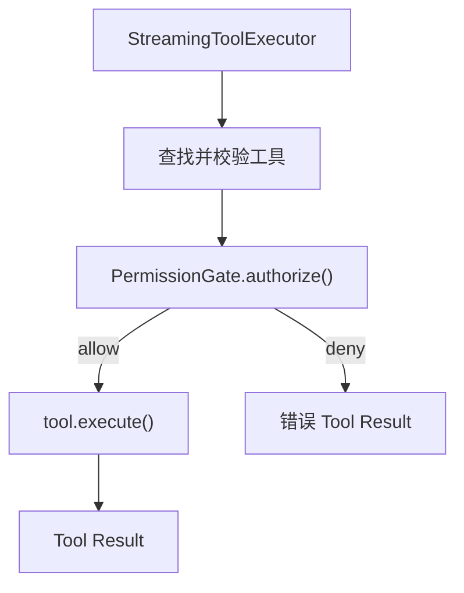
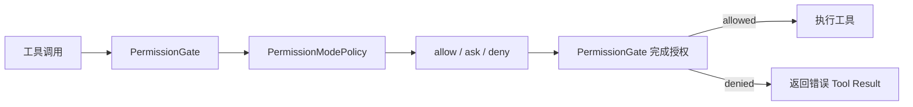

# 本期变更说明

0.6 聚焦 Agent 的权限与安全：让所有工具调用在执行前经过统一的权限判断，并通过权限模式、配置规则和用户确认控制 Agent 可以做什么。

本期仍以快速复现核心功能和关键技术为目标。具体匹配算法、交互细节和代码结构将在各目标开始实现前分别对齐，不在目标阶段提前展开。

# 对齐基线

本期以当前 [Claude Code 权限系统](https://code.claude.com/docs/en/permissions) 和 [权限模式](https://code.claude.com/docs/en/permission-modes) 的公开行为为主要基线

# 目标

1. 实现统一的工具权限门禁：所有工具调用在执行前先得到允许、询问或拒绝的权限结论。
2. 实现权限模式：支持 `default`、`acceptEdits`、`plan`、`dontAsk` 和 `bypassPermissions`。
3. 实现可配置权限规则：支持 `allow`、`ask`、`deny`，以及用户级、项目级和本地项目配置。
4. 实现基于工具语义的权限判断：区分读取、编辑、Shell 和网络访问，只自动放行能够确定安全的操作。
5. 实现用户确认与授权记忆：支持单次、会话级和持久授权，并把拒绝结果返回给模型继续处理。
6. 实现工作目录与保护路径边界：区分工作目录内外访问，并保护 Git 元数据和 Agent 配置等敏感路径。
7. 实现项目目录信任：首次进入项目时确认是否信任，未信任前不采用项目提供的自动授权配置。

# 1. 统一工具权限门禁

权限不能只依赖 System Prompt，也不能分散在 Agent Loop 和各个工具中。本阶段把 `executeTool()` 设为唯一的工具执行边界，所有工具在真正执行前都必须经过同一个 `PermissionGate`：



## 权限裁决与授权

`PermissionPolicy` 只根据工具请求返回原始结论，不执行工具，也不负责终端交互：

```ts
type PermissionDecision =
  | { behavior: "allow" }
  | { behavior: "ask"; reason: string }
  | { behavior: "deny"; reason: string };

type PermissionPolicy = {
  evaluate(request: PermissionRequest):
    | PermissionDecision
    | Promise<PermissionDecision>;
};
```

`PermissionGate.authorize()` 消费这个结论。`allow` 和 `deny` 可以直接得到最终结果；`ask` 则等待注入的 `PermissionPrompter`：

```ts
async authorize(request: PermissionRequest): Promise<PermissionAuthorization> {
  const decision = await waitForPermissionStep(
    () => this.policy.evaluate(request),
    request.signal,
  );

  if (decision.behavior === "allow") return { allowed: true };
  if (decision.behavior === "deny") {
    return { allowed: false, reason: decision.reason };
  }

  const confirmed = await waitForPermissionStep(
    () => this.prompter.confirm(request, decision.reason),
    request.signal,
  );
  return confirmed
    ? { allowed: true }
    : { allowed: false, reason: `User denied permission: ${decision.reason}` };
}
```

`waitForPermissionStep()` 让异步策略或确认器的等待过程也响应当前轮次的 `AbortSignal`，因此用户中断时不会卡在尚未完成的权限判断上。

Policy 与 Prompter 分开后，权限规则不依赖终端，单元测试也可以注入固定结论和确认结果。真实确认界面和授权记忆将在目标 5 实现；当前没有确认器时，`ask` 默认拒绝，不会静默放行。

## Agent 持有门禁

每个 Agent 持有自己的 `PermissionGate`，再通过 `ToolContext` 传入工具执行链：

```ts
type ToolContext = {
  cwd: string;
  permissionGate: PermissionGate;
  readFileState: Map<string, number>;
  signal?: AbortSignal;
};
```

门禁是必填依赖，`executeTool()` 在缺少门禁时直接报错，避免出现“没有配置权限系统就默认执行”的旁路。完成目标 2 后，Agent 不再使用 Allow-All Policy，而是创建默认模式为 `default` 的 `PermissionModePolicy` 并注入 `PermissionGate`。后续切换权限模式只修改这个 Policy 的当前状态，不需要再次改造工具执行链。

原始 `tools` 数组不再从 `src/tools/index.ts` 导出，业务代码只能调用 `executeTool()`

## 校验、授权和执行顺序

`executeTool()` 先完成无副作用的输入校验，再检查权限，最后才调用可能读写文件、访问网络或执行 Shell 的 handler：

```ts
const tool = toolMap.get(name);
if (!tool) return errorResult(`Unknown tool: ${name}`);

const validation = await tool.validateInput?.(input, context);
if (validation && !validation.ok) return errorResult(validation.message);

const authorization = await context.permissionGate.authorize({
  toolName: name,
  input,
  cwd: context.cwd,
  signal: context.signal,
});
if (!authorization.allowed) {
  return errorResult(`Permission denied: ${authorization.reason}`);
}

const result = await tool.execute(input, context);
```

无效参数本来就不能执行，因此不会触发无意义的权限确认；通过校验并获得授权后才会产生工具副作用。

## 结构化工具结果

`executeTool()` 不再只返回字符串，而是统一返回：

```ts
type ToolExecutionResult = {
  content: string;
  isError: boolean;
};
```

权限拒绝、未知工具和校验失败使用 `isError: true`，`StreamingToolExecutor` 将其转换成 Anthropic 的 `is_error: true`。错误仍作为 `tool_result` 加入历史，模型可以换一种方案，Agent Loop 不会因为正常的工具失败退出。

`run_shell` 同步采用结构化结果：退出码为 0 时返回成功；非零退出码、超时和进程启动错误保留 stdout、stderr 与错误原因，并标记为工具错误。

用户中断仍由现有 Signal 流程单独处理。这个行为与 Claude Code 把 Bash 非零退出码归入工具执行失败、随后继续 Agent Loop 的语义一致，参见 [PostToolUseFailure](https://code.claude.com/docs/en/hooks#posttoolusefailure)。

提前执行的工具把包含权限检查在内的完整 Promise 保存在 `earlyExecutions`，`finish()` 复用同一个 Promise，因此每个 `tool_use` 只授权并执行一次。异步 Prompter 也为后续把真实确认延迟到模型流结束后展示保留了接口。

# 2. 权限模式

## 权限模式如何接入现有门禁

权限模式不改变目标 1 建立的工具执行链，只替换 `PermissionGate` 使用的策略。Agent 创建时先生成 `PermissionModePolicy`，再把它注入统一门禁：

```ts
this.permissionModePolicy = new PermissionModePolicy(
  options.permissionMode ?? "default",
);

this.permissionGate = new PermissionGate({
  policy: this.permissionModePolicy,
  prompter: options.permissionPrompter,
});
```

`PermissionModePolicy` 保存当前权限模式，并根据“当前模式 + 工具权限类别”返回 `allow`、`ask` 或 `deny`。`PermissionGate` 继续负责把策略结论转换成最终授权结果，`executeTool()` 不需要感知具体有哪些权限模式。



在交互模式中切换权限模式时，只修改同一个 Policy 保存的当前模式：

```ts
setPermissionMode(mode: PermissionMode): void {
  this.permissionModePolicy.setMode(mode);
}
```

因此模式切换会立即影响后续工具调用，同时不需要重建 Agent、门禁或工具执行器。Agent 始终使用这一个 `PermissionModePolicy` 驱动实际授权，避免出现界面显示已切换、工具却仍按旧策略执行的问题。

## 工具声明权限类别

权限模式不直接判断 `read_file`、`write_file` 等具体工具名称，而是根据工具声明的权限类别进行裁决。目前定义了四种类别：

```ts
type PermissionKind = "read" | "edit" | "shell" | "network";
```

`permissionKind` 是 `Tool` 的必填属性，每个工具在定义时声明自身类别：

```ts
export type Tool = ToolDef & {
  permissionKind: PermissionKind;
  validateInput?: ToolValidator;
  isConcurrencySafe?: (
    input: Record<string, unknown>,
  ) => boolean;
  execute: ToolHandler;
};
```

当前工具分类如下：

| 权限类别 | 工具 |
| --- | --- |
| `read` | `read_file`、`list_files`、`grep_search` |
| `edit` | `write_file`、`edit_file` |
| `shell` | `run_shell` |
| `network` | `web_fetch` |

`executeTool()` 找到工具后，把工具自身声明的类别传给权限门禁：

```ts
const authorization = await context.permissionGate.authorize({
  toolName: name,
  permissionKind: tool.permissionKind,
  input,
  cwd: context.cwd,
  signal: context.signal,
});
```

这样 `PermissionModePolicy` 只需要处理有限且稳定的权限类别，不需要维护工具名称白名单或 `switch` 判断。新增工具时必须在工具定义处明确分类，TypeScript 也会阻止遗漏 `permissionKind` 的工具通过类型检查。

这里的分类只提供工具级别的基础语义。对 Shell 命令、具体路径和网络地址进行更细的安全判断，留到目标 4 实现。

## 五种模式的权限矩阵

`PermissionModePolicy` 使用一张集中矩阵，把权限模式和工具类别转换成 `allow`、`ask` 或 `deny`：

| 权限模式 | `read` | `edit` | `shell` | `network` |
| --- | --- | --- | --- | --- |
| `default` | `allow` | `ask` | `ask` | `ask` |
| `acceptEdits` | `allow` | `allow` | `ask` | `ask` |
| `plan` | `allow` | `deny` | `deny` | `ask` |
| `dontAsk` | `allow` | `deny` | `deny` | `deny` |
| `bypassPermissions` | `allow` | `allow` | `allow` | `allow` |

矩阵在代码中使用完整的 `Record` 类型声明：

```ts
const MODE_BEHAVIORS: Record<
  PermissionMode,
  Record<PermissionKind, PermissionBehavior>
> = {
  // 五种模式的完整映射
};
```

这种结构把所有模式差异集中在一个位置。新增权限模式或工具类别时，如果没有补齐对应关系，TypeScript 会直接报错，避免权限逻辑散落在 Agent、CLI 和各个工具中。

`evaluate()` 只读取当前模式和工具类别：

```ts
evaluate(request: PermissionRequest): PermissionDecision {
  const behavior =
    MODE_BEHAVIORS[this.mode][request.permissionKind];

  if (behavior === "allow") return { behavior };

  return {
    behavior,
    reason: `Permission mode "${this.mode}" ${
      behavior === "ask" ? "requires confirmation for" : "blocks"
    } ${request.permissionKind} tools`,
  };
}
```

`bypassPermissions` 也不会绕过 `PermissionGate`，只是矩阵对所有工具类别都返回 `allow`。因此所有模式仍然共用同一条权限执行链。

当前用户确认界面尚未实现，所以 `ask` 会由默认 Prompter 拒绝。目标 5 接入真实确认界面后，权限矩阵不需要修改。

## Agent 保存并切换当前模式

`PermissionModePolicy` 是一个带状态的策略对象，内部保存当前 `PermissionMode`。Agent 通过它读取和修改本次运行使用的权限模式：

```ts
getPermissionMode(): PermissionMode {
  return this.permissionModePolicy.getMode();
}

setPermissionMode(mode: PermissionMode): void {
  if (this.isProcessing()) {
    throw new Error("Agent 正在处理请求，不能切换权限模式");
  }

  if (
    mode === "bypassPermissions"
    && !this.bypassPermissionsAvailable
  ) {
    throw new Error(
      "bypassPermissions 未启用，请使用 "
      + "--allow-dangerously-skip-permissions 重新启动",
    );
  }

  this.permissionModePolicy.setMode(mode);
}
```

切换前有两个限制：

1. Agent 正在处理请求时不能切换，避免同一轮“模型请求 → 工具执行 → 再次请求模型”中途使用两套权限规则。
2. `bypassPermissions` 必须在启动时明确开放，普通交互会话不能直接切换到完全放行模式。

Agent 创建时记录危险模式是否可用：

```ts
this.bypassPermissionsAvailable =
  options.allowDangerouslySkipPermissions === true
  || this.permissionModePolicy.getMode()
    === "bypassPermissions";
```

显式以 `bypassPermissions` 启动，也会自动保留后续切回该模式的能力。其他模式可以在空闲时自由切换，修改会立即影响下一次工具授权。

当前模式只保存在 Agent 实例中，不写入 Session JSONL。恢复历史会话时默认重新使用 `default`，除非本次启动重新传入权限模式，避免旧会话静默恢复之前的危险授权状态。

## 启动参数决定初始模式

CLI 把“本次使用的初始模式”和“是否允许后续进入危险模式”作为两个独立状态传给 Agent：

```ts
agent = new Agent({
  permissionMode: parsed.permissionMode,
  allowDangerouslySkipPermissions:
    parsed.allowDangerouslySkipPermissions,
});
```

三个相关参数的行为不同：

| 启动参数 | 初始模式 | 后续能否切换到 `bypassPermissions` |
| --- | --- | --- |
| 不传参数 | `default` | 否 |
| `--permission-mode <mode>` | 指定模式 | 仅当指定为 `bypassPermissions` 时可以 |
| `--allow-dangerously-skip-permissions` | `default` | 可以 |
| `--dangerously-skip-permissions` | `bypassPermissions` | 可以 |

`--allow-dangerously-skip-permissions` 只开放危险模式入口，不会立即跳过权限检查。它也可以和普通模式组合：

```bash
pnpm run cli -- \
  --permission-mode plan \
  --allow-dangerously-skip-permissions
```

这时 Agent 以 `plan` 启动，但之后可以在 REPL 中主动切换到 `bypassPermissions`。

`--dangerously-skip-permissions` 则会在参数解析阶段同时设置两个状态：

```ts
if (dangerouslySkipPermissions) {
  permissionMode = "bypassPermissions";
  allowDangerouslySkipPermissions = true;
}
```

它不能和其他初始模式同时使用，避免命令行同时表达两种相互冲突的权限状态：

```bash
# 拒绝执行
pnpm run cli -- \
  --permission-mode plan \
  --dangerously-skip-permissions
```

原来的 `--mortis` 别名已经移除。现在传入该参数会直接报告未知参数，不会被误当成用户 Prompt。

## 在 REPL 中切换权限模式

交互模式提供 `/permission-mode` 命令。执行后不会要求用户手动输入模式名称，而是显示固定的编号列表：

```text
选择权限模式:
1. default（当前）
2. acceptEdits
3. plan
4. dontAsk
5. bypassPermissions（未开放）
q. 取消
```

所有可选模式集中定义在一个数组中，菜单展示和编号解析共用同一份数据：

```ts
const PERMISSION_MODE_OPTIONS = [
  "default",
  "acceptEdits",
  "plan",
  "dontAsk",
  "bypassPermissions",
] as const satisfies readonly PermissionMode[];
```

REPL 使用 `selectingPermissionMode` 记录当前是否正在等待模式选择。收到 `/permission-mode` 后进入选择状态，下一行输入不再作为用户 Prompt 发送给模型，而是作为菜单编号处理：

```ts
} else if (input === "/permission-mode") {
  selectingPermissionMode = true;
  showPermissionModeMenu(agent);
  rl.setPrompt(PERMISSION_MODE_PROMPT);
}
```

选择有效编号后，通过 Agent 的统一接口完成切换：

```ts
const mode =
  PERMISSION_MODE_OPTIONS[Number(input) - 1];

agent.setPermissionMode(mode);
selectingPermissionMode = false;
process.stdout.write(`权限模式: ${mode}\n`);
```

无效编号会继续等待输入，`q` 会取消选择。未在启动时开放 `bypassPermissions` 时，菜单会把它标记为“未开放”，选择该项也不会调用模式切换。

REPL 的提前检查用于提供友好的提示，`Agent.setPermissionMode()` 仍会再次验证危险模式权限，保证其他调用方不能绕过限制。

`/status` 会读取 Agent 当前状态并显示实际生效的模式：

```text
权限模式: plan
```

切换只影响当前进程中的后续工具调用，不修改已经完成的历史消息，也不会写入 Session JSONL。

## 与 Claude Code 当前行为的差异

当前实现复现了权限模式的核心裁决和切换机制，但没有完整复制 Claude Code 的全部模式行为。主要差异如下：

| 行为 | Claude Code | 当前实现 |
| --- | --- | --- |
| 交互切换 | 使用 `Shift+Tab` 循环 `default`、`acceptEdits`、`plan`，并加入已开放的可选模式；`dontAsk` 不参与循环 | 使用 `/permission-mode` 打开五种模式的编号菜单 |
| `acceptEdits` | 自动允许文件编辑以及工作目录内的常见文件操作命令 | 自动允许 `edit` 工具，所有 `shell` 工具仍为 `ask` |
| `plan` | 允许读取文件和执行只读 Shell 命令，并包含计划生成与批准流程 | 允许 `read`，拒绝全部 `edit` 和 `shell`；只实现权限限制，不实现完整计划工作流 |
| `bypassPermissions` | 跳过权限层，但仍保留根目录和 Home 目录删除的熔断检查 | 仍经过 `PermissionGate`，由 Mode Policy 对全部工具返回 `allow`；尚无特殊路径熔断 |
| 默认模式 | 可以通过 `settings.json` 的 `permissions.defaultMode` 持久配置 | 仅由本次启动参数决定，默认使用 `default` |

Claude Code 的当前模式行为参见[权限模式](https://code.claude.com/docs/en/permission-modes)和[CLI 参数](https://code.claude.com/docs/en/cli-usage)。

这些差异符合当前快速复现目标：Shell 命令的细粒度语义判断留到目标 4，持久配置留到目标 3，保护路径与危险删除边界留到目标 6。完整的 Plan 工作流和原始终端快捷键不属于本次权限模式实现。

## 权限模式的测试覆盖

权限模式分别从策略、工具、Agent 和 CLI 四个层级进行验证。

`PermissionModePolicy` 测试会遍历五种模式和四种工具类别，检查完整的 20 组裁决结果，避免只覆盖常用模式：

```ts
for (const [mode, kinds] of Object.entries(
  expectedBehaviors,
)) {
  const policy = new PermissionModePolicy(mode);

  for (const [kind, behavior] of Object.entries(kinds)) {
    assert.equal(
      policy.evaluate(createRequest(kind)).behavior,
      behavior,
    );
  }
}
```

工具测试检查每个已注册工具都声明了正确的 `permissionKind`，并验证 `executeTool()` 会把该类别传给 `PermissionGate`。

Agent 集成测试使用同一个 Agent 和同一个写文件工具：

1. 先在 `plan` 模式下调用，确认文件未创建，并向模型返回权限错误。
2. 切换为 `acceptEdits`。
3. 再次调用，确认文件被真实创建。

这条测试不仅验证 `getPermissionMode()` 的返回值，也验证模式切换确实改变了实际工具授权结果。

CLI 测试覆盖初始模式参数、危险参数冲突、`--mortis` 移除、REPL 编号选择、无效输入重试，以及未开放时不能切换到 `bypassPermissions`。

完整验证命令为：

```bash
pnpm test
pnpm run typecheck
```

# 3. 可配置权限规则

## 配置来源与加载顺序

Agent 创建时调用 `loadPermissionSettings()`，一次性读取当前工作目录对应的权限配置：

```ts
const permissionSettings = options.permissionSettings
  ?? loadPermissionSettings({ cwd: this.cwd });
```

当前支持三种配置来源：

| 加载顺序 | 配置范围 | 文件位置 |
| --- | --- | --- |
| 1 | 用户级 | `~/.mo-code/settings.json` |
| 2 | 项目级 | `<project>/.mo-code/settings.json` |
| 3 | 本地项目级 | `<project>/.mo-code/settings.local.json` |

项目配置从 `cwd` 开始向上查找，使用最近一个包含上述项目配置文件的 `.mo-code` 目录。找到后便停止，不继续合并外层项目的配置；缺失的配置文件直接忽略。

三层配置中的规则数组按加载顺序合并。`permissions.defaultMode` 是单值配置，后加载的层级覆盖前面的层级；本次启动显式传入的 CLI 模式仍具有最高优先级：

```ts
this.permissionModePolicy = new PermissionModePolicy(
  options.permissionMode
    ?? permissionSettings.defaultMode
    ?? "default",
);
```

配置只在 Agent 创建时加载一次，不进行热更新；恢复历史会话时会重新读取当前配置，权限规则本身不会写入 Session JSONL。配置文件不存在属于正常情况；JSON 损坏或权限配置结构错误会终止 Agent 创建，CLI 报错后不再调用模型。

项目目录信任要到目标 7 才实现，因此当前暂时把所在项目视为已信任，会直接加载项目级和本地项目级配置。

## 配置文件结构与解析结果

三个层级使用相同的 JSON 结构。权限相关内容统一放在 `permissions` 中：

```json
{
  "permissions": {
    "defaultMode": "default",
    "allow": [
      "read_file",
      "run_shell(pnpm test)"
    ],
    "ask": [
      "web_fetch(*)"
    ],
    "deny": [
      "read_file(.env)"
    ]
  }
}
```

`allow`、`ask` 和 `deny` 必须是字符串数组，`defaultMode` 必须是五种有效权限模式之一。配置根节点或 `permissions` 不是对象、规则数组中包含非字符串值，都会被视为无效配置；权限配置之外的字段暂时忽略，方便后续在同一个设置文件中加入其他功能。

加载器不会直接决定规则是否匹配，而是先把每条字符串展开成带来源信息的统一结构：

```ts
type PermissionRuleSetting = {
  behavior: "allow" | "ask" | "deny";
  raw: string;
  sourceScope: "user" | "project" | "local";
  sourcePath: string;
};
```

例如项目配置中的 `"deny": ["read_file(.env)"]` 会被转换成：

```ts
{
  behavior: "deny",
  raw: "read_file(.env)",
  sourceScope: "project",
  sourcePath: "/project/.mo-code/settings.json",
}
```

保留 `raw` 和 `sourcePath` 后，后续规则解析失败或工具被拒绝时，可以明确指出是哪条规则、来自哪个配置文件。`.mo-code/settings.local.json` 用于只在当前机器生效的设置，已经加入 `.gitignore`，避免误提交个人授权。

## 规则语法与预编译

每条权限规则支持两种写法：

```text
tool
tool(specifier)
```

裸工具名匹配这个工具的全部调用：

```text
read_file
```

带 `specifier` 的规则只匹配指定目标：

```text
read_file(.env)
run_shell(pnpm test)
web_fetch(https://api.example.com/*)
```

`specifier` 中的 `*` 可以出现在任意位置，表示任意长度的字符；没有 `*` 时按完整目标精确匹配。它不是正则表达式，因此 `+`、`?`、`.` 等字符都按普通文本处理。

Agent 创建 `PermissionRulePolicy` 时，会一次性调用 `compileRule()` 解析全部规则，而不是在每次工具调用时重新解析。编译后的结构保存工具名和目标匹配器：

```ts
type CompiledPermissionRule = PermissionRuleSetting & {
  toolName: string;
  matchesRequest:
    | ((request: PermissionRequest) => boolean)
    | undefined;
};
```

裸工具规则没有目标限制，因此 `matchesRequest` 为 `undefined`；带 `specifier` 的规则则生成对应的匹配函数。

预编译时会拒绝空规则、括号不完整、空 `specifier` 和未知工具名。已知工具名直接来自当前注册的 `toolDefinitions`：

```ts
new PermissionRulePolicy(
  permissionSettings.rules,
  this.permissionModePolicy,
  toolDefinitions.map((tool) => tool.name),
);
```

因此拼错工具名不会等到执行时才被忽略，而是让 Agent 启动失败，并通过规则保留的 `raw` 和 `sourcePath` 指出具体错误位置。

## 工具生成权限匹配目标

不同工具的输入结构不同：文件工具使用 `file_path`，Shell 使用 `command`，网络工具使用 `url`。权限策略不逐个判断这些字段，而是要求每个工具通过 `getPermissionTarget()` 声明本次调用真正要操作的目标：

```ts
type Tool = ToolDef & {
  permissionKind: PermissionKind;
  getPermissionTarget: (
    input: Record<string, unknown>,
    context: ToolContext,
  ) => string;
  // ...
};
```

例如 `run_shell` 直接使用完整命令，`web_fetch` 使用 URL，文件工具则把路径转换成基于 Agent 工作目录的绝对路径：

```ts
getPermissionTarget: (input) =>
  String(input.command ?? "")

getPermissionTarget: (input) =>
  String(input.url ?? "")

getPermissionTarget: (input, context) =>
  normalizePermissionPath(
    context.cwd,
    String(input.file_path ?? ""),
  )
```

`executeTool()` 在输入校验通过后、进入 `PermissionGate` 前生成目标：

```ts
const authorization = await context.permissionGate.authorize({
  toolName: name,
  permissionKind: tool.permissionKind,
  permissionTarget: tool.getPermissionTarget(input, context),
  input,
  cwd: context.cwd,
  signal: context.signal,
});
```

规则中的 `specifier` 表示期望目标，`permissionTarget` 表示当前调用的实际目标。例如 `run_shell(pnpm *)` 会用 `pnpm *` 匹配实际命令 `pnpm test`。

这种设计避免在权限模块中维护按工具名分支的中央映射。新增工具时，工具在注册自身权限类别的同时声明匹配目标，`PermissionRulePolicy` 只处理统一的字符串匹配。

当前文件目标只进行绝对路径和分隔符的词法规范化，不解析符号链接；真实路径和工作目录边界将在目标 6 统一处理。

# 本期不实现

## OS 级沙箱

Claude Code 的沙箱使用操作系统能力限制 Bash 及其子进程能够访问的文件和网络，与应用层权限判断是互补但独立的安全层。本期只实现应用层权限系统，不实现 macOS Seatbelt、Linux namespace 等 OS 级隔离，避免把工作扩展成跨平台执行基础设施。

## Auto Mode 安全分类模型

Claude Code 的 Auto Mode 会使用独立的安全分类模型在后台审查工具调用，从而在减少确认弹窗的同时阻止超出用户意图的操作。它需要额外的模型请求、分类上下文、故障降级和安全评估，会增加费用、延迟与实现复杂度，而且当前仍属于 research preview。

0.6 先完成确定性的权限规则、模式和边界。Auto Mode 更适合在后续“Agent 自主执行”阶段单独实现，不能代替明确的 `deny` 规则和路径保护。

## 企业托管策略

Claude Code 还支持由组织管理员统一下发的 managed settings。它的优先级高于命令行、项目和用户配置，普通用户只能在管理员允许的范围内补充或收紧权限，不能通过项目 `allow` 规则覆盖组织 `deny`，也不能重新开启被管理员禁用的 `bypassPermissions`。

这套机制主要用于统一禁止生产部署、敏感目录访问，或限制可使用的 MCP、插件和 Hook。本项目当前面向本地单用户快速复现，没有组织管理员和策略下发渠道，因此本期不实现企业策略分发、管理员锁定和相关配置来源。
