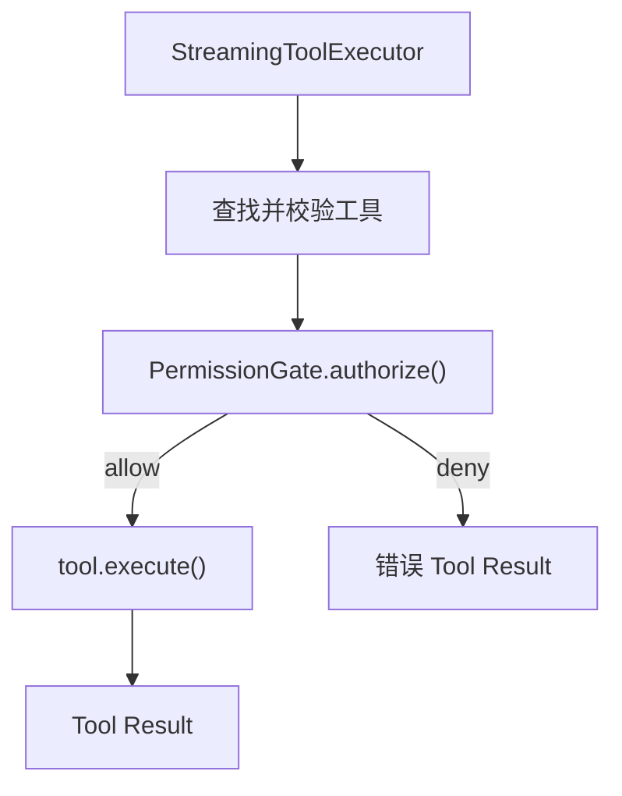
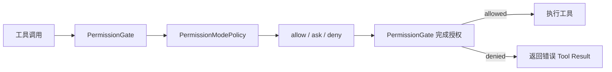

# 本期变更说明

0.6 聚焦 Agent 的权限与安全：让所有工具调用在执行前经过统一的权限判断，并通过权限模式、配置规则和用户确认控制 Agent 可以做什么。

本期仍以快速复现核心功能和关键技术为目标。具体匹配算法、交互细节和代码结构将在各目标开始实现前分别对齐，不在目标阶段提前展开。

# 对齐基线

本期以当前 [Claude Code 权限系统](https://code.claude.com/docs/en/permissions) 和 [权限模式](https://code.claude.com/docs/en/permission-modes) 的公开行为为主要基线

# 目标

1. 实现统一的工具权限门禁：所有工具调用在执行前先得到允许、询问或拒绝的权限结论。
2. 实现权限模式：支持 `default`、`acceptEdits`、`plan`、`dontAsk` 和 `bypassPermissions`。
3. 实现可配置权限规则：支持 `allow`、`ask`、`deny`，以及用户级、项目级和本地项目配置。
4. 实现基于工具语义的权限判断：区分读取、编辑、Shell 和网络访问，只自动放行能够确定安全的操作。
5. 实现用户确认与授权记忆：支持单次、会话级和持久授权，并把拒绝结果返回给模型继续处理。
6. 实现工作目录与保护路径边界：区分工作目录内外访问，并保护 Git 元数据和 Agent 配置等敏感路径。
7. 实现项目目录信任：首次进入项目时确认是否信任，未信任前不采用项目提供的自动授权配置。

# 1. 统一工具权限门禁

权限不能只依赖 System Prompt，也不能分散在 Agent Loop 和各个工具中。本阶段把 `executeTool()` 设为唯一的工具执行边界，所有工具在真正执行前都必须经过同一个 `PermissionGate`：



## 权限裁决与授权

`PermissionPolicy` 只根据工具请求返回原始结论，不执行工具，也不负责终端交互：

```ts
type PermissionDecision =
  | { behavior: "allow" }
  | { behavior: "ask"; reason: string }
  | { behavior: "deny"; reason: string };

type PermissionPolicy = {
  evaluate(request: PermissionRequest):
    | PermissionDecision
    | Promise<PermissionDecision>;
};
```

`PermissionGate.authorize()` 消费这个结论。`allow` 和 `deny` 可以直接得到最终结果；`ask` 则等待注入的 `PermissionPrompter`：

```ts
async authorize(request: PermissionRequest): Promise<PermissionAuthorization> {
  const decision = await waitForPermissionStep(
    () => this.policy.evaluate(request),
    request.signal,
  );

  if (decision.behavior === "allow") return { allowed: true };
  if (decision.behavior === "deny") {
    return { allowed: false, reason: decision.reason };
  }

  const confirmed = await waitForPermissionStep(
    () => this.prompter.confirm(request, decision.reason),
    request.signal,
  );
  return confirmed
    ? { allowed: true }
    : { allowed: false, reason: `User denied permission: ${decision.reason}` };
}
```

`waitForPermissionStep()` 让异步策略或确认器的等待过程也响应当前轮次的 `AbortSignal`，因此用户中断时不会卡在尚未完成的权限判断上。

Policy 与 Prompter 分开后，权限规则不依赖终端，单元测试也可以注入固定结论和确认结果。真实确认界面和授权记忆将在目标 5 实现；当前没有确认器时，`ask` 默认拒绝，不会静默放行。

## Agent 持有门禁

每个 Agent 持有自己的 `PermissionGate`，再通过 `ToolContext` 传入工具执行链：

```ts
type ToolContext = {
  cwd: string;
  permissionGate: PermissionGate;
  readFileState: Map<string, number>;
  signal?: AbortSignal;
};
```

门禁是必填依赖，`executeTool()` 在缺少门禁时直接报错，避免出现“没有配置权限系统就默认执行”的旁路。完成目标 2 后，Agent 不再使用 Allow-All Policy，而是创建默认模式为 `default` 的 `PermissionModePolicy` 并注入 `PermissionGate`。后续切换权限模式只修改这个 Policy 的当前状态，不需要再次改造工具执行链。

原始 `tools` 数组不再从 `src/tools/index.ts` 导出，业务代码只能调用 `executeTool()`

## 校验、授权和执行顺序

`executeTool()` 先完成无副作用的输入校验，再检查权限，最后才调用可能读写文件、访问网络或执行 Shell 的 handler：

```ts
const tool = toolMap.get(name);
if (!tool) return errorResult(`Unknown tool: ${name}`);

const validation = await tool.validateInput?.(input, context);
if (validation && !validation.ok) return errorResult(validation.message);

const authorization = await context.permissionGate.authorize({
  toolName: name,
  input,
  cwd: context.cwd,
  signal: context.signal,
});
if (!authorization.allowed) {
  return errorResult(`Permission denied: ${authorization.reason}`);
}

const result = await tool.execute(input, context);
```

无效参数本来就不能执行，因此不会触发无意义的权限确认；通过校验并获得授权后才会产生工具副作用。

## 结构化工具结果

`executeTool()` 不再只返回字符串，而是统一返回：

```ts
type ToolExecutionResult = {
  content: string;
  isError: boolean;
};
```

权限拒绝、未知工具和校验失败使用 `isError: true`，`StreamingToolExecutor` 将其转换成 Anthropic 的 `is_error: true`。错误仍作为 `tool_result` 加入历史，模型可以换一种方案，Agent Loop 不会因为正常的工具失败退出。

`run_shell` 同步采用结构化结果：退出码为 0 时返回成功；非零退出码、超时和进程启动错误保留 stdout、stderr 与错误原因，并标记为工具错误。

用户中断仍由现有 Signal 流程单独处理。这个行为与 Claude Code 把 Bash 非零退出码归入工具执行失败、随后继续 Agent Loop 的语义一致，参见 [PostToolUseFailure](https://code.claude.com/docs/en/hooks#posttoolusefailure)。

提前执行的工具把包含权限检查在内的完整 Promise 保存在 `earlyExecutions`，`finish()` 复用同一个 Promise，因此每个 `tool_use` 只授权并执行一次。异步 Prompter 也为后续把真实确认延迟到模型流结束后展示保留了接口。

# 2. 权限模式

## 权限模式如何接入现有门禁

权限模式不改变目标 1 建立的工具执行链，只替换 `PermissionGate` 使用的策略。Agent 创建时先生成 `PermissionModePolicy`，再把它注入统一门禁：

```ts
this.permissionModePolicy = new PermissionModePolicy(
  options.permissionMode ?? "default",
);

this.permissionGate = new PermissionGate({
  policy: this.permissionModePolicy,
  prompter: options.permissionPrompter,
});
```

`PermissionModePolicy` 保存当前权限模式，并根据“当前模式 + 工具权限类别”返回 `allow`、`ask` 或 `deny`。`PermissionGate` 继续负责把策略结论转换成最终授权结果，`executeTool()` 不需要感知具体有哪些权限模式。



在交互模式中切换权限模式时，只修改同一个 Policy 保存的当前模式：

```ts
setPermissionMode(mode: PermissionMode): void {
  this.permissionModePolicy.setMode(mode);
}
```

因此模式切换会立即影响后续工具调用，同时不需要重建 Agent、门禁或工具执行器。Agent 始终使用这一个 `PermissionModePolicy` 驱动实际授权，避免出现界面显示已切换、工具却仍按旧策略执行的问题。

## 工具声明权限类别

权限模式不直接判断 `read_file`、`write_file` 等具体工具名称，而是根据工具声明的权限类别进行裁决。目前定义了四种类别：

```ts
type PermissionKind = "read" | "edit" | "shell" | "network";
```

`permissionKind` 是 `Tool` 的必填属性，每个工具在定义时声明自身类别：

```ts
export type Tool = ToolDef & {
  permissionKind: PermissionKind;
  validateInput?: ToolValidator;
  isConcurrencySafe?: (
    input: Record<string, unknown>,
  ) => boolean;
  execute: ToolHandler;
};
```

当前工具分类如下：

| 权限类别 | 工具 |
| --- | --- |
| `read` | `read_file`、`list_files`、`grep_search` |
| `edit` | `write_file`、`edit_file` |
| `shell` | `run_shell` |
| `network` | `web_fetch` |

`executeTool()` 找到工具后，把工具自身声明的类别传给权限门禁：

```ts
const authorization = await context.permissionGate.authorize({
  toolName: name,
  permissionKind: tool.permissionKind,
  input,
  cwd: context.cwd,
  signal: context.signal,
});
```

这样 `PermissionModePolicy` 只需要处理有限且稳定的权限类别，不需要维护工具名称白名单或 `switch` 判断。新增工具时必须在工具定义处明确分类，TypeScript 也会阻止遗漏 `permissionKind` 的工具通过类型检查。

这里的分类只提供工具级别的基础语义。对 Shell 命令、具体路径和网络地址进行更细的安全判断，留到目标 4 实现。

## 五种模式的权限矩阵

`PermissionModePolicy` 使用一张集中矩阵，把权限模式和工具类别转换成 `allow`、`ask` 或 `deny`：

| 权限模式 | `read` | `edit` | `shell` | `network` |
| --- | --- | --- | --- | --- |
| `default` | `allow` | `ask` | `ask` | `ask` |
| `acceptEdits` | `allow` | `allow` | `ask` | `ask` |
| `plan` | `allow` | `deny` | `deny` | `ask` |
| `dontAsk` | `allow` | `deny` | `deny` | `deny` |
| `bypassPermissions` | `allow` | `allow` | `allow` | `allow` |

矩阵在代码中使用完整的 `Record` 类型声明：

```ts
const MODE_BEHAVIORS: Record<
  PermissionMode,
  Record<PermissionKind, PermissionBehavior>
> = {
  // 五种模式的完整映射
};
```

这种结构把所有模式差异集中在一个位置。新增权限模式或工具类别时，如果没有补齐对应关系，TypeScript 会直接报错，避免权限逻辑散落在 Agent、CLI 和各个工具中。

`evaluate()` 只读取当前模式和工具类别：

```ts
evaluate(request: PermissionRequest): PermissionDecision {
  const behavior =
    MODE_BEHAVIORS[this.mode][request.permissionKind];

  if (behavior === "allow") return { behavior };

  return {
    behavior,
    reason: `Permission mode "${this.mode}" ${
      behavior === "ask" ? "requires confirmation for" : "blocks"
    } ${request.permissionKind} tools`,
  };
}
```

`bypassPermissions` 也不会绕过 `PermissionGate`，只是矩阵对所有工具类别都返回 `allow`。因此所有模式仍然共用同一条权限执行链。

当前用户确认界面尚未实现，所以 `ask` 会由默认 Prompter 拒绝。目标 5 接入真实确认界面后，权限矩阵不需要修改。

## Agent 保存并切换当前模式

`PermissionModePolicy` 是一个带状态的策略对象，内部保存当前 `PermissionMode`。Agent 通过它读取和修改本次运行使用的权限模式：

```ts
getPermissionMode(): PermissionMode {
  return this.permissionModePolicy.getMode();
}

setPermissionMode(mode: PermissionMode): void {
  if (this.isProcessing()) {
    throw new Error("Agent 正在处理请求，不能切换权限模式");
  }

  if (
    mode === "bypassPermissions"
    && !this.bypassPermissionsAvailable
  ) {
    throw new Error(
      "bypassPermissions 未启用，请使用 "
      + "--allow-dangerously-skip-permissions 重新启动",
    );
  }

  this.permissionModePolicy.setMode(mode);
}
```

切换前有两个限制：

1. Agent 正在处理请求时不能切换，避免同一轮“模型请求 → 工具执行 → 再次请求模型”中途使用两套权限规则。
2. `bypassPermissions` 必须在启动时明确开放，普通交互会话不能直接切换到完全放行模式。

Agent 创建时记录危险模式是否可用：

```ts
this.bypassPermissionsAvailable =
  options.allowDangerouslySkipPermissions === true
  || this.permissionModePolicy.getMode()
    === "bypassPermissions";
```

显式以 `bypassPermissions` 启动，也会自动保留后续切回该模式的能力。其他模式可以在空闲时自由切换，修改会立即影响下一次工具授权。

当前模式只保存在 Agent 实例中，不写入 Session JSONL。恢复历史会话时默认重新使用 `default`，除非本次启动重新传入权限模式，避免旧会话静默恢复之前的危险授权状态。

## 启动参数决定初始模式

CLI 把“本次使用的初始模式”和“是否允许后续进入危险模式”作为两个独立状态传给 Agent：

```ts
agent = new Agent({
  permissionMode: parsed.permissionMode,
  allowDangerouslySkipPermissions:
    parsed.allowDangerouslySkipPermissions,
});
```

三个相关参数的行为不同：

| 启动参数 | 初始模式 | 后续能否切换到 `bypassPermissions` |
| --- | --- | --- |
| 不传参数 | `default` | 否 |
| `--permission-mode <mode>` | 指定模式 | 仅当指定为 `bypassPermissions` 时可以 |
| `--allow-dangerously-skip-permissions` | `default` | 可以 |
| `--dangerously-skip-permissions` | `bypassPermissions` | 可以 |

`--allow-dangerously-skip-permissions` 只开放危险模式入口，不会立即跳过权限检查。它也可以和普通模式组合：

```bash
pnpm run cli -- \
  --permission-mode plan \
  --allow-dangerously-skip-permissions
```

这时 Agent 以 `plan` 启动，但之后可以在 REPL 中主动切换到 `bypassPermissions`。

`--dangerously-skip-permissions` 则会在参数解析阶段同时设置两个状态：

```ts
if (dangerouslySkipPermissions) {
  permissionMode = "bypassPermissions";
  allowDangerouslySkipPermissions = true;
}
```

它不能和其他初始模式同时使用，避免命令行同时表达两种相互冲突的权限状态：

```bash
# 拒绝执行
pnpm run cli -- \
  --permission-mode plan \
  --dangerously-skip-permissions
```

原来的 `--mortis` 别名已经移除。现在传入该参数会直接报告未知参数，不会被误当成用户 Prompt。

## 在 REPL 中切换权限模式

交互模式提供 `/permission-mode` 命令。执行后不会要求用户手动输入模式名称，而是显示固定的编号列表：

```text
选择权限模式:
1. default（当前）
2. acceptEdits
3. plan
4. dontAsk
5. bypassPermissions（未开放）
q. 取消
```

所有可选模式集中定义在一个数组中，菜单展示和编号解析共用同一份数据：

```ts
const PERMISSION_MODE_OPTIONS = [
  "default",
  "acceptEdits",
  "plan",
  "dontAsk",
  "bypassPermissions",
] as const satisfies readonly PermissionMode[];
```

REPL 使用 `selectingPermissionMode` 记录当前是否正在等待模式选择。收到 `/permission-mode` 后进入选择状态，下一行输入不再作为用户 Prompt 发送给模型，而是作为菜单编号处理：

```ts
} else if (input === "/permission-mode") {
  selectingPermissionMode = true;
  showPermissionModeMenu(agent);
  rl.setPrompt(PERMISSION_MODE_PROMPT);
}
```

选择有效编号后，通过 Agent 的统一接口完成切换：

```ts
const mode =
  PERMISSION_MODE_OPTIONS[Number(input) - 1];

agent.setPermissionMode(mode);
selectingPermissionMode = false;
process.stdout.write(`权限模式: ${mode}\n`);
```

无效编号会继续等待输入，`q` 会取消选择。未在启动时开放 `bypassPermissions` 时，菜单会把它标记为“未开放”，选择该项也不会调用模式切换。

REPL 的提前检查用于提供友好的提示，`Agent.setPermissionMode()` 仍会再次验证危险模式权限，保证其他调用方不能绕过限制。

`/status` 会读取 Agent 当前状态并显示实际生效的模式：

```text
权限模式: plan
```

切换只影响当前进程中的后续工具调用，不修改已经完成的历史消息，也不会写入 Session JSONL。

## 与 Claude Code 当前行为的差异

当前实现复现了权限模式的核心裁决和切换机制，但没有完整复制 Claude Code 的全部模式行为。主要差异如下：

| 行为 | Claude Code | 当前实现 |
| --- | --- | --- |
| 交互切换 | 使用 `Shift+Tab` 循环 `default`、`acceptEdits`、`plan`，并加入已开放的可选模式；`dontAsk` 不参与循环 | 使用 `/permission-mode` 打开五种模式的编号菜单 |
| `acceptEdits` | 自动允许文件编辑以及工作目录内的常见文件操作命令 | 自动允许 `edit` 工具，所有 `shell` 工具仍为 `ask` |
| `plan` | 允许读取文件和执行只读 Shell 命令，并包含计划生成与批准流程 | 允许 `read`，拒绝全部 `edit` 和 `shell`；只实现权限限制，不实现完整计划工作流 |
| `bypassPermissions` | 跳过权限层，但仍保留根目录和 Home 目录删除的熔断检查 | 仍经过 `PermissionGate`，由 Mode Policy 对全部工具返回 `allow`；尚无特殊路径熔断 |
| 默认模式 | 可以通过 `settings.json` 的 `permissions.defaultMode` 持久配置 | 仅由本次启动参数决定，默认使用 `default` |

Claude Code 的当前模式行为参见[权限模式](https://code.claude.com/docs/en/permission-modes)和[CLI 参数](https://code.claude.com/docs/en/cli-usage)。

这些差异符合当前快速复现目标：Shell 命令的细粒度语义判断留到目标 4，持久配置留到目标 3，保护路径与危险删除边界留到目标 6。完整的 Plan 工作流和原始终端快捷键不属于本次权限模式实现。

## 权限模式的测试覆盖

权限模式分别从策略、工具、Agent 和 CLI 四个层级进行验证。

`PermissionModePolicy` 测试会遍历五种模式和四种工具类别，检查完整的 20 组裁决结果，避免只覆盖常用模式：

```ts
for (const [mode, kinds] of Object.entries(
  expectedBehaviors,
)) {
  const policy = new PermissionModePolicy(mode);

  for (const [kind, behavior] of Object.entries(kinds)) {
    assert.equal(
      policy.evaluate(createRequest(kind)).behavior,
      behavior,
    );
  }
}
```

工具测试检查每个已注册工具都声明了正确的 `permissionKind`，并验证 `executeTool()` 会把该类别传给 `PermissionGate`。

Agent 集成测试使用同一个 Agent 和同一个写文件工具：

1. 先在 `plan` 模式下调用，确认文件未创建，并向模型返回权限错误。
2. 切换为 `acceptEdits`。
3. 再次调用，确认文件被真实创建。

这条测试不仅验证 `getPermissionMode()` 的返回值，也验证模式切换确实改变了实际工具授权结果。

CLI 测试覆盖初始模式参数、危险参数冲突、`--mortis` 移除、REPL 编号选择、无效输入重试，以及未开放时不能切换到 `bypassPermissions`。

完整验证命令为：

```bash
pnpm test
pnpm run typecheck
```

# 3. 可配置权限规则

## 配置来源与加载顺序

Agent 创建时调用 `loadPermissionSettings()`，一次性读取当前工作目录对应的权限配置：

```ts
const permissionSettings = options.permissionSettings
  ?? loadPermissionSettings({ cwd: this.cwd });
```

当前支持三种配置来源：

| 加载顺序 | 配置范围 | 文件位置 |
| --- | --- | --- |
| 1 | 用户级 | `~/.mo-code/settings.json` |
| 2 | 项目级 | `<project>/.mo-code/settings.json` |
| 3 | 本地项目级 | `<project>/.mo-code/settings.local.json` |

项目配置从 `cwd` 开始向上查找，使用最近一个包含上述项目配置文件的 `.mo-code` 目录。找到后便停止，不继续合并外层项目的配置；缺失的配置文件直接忽略。

三层配置中的规则数组按加载顺序合并。`permissions.defaultMode` 是单值配置，后加载的层级覆盖前面的层级；本次启动显式传入的 CLI 模式仍具有最高优先级：

```ts
this.permissionModePolicy = new PermissionModePolicy(
  options.permissionMode
    ?? permissionSettings.defaultMode
    ?? "default",
);
```

配置只在 Agent 创建时加载一次，不进行热更新；恢复历史会话时会重新读取当前配置，权限规则本身不会写入 Session JSONL。配置文件不存在属于正常情况；JSON 损坏或权限配置结构错误会终止 Agent 创建，CLI 报错后不再调用模型。

项目目录信任要到目标 7 才实现，因此当前暂时把所在项目视为已信任，会直接加载项目级和本地项目级配置。

## 配置文件结构与解析结果

三个层级使用相同的 JSON 结构。权限相关内容统一放在 `permissions` 中：

```json
{
  "permissions": {
    "defaultMode": "default",
    "allow": [
      "read_file",
      "run_shell(pnpm test)"
    ],
    "ask": [
      "web_fetch(*)"
    ],
    "deny": [
      "read_file(.env)"
    ]
  }
}
```

`allow`、`ask` 和 `deny` 必须是字符串数组，`defaultMode` 必须是五种有效权限模式之一。配置根节点或 `permissions` 不是对象、规则数组中包含非字符串值，都会被视为无效配置；权限配置之外的字段暂时忽略，方便后续在同一个设置文件中加入其他功能。

加载器不会直接决定规则是否匹配，而是先把每条字符串展开成带来源信息的统一结构：

```ts
type PermissionRuleSetting = {
  behavior: "allow" | "ask" | "deny";
  raw: string;
  sourceScope: "user" | "project" | "local";
  sourcePath: string;
};
```

例如项目配置中的 `"deny": ["read_file(.env)"]` 会被转换成：

```ts
{
  behavior: "deny",
  raw: "read_file(.env)",
  sourceScope: "project",
  sourcePath: "/project/.mo-code/settings.json",
}
```

保留 `raw` 和 `sourcePath` 后，后续规则解析失败或工具被拒绝时，可以明确指出是哪条规则、来自哪个配置文件。`.mo-code/settings.local.json` 用于只在当前机器生效的设置，已经加入 `.gitignore`，避免误提交个人授权。

## 规则语法与预编译

每条权限规则支持两种写法：

```text
tool
tool(specifier)
```

裸工具名匹配这个工具的全部调用：

```text
read_file
```

带 `specifier` 的规则只匹配指定目标：

```text
read_file(.env)
run_shell(pnpm test)
web_fetch(https://api.example.com/*)
```

`specifier` 中的 `*` 可以出现在任意位置，表示任意长度的字符；没有 `*` 时按完整目标精确匹配。它不是正则表达式，因此 `+`、`?`、`.` 等字符都按普通文本处理。

Agent 创建 `PermissionRulePolicy` 时，会一次性调用 `compileRule()` 解析全部规则，而不是在每次工具调用时重新解析。编译后的结构保存工具名和目标匹配器：

```ts
type CompiledPermissionRule = PermissionRuleSetting & {
  toolName: string;
  matchesRequest:
    | ((request: PermissionRequest) => boolean)
    | undefined;
};
```

裸工具规则没有目标限制，因此 `matchesRequest` 为 `undefined`；带 `specifier` 的规则则生成对应的匹配函数。

预编译时会拒绝空规则、括号不完整、空 `specifier` 和未知工具名。已知工具名直接来自当前注册的 `toolDefinitions`：

```ts
new PermissionRulePolicy(
  permissionSettings.rules,
  this.permissionModePolicy,
  toolDefinitions.map((tool) => tool.name),
);
```

因此拼错工具名不会等到执行时才被忽略，而是让 Agent 启动失败，并通过规则保留的 `raw` 和 `sourcePath` 指出具体错误位置。

## 工具生成权限匹配目标

不同工具的输入结构不同：文件工具使用 `file_path`，Shell 使用 `command`，网络工具使用 `url`。权限策略不逐个判断这些字段，而是要求每个工具通过 `getPermissionTarget()` 声明本次调用真正要操作的目标：

```ts
type Tool = ToolDef & {
  permissionKind: PermissionKind;
  getPermissionTarget: (
    input: Record<string, unknown>,
    context: ToolContext,
  ) => string;
  // ...
};
```

例如 `run_shell` 直接使用完整命令，`web_fetch` 使用 URL，文件工具则把路径转换成基于 Agent 工作目录的绝对路径：

```ts
getPermissionTarget: (input) =>
  String(input.command ?? "")

getPermissionTarget: (input) =>
  String(input.url ?? "")

getPermissionTarget: (input, context) =>
  normalizePermissionPath(
    context.cwd,
    String(input.file_path ?? ""),
  )
```

`executeTool()` 在输入校验通过后、进入 `PermissionGate` 前生成目标：

```ts
const authorization = await context.permissionGate.authorize({
  toolName: name,
  permissionKind: tool.permissionKind,
  permissionTarget: tool.getPermissionTarget(input, context),
  input,
  cwd: context.cwd,
  signal: context.signal,
});
```

规则中的 `specifier` 表示期望目标，`permissionTarget` 表示当前调用的实际目标。例如 `run_shell(pnpm *)` 会用 `pnpm *` 匹配实际命令 `pnpm test`。

这种设计避免在权限模块中维护按工具名分支的中央映射。新增工具时，工具在注册自身权限类别的同时声明匹配目标，`PermissionRulePolicy` 只处理统一的字符串匹配。

当前文件目标只进行绝对路径和分隔符的词法规范化，不解析符号链接；真实路径和工作目录边界将在目标 6 统一处理。

# 4. 基于工具语义的权限判断

## 为什么还需要工具语义

前面的权限系统通过 `PermissionKind` 区分读取、编辑、Shell 和网络工具，但这种静态分类只能说明“调用了哪类工具”，不能说明“这次调用具体要做什么”。

例如下面的命令都属于 `shell`：

```bash
pwd
git status
rm -rf build
git push
```

如果只根据 `permissionKind: "shell"` 判断，它们只能得到相同的权限结论。这样 `plan` 模式无法自动执行只读命令，`default` 模式也会对每条 Shell 命令进行询问。

本阶段在工具类别之外增加动态语义：

```ts
type ShellCommandSemantics =
  | "readOnly"
  | "mutating"
  | "unknown";
```

`run_shell` 在执行前分析本次命令，并把分类结果放入权限描述：

```text
Shell 命令
  → 语义分类
  → ToolPermissionDescriptor
  → PermissionPolicy
  → allow / ask / deny
```

只有能够确定为 `readOnly` 的命令才可以根据权限模式自动放行。明确修改状态的命令返回 `mutating`；无法可靠理解的命令返回 `unknown`，继续采用原有模式的询问或拒绝行为。

这里的 `readOnly` 只表示命令不会修改状态，不表示它访问的路径已经获得授权。工作目录和保护路径检查将在目标 6 实现。

## 工具统一生成权限描述

目标 2 和目标 3 中，工具分别通过静态的 `permissionKind` 和 `getPermissionTarget()` 提供权限信息。Shell 语义取决于本次输入，如果继续增加一个并行的 `getShellSemantics()`，调用方就需要分别组装多份权限数据。

因此本阶段把它们统一为一个判别联合类型：

```ts
type ToolPermissionDescriptor =
  | {
      permissionKind: "read" | "edit" | "network";
      permissionTarget: string;
    }
  | {
      permissionKind: "shell";
      permissionTarget: string;
      shellSemantics: ShellCommandSemantics;
    };
```

`Tool` 只保留一个权限描述接口：

```ts
type Tool = ToolDef & {
  getPermissionDescriptor(
    input: Record<string, unknown>,
    context: ToolContext,
  ): ToolPermissionDescriptor;

  // ...
};
```

普通工具返回静态类别和当前目标：

```ts
getPermissionDescriptor: (input, context) => ({
  permissionKind: "read",
  permissionTarget: normalizePermissionPath(
    context.cwd,
    String(input.file_path ?? ""),
  ),
})
```

`run_shell` 还会根据本次命令生成动态语义：

```ts
getPermissionDescriptor: (input) => {
  const command = String(input.command ?? "");

  return {
    permissionKind: "shell",
    permissionTarget: command,
    shellSemantics: classifyShellCommand(command),
  };
}
```

`executeTool()` 不再了解不同工具如何生成权限信息，只负责补充公共字段并提交给门禁：

```ts
const permission =
  tool.getPermissionDescriptor(input, context);

const authorization =
  await context.permissionGate.authorize({
    ...permission,
    toolName: name,
    input,
    cwd: context.cwd,
    signal: context.signal,
  });
```

这样新增工具时，权限类别、匹配目标和动态语义都由工具自身提供，Policy 不需要根据工具名称进行硬编码判断。

只读 Shell 的 `permissionKind` 仍然保持为 `shell`，不会改成 `read`。`readOnly` 表示命令语义，而 `read` 表示文件读取工具类别；混用两者会导致规则匹配把 Shell 命令错误地当作文件路径处理。

## Shell 命令的两阶段分类

`classifyShellCommand()` 不直接使用一个正则表达式判断完整命令，而是分成两个阶段：

```text
扫描 Shell 结构
  → 得到多个简单命令
  → 分别判断命令语义
  → 汇总整体结果
```

第一阶段由 `scanShellCommand()` 完成。它识别顶层的以下连接符：

```text
&&  ||  ;  |  |&  &  换行
```

扫描时会跟踪单引号、双引号和反斜杠，因此引号中的连接符不会被错误拆分：

```bash
pwd && git status       # 两个命令
echo "a && b"           # 一个命令
```

扫描器还会记录当前命令是否包含重定向、语法残缺或暂不支持的复杂展开。未闭合引号、命令替换、变量展开、brace 展开和未引用的 glob 都会保守返回 `unknown`：

```bash
echo "$(run-command)"       # unknown
find . "-$ACTION"           # unknown
find . -{delete,print}      # unknown
find . -delet?              # unknown
```

这些展开可能在 Shell 执行前生成新的参数。例如 `-{delete,print}` 可以展开成 `-delete -print`，如果只检查原始字符串，就可能把实际会删除文件的 `find` 命令误判为只读。

单引号和反斜杠转义的内容仍按字面量处理：

```bash
echo '$(run-command)'       # readOnly
echo \*.ts                  # readOnly
```

扫描完成后，分类器汇总所有子命令：

```ts
const classifications =
  scan.segments.map(classifySimpleCommand);

if (classifications.includes("mutating")) {
  return "mutating";
}
if (classifications.includes("unknown")) {
  return "unknown";
}
return "readOnly";
```

因此只有每个子命令都能确定为只读时，整个复合命令才是 `readOnly`：

```bash
pwd && git status       # readOnly
cat file | grep text    # readOnly
pwd && rm file          # mutating
pwd && custom-command   # unknown
```

输出重定向统一视为 `mutating`，输入重定向统一视为 `unknown`。这个分类器只复现关键 Shell 语义，不尝试实现完整的 Shell AST。

## 正向识别只读命令

简单命令完成分词后，分类器先得到实际执行的命令名，再通过正向名单判断它是否具备只读候选资格：

```ts
const READ_ONLY_COMMANDS = new Set([
  "pwd",
  "ls",
  "cat",
  "head",
  "tail",
  "grep",
  "rg",
  "wc",
  "which",
  "file",
  "stat",
  "du",
  "df",
  "echo",
  "printf",
]);
```

这里使用只读白名单，而不是维护危险命令黑名单。危险命令和第三方程序无法被完整穷举，而只读名单只需要承诺项目真正理解的少量命令。

分类顺序如下：

```ts
if (SHELL_WRAPPERS.has(executable)) {
  return "unknown";
}
if (MUTATING_COMMANDS.has(executable)) {
  return "mutating";
}
if (!READ_ONLY_COMMANDS.has(executable)) {
  return "unknown";
}
```

一些行为明确的常见写入命令会直接返回 `mutating`：

```text
rm、mv、cp、mkdir、touch、chmod、tee、dd
```

没有进入只读名单，也没有被明确识别为修改操作的命令统一返回 `unknown`：

```bash
npm test
pnpm test
node script.js
python script.py
custom-command
```

包管理器和脚本运行器可能间接执行任意项目代码，不能根据命令名称判断为只读。

首版也不解析命令包装器和环境变量前缀：

```bash
FOO=bar git status
env FOO=bar git status
timeout 10 git status
sudo cat file
sh -c "git status"
command git status
```

这些形式都会返回 `unknown`。这样即使暂时少放行一些安全命令，也不会因为没有理解包装层而错误自动授权。

进入 `READ_ONLY_COMMANDS` 只代表命令具备只读候选资格，并不表示立即返回 `readOnly`。`rg`、`file` 和 `printf` 等命令仍需检查可能执行外部程序或修改状态的特殊参数。

## 根据参数修正命令语义

部分命令通常用于读取，但特定参数可能写入文件或执行其他程序，因此不能只根据命令名直接返回 `readOnly`。

当前对四类命令进行额外检查：

| 命令形式 | 分类 | 原因 |
| --- | --- | --- |
| `find . -name "*.ts"` | `readOnly` | 只查找文件 |
| `find . -delete` | `mutating` | 删除匹配文件 |
| `find . -fprint result.txt` | `mutating` | 把结果写入文件 |
| `find . -exec ...` | `unknown` | 可以执行任意命令 |
| `rg --pre command` | `unknown` | 使用外部程序预处理文件 |
| `rg -z archive.gz` | `unknown` | 可能启动外部解压程序 |
| `file --compile magic` | `mutating` | 生成编译后的 magic 数据文件 |
| `printf -vPATH value` | `mutating` | 修改当前 Shell 变量 |

`find` 的判断集中在独立函数中：

```ts
function classifyFind(
  arguments_: string[],
): ShellCommandSemantics {
  if (arguments_.some((argument) => (
    argument === "-delete"
    || argument === "-fprint"
    || argument === "-fprint0"
    || argument === "-fprintf"
    || argument === "-fls"
  ))) {
    return "mutating";
  }
  if (arguments_.some((argument) => (
    argument === "-exec"
    || argument === "-execdir"
    || argument === "-ok"
    || argument === "-okdir"
  ))) {
    return "unknown";
  }
  return "readOnly";
}
```

写入动作包括 `-delete`、`-fprint`、`-fprintf` 和 `-fls`；`-exec`、`-execdir`、`-ok` 和 `-okdir` 可以启动其他程序，因此无法继续根据 `find` 本身判断语义。

`rg` 的 `--pre` 可以指定任意预处理程序，`-z` 和 `--search-zip` 可能调用外部解压程序。这些参数不会修改项目文件，但已经越过“只执行已知读取命令”的范围，因此返回 `unknown`，交给正常权限流程处理。

`file` 的 `-C` 和 `--compile` 会写入数据文件。实现还会识别组合短参数和长参数缩写：

```bash
file -Cm magic
file --comp -m magic
```

`file` 会把 `--comp` 识别为 `--compile`，所以只匹配完整参数仍可能造成误放行。

`printf -v...` 会修改当前 Shell 的变量。复合命令中的后续操作可能受到影响：

```bash
printf -vPATH /tmp/bin && ls
```

如果 `/tmp/bin` 中存在另一个 `ls`，后续执行对象就可能发生变化，因此所有 `-v...` 形式都归为 `mutating`。

这些检查仍遵循同一个原则：只对已经理解的安全参数返回 `readOnly`；可能执行外部程序但无法确定副作用时返回 `unknown`。

## Git 子命令的语义判断

`git` 既包含只读查询，也包含仓库写入和网络操作，因此不能把所有 Git 命令统一视为只读。

`classifyGit()` 先取得直接子命令，再按以下顺序判断：

```ts
function classifyGit(
  arguments_: string[],
): ShellCommandSemantics {
  const [subcommand, ...subcommandArguments] =
    arguments_;

  if (!subcommand || subcommand.startsWith("-")) {
    return "unknown";
  }
  if (hasGitOutputOption(subcommandArguments)) {
    return "mutating";
  }
  if (hasGitExternalExecutionOption(
    subcommandArguments,
  )) {
    return "unknown";
  }
  if (READ_ONLY_GIT_SUBCOMMANDS.has(subcommand)) {
    return "readOnly";
  }

  // branch、tag 和 remote 单独判断

  if (MUTATING_GIT_SUBCOMMANDS.has(subcommand)) {
    return "mutating";
  }
  return "unknown";
}
```

当前明确识别的只读子命令包括：

```text
status、diff、log、show、rev-parse、ls-files、
ls-tree、cat-file、blame、grep、describe
```

常见的修改操作返回 `mutating`：

```text
add、commit、push、pull、checkout、switch、
merge、rebase、reset、restore、stash、worktree
```

不在两组名单中的 Git 子命令返回 `unknown`。首版也不解析 Git 全局参数，因此下面的命令不会自动放行：

```bash
git -C .. status       # unknown
```

`branch`、`tag` 和 `remote` 同时包含查询与修改行为，需要继续检查参数：

| 命令 | 分类 |
| --- | --- |
| `git branch` | `readOnly` |
| `git branch --show-current` | `readOnly` |
| `git branch --list "feature/*"` | `readOnly` |
| `git branch feature/new` | `mutating` |
| `git branch -D old` | `mutating` |
| `git tag --list "v*"` | `readOnly` |
| `git tag v1.0.0` | `mutating` |
| `git remote -v` | `readOnly` |
| `git remote get-url origin` | `readOnly` |
| `git remote set-url origin URL` | `mutating` |
| `git remote show origin` | `unknown` |

`git remote show origin` 可能查询远端，因此只有带 `-n` 或 `--no-query` 的本地查看形式才会返回 `readOnly`。

部分只读子命令也能通过参数产生副作用：

```bash
git diff --output=changes.patch
git diff --ext-diff
git show --textconv
git grep -O pager pattern
git grep --open-files-in-pager=command pattern
```

`--output` 会写入文件，因此返回 `mutating`；外部 diff、textconv 和 pager 可以启动其他程序，因此返回 `unknown`。

Git 接受长参数缩写，所以分类器不能只匹配完整字符串：

```bash
git diff --out=changes.patch
git diff --ext-di
git show --textc
```

实现通过 `matchesLongOption()` 同时识别完整参数、带值参数和合法前缀：

```ts
function matchesLongOption(
  argument: string,
  option: string,
): boolean {
  const name = argument.split("=", 1)[0];

  return name.length > 2
    && name.startsWith("--")
    && option.startsWith(name);
}
```

这样已知查询命令只有在没有写入参数和外部执行参数时，才会最终得到 `readOnly`。

## 语义结果如何参与权限裁决

`PermissionModePolicy` 在读取原有权限矩阵前，先检查 Shell 语义：

```ts
evaluate(
  request: PermissionRequest,
): PermissionDecision {
  if (
    request.permissionKind === "shell"
    && request.shellSemantics === "readOnly"
  ) {
    return { behavior: "allow" };
  }

  const behavior =
    MODE_BEHAVIORS[this.mode][
      request.permissionKind
    ];

  // ...
}
```

因此在没有匹配显式规则时，Shell 命令的最终行为如下：

| 权限模式 | `readOnly` | `mutating` | `unknown` |
| --- | --- | --- | --- |
| `default` | `allow` | `ask` | `ask` |
| `acceptEdits` | `allow` | `ask` | `ask` |
| `plan` | `allow` | `deny` | `deny` |
| `dontAsk` | `allow` | `deny` | `deny` |
| `bypassPermissions` | `allow` | `allow` | `allow` |

`readOnly` 不是绕过权限规则的特殊通道。`PermissionRulePolicy` 仍然先检查显式规则：

```text
bypassPermissions
  → 直接 allow

deny 规则
  → deny

plan 中的 edit 或非只读 shell
  → deny

ask 规则
  → ask
  → dontAsk 模式下转为 deny

allow 规则
  → allow

没有匹配规则
  → 使用 Mode Policy
```

`plan` 对非只读 Shell 的硬拒绝保持不变，即使配置了对应的 `ask` 或 `allow` 规则也不会执行。只有确定为 `readOnly` 的 Shell 会跳过这层硬拒绝，继续检查 `ask` 和 `allow` 规则。

例如：

```text
plan + git status
  → readOnly
  → 没有显式规则
  → allow
```

如果配置要求询问：

```json
{
  "permissions": {
    "ask": [
      "run_shell(git status)"
    ]
  }
}
```

则仍然得到 `ask`；在 `dontAsk` 模式中，该结论会转换为 `deny`。显式 `deny` 同样可以阻止已识别的只读命令。

`acceptEdits` 当前只额外允许 `edit` 工具。`mkdir`、`rm`、`mv` 等 Shell 文件操作仍然是 `mutating`，继续得到 `ask`。等目标 6 实现工作目录和保护路径判断后，再决定哪些目录内文件操作可以安全放行。

`bypassPermissions` 继续保持项目现有语义，在规则判断前直接返回 `allow`，本阶段不改变这一既有行为。

## 与 Claude Code 当前行为的差异

本项目与 Claude Code 保持相同的核心思路：

- 已知的只读命令可以自动执行。
- 复合命令需要分别判断每一段。
- 显式的 `deny` 和 `ask` 可以收紧只读命令的权限。
- 无法可靠理解的命令不会被当作只读命令自动放行。

但为了快速复现核心机制，本项目没有完整复制 Claude Code 的 Shell 分析能力：

| 对比项 | Claude Code | 本项目 |
| --- | --- | --- |
| Shell 解析 | 使用更完整的命令解析能力 | 使用轻量扫描器，仅支持常见语法 |
| 只读命令 | 内置更完整的命令和参数判断 | 只识别当前明确支持的命令 |
| 包装命令 | 能识别部分 `timeout`、`nice`、`command` 等包装器 | 暂时统一返回 `unknown` |
| Shell 展开 | 部分只读命令允许安全的通配符 | 变量、通配符和大括号展开统一返回 `unknown` |
| 文件路径 | 部分 Shell 文件操作会结合 Read/Edit 规则判断 | 当前仍按完整命令匹配，路径边界留到目标 6 |
| `acceptEdits` | 可以自动允许部分工作目录内的文件系统命令 | 当前只影响编辑工具 |
| `bypassPermissions` | 当前仍保留显式 `ask` 等安全限制 | 本项目会直接允许工具调用，不再检查其他规则 |

这些差异是有意保留的：本项目优先展示“命令语义如何参与权限裁决”，不在这一阶段复刻完整 Shell AST、沙箱和路径分析系统。具体行为可参考 [Claude Code 权限文档](https://code.claude.com/docs/en/permissions)和[权限模式文档](https://code.claude.com/docs/en/permission-modes)。

## 如何验证

这一功能分别从三个层级进行验证：

1. `shell-command-semantics.test.mjs` 验证 Shell 分类器，包括复合命令、引号与转义、重定向、Shell 展开、危险参数和 Git 子命令。
2. `permission-mode-policy.test.mjs` 验证 `readOnly`、`mutating` 和 `unknown` 在五种权限模式下的默认行为。
3. `permission-rule-policy.test.mjs` 验证显式 `deny`、`ask`、`allow` 与 Shell 语义之间的优先级。

可以只运行 Shell 语义测试：

```bash
pnpm test -- test/tools/shell-command-semantics.test.mjs
```

也可以执行完整验证：

```bash
pnpm test
pnpm typecheck
```

测试重点不是覆盖所有 Shell 语法，而是确认两条边界：

- 明确理解且确定无副作用的命令才返回 `readOnly`。
- 任何无法可靠判断的输入都返回 `unknown`，不会因为分类失败而自动获得权限。

# 5. 用户确认与授权记忆

## 整体授权调用链

前面的权限实现中，`PermissionPolicy.evaluate()` 只负责给出 `allow`、`ask` 或 `deny` 结论。`ask` 还不是最终结果，必须经过用户确认才能决定是否执行工具。

本次实现后的调用链是：`executeTool()` 将权限请求交给 `PermissionGate.authorize()`，Gate 先执行 Policy；`allow` 直接执行，`deny` 直接拒绝，`ask` 则检查已有授权，没有命中时再进入用户确认队列。

这条链路有两个重要边界：

- Policy 只负责判断，不读取终端，也不保存授权。
- Gate 才负责把策略结论、已有授权和用户选择合成最终结果。

这样可以保证所有工具都经过同一个门禁。授权逻辑不会散落到 Agent 循环、CLI 和各个工具执行函数中，也不会出现某个新工具忘记接入确认流程的旁路。

交互模式启动时，`runCli()` 创建 `TerminalPermissionPrompter`，再依次传给 `Agent` 和 `PermissionGate`。各模块的职责保持分离：

- `PermissionPolicy` 判断当前调用应该允许、询问还是拒绝。
- `PermissionGate` 统一处理授权记忆、确认队列和最终结果。
- `TerminalPermissionPrompter` 展示终端选项并返回用户选择。
- 工具通过权限描述提供授权建议，但不操作 Session 或配置文件。
- `executeTool()` 根据最终授权结果执行工具，或向模型返回拒绝结果。

因此，Agent 和 CLI 不需要根据 `run_shell`、`write_file`、`web_fetch` 等工具名称分别编写权限逻辑。新增工具只需要通过 `getPermissionDescriptor()` 声明自己的权限目标和授权建议。

工具描述的是“这是什么操作、可以怎样记忆”，Gate 决定“这次最终能不能执行”。这也是本次实现最核心的模块边界。

## 授权有效期及保存位置

工具权限描述中的可选 `grant` 表示：如果用户选择“不再询问”，这次调用可以生成什么授权。

```ts
type PermissionGrantProposal =
  | {
      scope: "session";
      key: string;
      label: string;
    }
  | {
      scope: "persistent";
      key: string;
      rule: string;
      label: string;
    };
```

这里没有 `once`，因为“仅允许本次”不会生成授权记录，只会放行当前工具调用。

| 有效期 | 进程内 | 磁盘上 | 当前用途 |
| --- | --- | --- | --- |
| 单次 | 不保存 | 不保存 | 只执行当前调用 |
| 会话 | `sessionGrants` | Session JSONL 的 `permissionGrants` | `write_file`、`edit_file` |
| 持久 | `persistentGrants` | `.mo-code/settings.local.json` 的 `permissions.allow` | `run_shell`、`web_fetch` |

### 单次与会话授权

单次允许是最窄的授权：Gate 只为当前 `tool_use` 返回 `allowed: true`，既不修改集合，也不写入文件。下次遇到相同操作仍然需要重新确认。

文件编辑工具共享 `edit:*` 会话授权。Agent 和 PermissionGate 共用同一个 `Set`；每轮结束后，CLI 将其快照写入 Session JSONL。`--resume` 从最后一个 turn 恢复授权，旧 Session 没有 `permissionGrants` 时按空数组处理。因此，这里的“会话”可以跨进程恢复，但只跟随原 Session，不会影响其他会话。

恢复过程是：`loadSession()` 读取最后一个 turn 的 `permissionGrants`，Agent 用它创建 `Set`，再把同一个集合交给 PermissionGate。Gate 新增授权后，Agent 读取到的就是最新内容，不需要在两个对象之间同步。

文件编辑使用统一的 `edit:*`，而不是按单个文件记忆。这复现的是“本次 Session 允许编辑”的交互语义；路径是否允许仍然由工作目录边界和显式权限规则判断。

### 持久授权

Shell 和 WebFetch 使用持久授权。Gate 会先把规则写入项目的 `.mo-code/settings.local.json`，成功后再把授权键加入当前进程的 `persistentGrants`：

- `run_shell:pnpm test` 对应 `run_shell(pnpm test)`。
- `web_fetch:https://example.com` 对应 `web_fetch(https://example.com/*)`。

持久授权中的三个字段分别承担不同职责：

- `key` 用于当前进程中的严格相等匹配。
- `rule` 写入 `permissions.allow`，供后续进程加载。
- `label` 只负责确认界面展示，不参与权限判断。

`key` 和 `rule` 分开，是因为进程内记忆需要严格、快速地判断“是否就是同一项操作”，而配置规则需要使用项目已经定义的权限语法。两者不应混为一个模糊匹配字符串。

本地配置的写入位置按“最近的项目设置根 → Git 根目录 → cwd”选择。写入时保留已有字段，只向 `permissions.allow` 追加并去重规则。Shell 命令里的反斜杠和 `*` 会先转义，确保生成的是精确规则，而不是意外扩大的通配规则。

`persistentGrants` 让授权在当前进程立即生效；下次启动则由 `loadPermissionSettings()` 读取 `permissions.allow`。Gate 只有在配置写入成功后才记录持久授权；写入失败时，当前调用降级为“仅允许本次”并输出警告，后续相同调用仍会重新询问。

持久化顺序刻意设计为：先写配置，再更新内存。否则写盘失败后，当前进程会表现得像“已经永久记住”，重新启动却再次询问，造成授权状态不一致。

`grant` 只是工具提供的授权建议，不代表工具已经得到允许。它只有在权限结论允许记忆，并且用户主动选择“不再询问”时才会生效。

## 授权记忆的裁决优先级

授权记忆不能绕过权限策略。整体优先级是：

```text
bypassPermissions
  → 显式 deny
  → plan 硬拒绝
  → 显式 ask
  → 配置 allow
  → 已有授权记忆
  → 权限模式默认行为
```

其中 `bypassPermissions` 是项目已有的特殊短路语义。除此之外，显式收紧规则始终排在授权记忆之前。

权限模式默认产生的 `ask` 带有 `rememberable: true`，因此可以读取或创建授权记忆：

```ts
if (decision.behavior === "deny") {
  if (decision.grantable && this.hasGrant(request.grant)) {
    this.finishPolicyEvaluation(sequence);
    return { allowed: true };
  }
  this.finishPolicyEvaluation(sequence);
  return { allowed: false, reason: decision.reason };
}

if (decision.rememberable && this.hasGrant(request.grant)) {
  this.finishPolicyEvaluation(sequence);
  return { allowed: true };
}
```

显式配置的 `ask` 使用 `rememberable: false`，表达“每次都必须询问”。它不会读取已有授权，确认界面也不会提供“不再询问”选项。

`dontAsk` 不允许弹出确认界面，但已经获得的授权仍然有效。它的模式默认拒绝带有 `grantable: true`，因此可以被已有授权覆盖；显式 `deny` 和 `plan` 的硬拒绝没有 `grantable`，授权记忆无法绕过它们。

| 策略来源 | 是否读取记忆 | 是否提供“不再询问” |
| --- | --- | --- |
| 模式默认 `ask` | 是 | 是 |
| 显式 `ask` 规则 | 否 | 否 |
| `dontAsk` 默认拒绝 | 只读取已有记忆 | 不弹确认 |
| 显式 `deny` / `plan` 硬拒绝 | 否 | 否 |

这个顺序保证同一持久授权在当前进程中作为授权记忆生效、重新启动后作为 `allow` 规则生效时，权限含义保持一致。

## 终端确认、延迟队列与中断

REPL、权限模式菜单和工具确认界面都需要读取 `stdin`。如果分别创建 `readline`，确认编号可能被另一个读取器误认为下一条对话消息。因此，交互模式只创建一个 `ReadlineTerminalInput`：

`ReadlineTerminalInput` 同时供 REPL 对话、`/permission-mode` 菜单和 `TerminalPermissionPrompter` 使用。它负责串行读取输入、重新显示提示、统一监听中断，并且只在退出整个交互模式时关闭。

共享输入器解决的不是显示问题，而是输入归属问题：任意时刻只能有一个调用方等待用户输入。否则用户输入的选项 `2` 既可能被权限菜单读走，也可能被 REPL 当成下一条消息。

允许记忆的请求显示三个选项：

- 仅允许本次。
- 当前会话或当前项目中不再询问。
- 拒绝并告诉 Agent 如何调整。

确认器只返回“允许或拒绝、是否记忆、可选反馈”这些结构化结果，不直接修改权限。第二个选项的文字来自工具声明的 `grant.label`，所以文件编辑、Shell 和 WebFetch 可以展示不同的有效范围。

- 文件编辑显示“当前会话不再询问文件编辑”。
- Shell 显示“在当前项目中不再询问这条命令”。
- WebFetch 显示“在当前项目中不再询问这个来源”。

显式 `ask` 不允许记忆，只显示“仅允许本次”和“拒绝并反馈”。`--print` 属于非交互模式，使用 `nonInteractivePermissionPrompter` 直接拒绝需要确认的调用，并向模型说明当前模式无法弹出确认界面。

工具调用可能在模型流式响应尚未结束时形成。为避免后续模型文字与确认菜单混在一起，`Agent.chat()` 使用 `deferPromptsWhile()` 包住模型流：

Gate 使用计数器表示当前是否处在需要延迟确认的操作中，并保证模型流成功或失败时都会解除延迟：

```ts
async deferPromptsWhile<T>(
  operation: () => Promise<T>,
): Promise<T> {
  this.promptDeferralDepth++;
  try {
    return await operation();
  } finally {
    this.promptDeferralDepth--;
    this.startDrainingPrompts();
  }
}

// 在异步 Policy 开始前预留顺序号
const sequence = this.nextAuthorizationSequence++;
this.evaluatingSequences.add(sequence);

// 入队后按预留顺序排列
this.promptQueue.push(item);
this.promptQueue.sort(
  (left, right) => left.sequence - right.sequence,
);
```

自动允许的工具仍可提前执行；需要确认的调用进入队列，等模型流结束后再显示。队列按预留的 `sequence` 排序，所以异步 Policy 即使后发先完成，也不会改变菜单顺序。

队列处理分为四步：

1. 工具开始权限判断前就取得顺序号。
2. `ask` 请求先进入队列，模型流结束后才开始展示。
3. 如果更早的 Policy 仍在计算，后面的请求继续等待。
4. 每次确认结束后继续处理下一项，直到队列为空。

每个菜单显示前还会重新检查授权。模型连续请求两个文件编辑时，第一个确认如果创建了 `edit:*`，第二个调用会直接命中授权，不再重复显示菜单。拒绝一个工具只影响当前调用，队列会继续处理后面的请求。

当前 Agent 轮次的同一个 `AbortSignal` 会传给 Policy、PermissionGate、Prompter 和终端输入器。Agent 处理期间按一次 Ctrl+C，会取消当前确认、队列中的其他确认和尚未完成的工具，再返回 REPL；终端输入器本身不会关闭。Agent 空闲时仍保持连续两次 Ctrl+C 才退出的既有行为。

中断后会移除监听器并拒绝等待中的 Promise，但不会关闭共享的 `ReadlineTerminalInput`，所以 REPL 可以继续读取下一条输入。

## 拒绝结果如何返回模型

用户拒绝工具时可以填写可选反馈。PermissionGate 不会抛出异常，而是返回普通的拒绝结果：

```ts
if (result.action === "deny") {
  const feedback = result.feedback?.trim();
  this.resolveAuthorization(item, {
    allowed: false,
    reason: feedback || "User denied this action.",
  });
  return;
}

if (!authorization.allowed) {
  return errorResult(`Permission denied: ${authorization.reason}`);
}

if (outcome.output.isError) {
  toolResult.is_error = true;
}
```

`executeTool()` 不执行工具，而是把拒绝转换成错误结果。`StreamingToolExecutor` 再将它包装为带 `is_error: true` 的 Anthropic `tool_result`；Agent 把结果加入消息历史并继续请求模型。

完整结果链路是：

1. Prompter 返回拒绝和可选反馈。
2. Gate 形成 `allowed: false` 的授权结果。
3. `executeTool()` 跳过工具执行并生成错误结果。
4. StreamingToolExecutor 生成 `is_error: true` 的 `tool_result`。
5. Agent 把结果加入历史，再请求模型继续处理。

因此，用户可以要求模型缩小命令或改用其他方案，而不是让整个 Agent 轮次直接失败。工具拒绝只影响当前调用；Ctrl+C 才表示中断整个轮次。

## WebFetch 重定向边界

PermissionGate 判断的是模型最初提供的 URL。如果 Fetch 自动跟随重定向，一个已允许的地址可能跳转到另一个未授权来源，绕过新来源对应的 `deny` 或 `ask` 规则。

因此，`webFetch()` 使用 `redirect: "manual"` 自行处理跳转。`origin` 由协议、主机和端口组成：

```ts
response = await fetch(currentUrl, {
  signal: controller.signal,
  redirect: "manual",
  headers: {
    "User-Agent": "mini-claude/1.0",
  },
});

const location = response.headers.get("location");
if (!location) return "Error: redirect response is missing Location";

const nextUrl = parseRedirectUrl(location, currentUrl);
if (!nextUrl) return "Error: redirect target must use http(s)";

if (nextUrl.origin !== initialUrl.origin) {
  return `Error: cross-origin redirect blocked (${initialUrl.origin} -> ${nextUrl.origin})`;
}

currentUrl = nextUrl;
redirectCount++;
```

工具读取 `Location`，以当前 URL 为基准解析相对地址，并检查目标仍使用 HTTP(S)。同 origin 最多跟随 10 次重定向，避免重定向循环；协议、主机或端口任一变化都会在发出目标请求前被阻止。

| 重定向目标 | 结果 | 原因 |
| --- | --- | --- |
| `/login` | 继续访问 | 相对地址仍属于原 origin |
| `http://example.com` | 阻止 | 协议改变 |
| `https://api.example.com` | 阻止 | 主机改变 |
| `https://example.com:8443` | 阻止 | 端口改变 |

当前实现不会在一次 `web_fetch` 中为新来源再次弹出权限确认。如果确实需要访问新来源，模型必须发起新的工具调用，让新 URL 完整经过权限门禁。

## 与 Claude Code 的差异及验证方式

本项目与 Claude Code 保持相同的核心授权方式：只读工具通常不需要授权记忆；Shell 的“不再询问”按项目和命令持久保存；文件修改使用会话授权；显式 `ask` 每次重新确认；规则遵循 `deny → ask → allow`。具体语义可参考 [Claude Code 权限文档](https://code.claude.com/docs/en/permissions)。

当前保留以下差异：

| 对比项 | Claude Code | 本项目 |
| --- | --- | --- |
| Shell 授权 | 按项目目录和命令持久保存 | 只自动生成完整命令的精确规则 |
| 文件编辑授权 | 官方描述为持续到 Session 结束 | 保存到 Session JSONL，`--resume` 原 Session 时恢复 |
| WebFetch 授权 | 使用 `WebFetch(domain:example.com)` 按域名匹配 | 使用协议、主机和端口组成的 origin 匹配 |
| 权限管理 | 提供 `/permissions` 管理规则 | 当前通过配置文件管理，只实现调用时确认菜单 |
| 非交互确认 | 可用 `--permission-prompt-tool` 交给 MCP 工具 | `--print` 遇到 `ask` 直接拒绝 |

Claude Code 的非交互入口可参考 [CLI 参数文档](https://code.claude.com/docs/en/cli-reference)。本项目优先复现授权有效期、匹配、持久化和拒绝回灌模型，不实现完整权限管理界面或外部确认工具。

目标 5 的重点测试覆盖 PermissionGate、配置写入、Session、终端确认和 WebFetch。最终执行完整验证：

```bash
pnpm test
pnpm typecheck
```

验证重点包括：授权优先级、三种授权有效期、Session 恢复、持久规则追加与去重、确认 FIFO、流式输出延迟、中断、拒绝回灌模型，以及跨 origin 重定向不会绕过权限。

# 本期不实现

## OS 级沙箱

Claude Code 的沙箱使用操作系统能力限制 Bash 及其子进程能够访问的文件和网络，与应用层权限判断是互补但独立的安全层。本期只实现应用层权限系统，不实现 macOS Seatbelt、Linux namespace 等 OS 级隔离，避免把工作扩展成跨平台执行基础设施。

## Auto Mode 安全分类模型

Claude Code 的 Auto Mode 会使用独立的安全分类模型在后台审查工具调用，从而在减少确认弹窗的同时阻止超出用户意图的操作。它需要额外的模型请求、分类上下文、故障降级和安全评估，会增加费用、延迟与实现复杂度，而且当前仍属于 research preview。

0.6 先完成确定性的权限规则、模式和边界。Auto Mode 更适合在后续“Agent 自主执行”阶段单独实现，不能代替明确的 `deny` 规则和路径保护。

## 企业托管策略

Claude Code 还支持由组织管理员统一下发的 managed settings。它的优先级高于命令行、项目和用户配置，普通用户只能在管理员允许的范围内补充或收紧权限，不能通过项目 `allow` 规则覆盖组织 `deny`，也不能重新开启被管理员禁用的 `bypassPermissions`。

这套机制主要用于统一禁止生产部署、敏感目录访问，或限制可使用的 MCP、插件和 Hook。本项目当前面向本地单用户快速复现，没有组织管理员和策略下发渠道，因此本期不实现企业策略分发、管理员锁定和相关配置来源。
