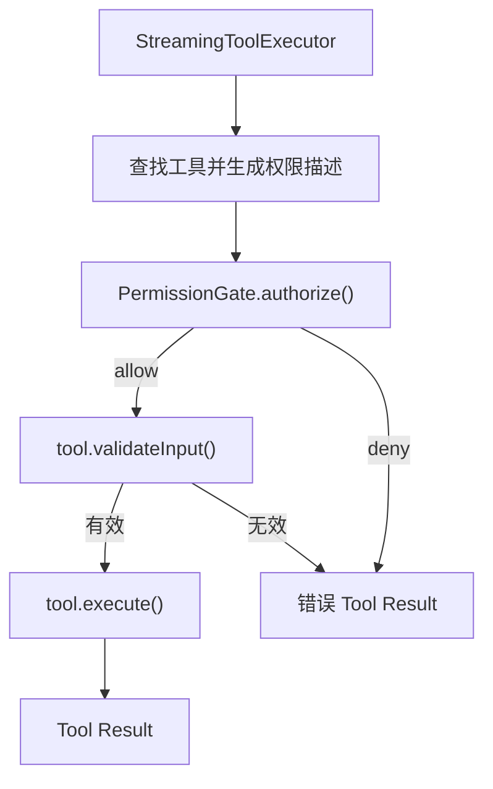
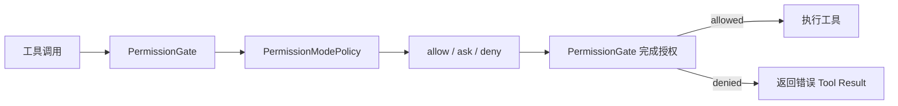
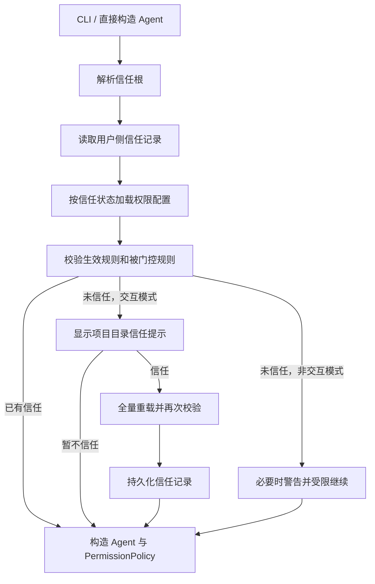

# 本期变更说明

0.6 聚焦 Agent 的权限与安全：让所有工具调用在执行前经过统一的权限判断，并通过权限模式、配置规则和用户确认控制 Agent 可以做什么。

本期仍以快速复现核心功能和关键技术为目标。具体匹配算法、交互细节和代码结构将在各目标开始实现前分别对齐，不在目标阶段提前展开。

# 对齐基线

本期以当前 [Claude Code 权限系统](https://code.claude.com/docs/en/permissions) 和 [权限模式](https://code.claude.com/docs/en/permission-modes) 的公开行为为主要基线

# 目标

1. 实现统一的工具权限门禁：所有工具调用在执行前先得到允许、询问或拒绝的权限结论。
2. 实现权限模式：支持 `default`、`acceptEdits`、`plan`、`dontAsk` 和 `bypassPermissions`。
3. 实现可配置权限规则：支持 `allow`、`ask`、`deny`，以及用户级、项目级和本地项目配置。
4. 实现基于工具语义的权限判断：区分读取、编辑、Shell 和网络访问，只自动放行能够确定安全的操作。
5. 实现用户确认与授权记忆：支持单次、会话级和持久授权，并把拒绝结果返回给模型继续处理。
6. 实现工作目录与保护路径边界：区分工作目录内外访问，并保护 Git 元数据和 Agent 配置等敏感路径。
7. 实现项目目录信任：首次进入项目时确认是否信任，未信任前不采用项目提供的自动授权配置。

# 1. 统一工具权限门禁

权限不能只依赖 System Prompt，也不能分散在 Agent Loop 和各个工具中。本阶段把 `executeTool()` 设为唯一的工具执行边界，所有工具在真正执行前都必须经过同一个 `PermissionGate`：



## 权限裁决与授权

`PermissionPolicy` 只根据工具请求返回原始结论，不执行工具，也不负责终端交互：

```ts
type PermissionDecision =
  | { behavior: "allow" }
  | { behavior: "ask"; reason: string }
  | { behavior: "deny"; reason: string };

type PermissionPolicy = {
  evaluate(request: PermissionRequest):
    | PermissionDecision
    | Promise<PermissionDecision>;
};
```

`PermissionGate.authorize()` 消费这个结论。`allow` 和 `deny` 可以直接得到最终结果；`ask` 则等待注入的 `PermissionPrompter`：

```ts
async authorize(request: PermissionRequest): Promise<PermissionAuthorization> {
  const decision = await waitForPermissionStep(
    () => this.policy.evaluate(request),
    request.signal,
  );

  if (decision.behavior === "allow") return { allowed: true };
  if (decision.behavior === "deny") {
    return { allowed: false, reason: decision.reason };
  }

  const confirmed = await waitForPermissionStep(
    () => this.prompter.confirm(request, decision.reason),
    request.signal,
  );
  return confirmed
    ? { allowed: true }
    : { allowed: false, reason: `User denied permission: ${decision.reason}` };
}
```

`waitForPermissionStep()` 让异步策略或确认器的等待过程也响应当前轮次的 `AbortSignal`，因此用户中断时不会卡在尚未完成的权限判断上。

Policy 与 Prompter 分开后，权限规则不依赖终端，单元测试也可以注入固定结论和确认结果。目标 5 已经接入真实确认界面和授权记忆；没有注入确认器时，`ask` 仍然默认拒绝，不会静默放行。

## Agent 持有门禁

每个 Agent 持有自己的 `PermissionGate`，再通过 `ToolContext` 传入工具执行链：

```ts
type ToolContext = {
  cwd: string;
  permissionGate: PermissionGate;
  readFileState: Map<string, number>;
  signal?: AbortSignal;
};
```

门禁是必填依赖，`executeTool()` 在缺少门禁时直接报错，避免出现“没有配置权限系统就默认执行”的旁路。完成目标 2 后，Agent 不再使用 Allow-All Policy，而是创建默认模式为 `default` 的 `PermissionModePolicy` 并注入 `PermissionGate`。后续切换权限模式只修改这个 Policy 的当前状态，不需要再次改造工具执行链。

原始 `tools` 数组不再从 `src/tools/index.ts` 导出，业务代码只能调用 `executeTool()`

## 授权、校验和执行顺序

`executeTool()` 先让工具生成权限描述并完成授权，再执行输入校验，最后才调用真正的 handler：

```ts
const tool = toolMap.get(name);
if (!tool) return errorResult(`Unknown tool: ${name}`);

const permission = tool.getPermissionDescriptor(input, context);
const authorization = await context.permissionGate.authorize({
  ...permission,
  toolName: name,
  input,
  cwd: context.cwd,
  signal: context.signal,
});
if (!authorization.allowed) {
  return errorResult(`Permission denied: ${authorization.reason}`);
}

const validation = await tool.validateInput?.(input, context);
if (validation && !validation.ok) return errorResult(validation.message);

const result = await tool.execute(input, context);
```

这个顺序是目标 6 引入路径边界后的必要调整。`write_file` 和 `edit_file` 的校验会读取目标文件的 mtime，以确认模型编辑前文件没有被外部修改；如果把它放在权限门禁之前，就会在用户尚未授权时访问目标元数据。

`getPermissionDescriptor()` 和权限门禁仍可以为裁决而解析路径、检查路径属性，但不会读取文件正文或执行工具副作用。只有获得允许后，工具才进行 read-before-write、mtime 等业务校验；校验通过后才真正读写文件、访问网络或执行 Shell。

## 结构化工具结果

`executeTool()` 不再只返回字符串，而是统一返回：

```ts
type ToolExecutionResult = {
  content: string;
  isError: boolean;
};
```

权限拒绝、未知工具和校验失败使用 `isError: true`，`StreamingToolExecutor` 将其转换成 Anthropic 的 `is_error: true`。错误仍作为 `tool_result` 加入历史，模型可以换一种方案，Agent Loop 不会因为正常的工具失败退出。

`run_shell` 同步采用结构化结果：退出码为 0 时返回成功；非零退出码、超时和进程启动错误保留 stdout、stderr 与错误原因，并标记为工具错误。

用户中断仍由现有 Signal 流程单独处理。这个行为与 Claude Code 把 Bash 非零退出码归入工具执行失败、随后继续 Agent Loop 的语义一致，参见 [PostToolUseFailure](https://code.claude.com/docs/en/hooks#posttoolusefailure)。

提前执行的工具把包含权限检查在内的完整 Promise 保存在 `earlyExecutions`，`finish()` 复用同一个 Promise，因此每个 `tool_use` 只授权并执行一次。异步 Prompter 也为后续把真实确认延迟到模型流结束后展示保留了接口。

# 2. 权限模式

## 权限模式如何接入现有门禁

权限模式不改变目标 1 建立的工具执行链，只替换 `PermissionGate` 使用的策略。Agent 创建时先生成 `PermissionModePolicy`，再把它注入统一门禁：

```ts
this.permissionModePolicy = new PermissionModePolicy(
  options.permissionMode ?? "default",
);

this.permissionGate = new PermissionGate({
  policy: this.permissionModePolicy,
  prompter: options.permissionPrompter,
});
```

`PermissionModePolicy` 保存当前权限模式，并根据“当前模式 + 工具权限类别”返回 `allow`、`ask` 或 `deny`。`PermissionGate` 继续负责把策略结论转换成最终授权结果，`executeTool()` 不需要感知具体有哪些权限模式。



在交互模式中切换权限模式时，只修改同一个 Policy 保存的当前模式：

```ts
setPermissionMode(mode: PermissionMode): void {
  this.permissionModePolicy.setMode(mode);
}
```

因此模式切换会立即影响后续工具调用，同时不需要重建 Agent、门禁或工具执行器。Agent 始终使用这一个 `PermissionModePolicy` 驱动实际授权，避免出现界面显示已切换、工具却仍按旧策略执行的问题。

## 工具声明权限类别

权限模式不直接判断 `read_file`、`write_file` 等具体工具名称，而是根据工具声明的权限类别进行裁决。目前定义了四种类别：

```ts
type PermissionKind = "read" | "edit" | "shell" | "network";
```

`permissionKind` 是 `Tool` 的必填属性，每个工具在定义时声明自身类别：

```ts
export type Tool = ToolDef & {
  permissionKind: PermissionKind;
  validateInput?: ToolValidator;
  isConcurrencySafe?: (
    input: Record<string, unknown>,
  ) => boolean;
  execute: ToolHandler;
};
```

当前工具分类如下：

| 权限类别 | 工具 |
| --- | --- |
| `read` | `read_file`、`list_files`、`grep_search` |
| `edit` | `write_file`、`edit_file` |
| `shell` | `run_shell` |
| `network` | `web_fetch` |

`executeTool()` 找到工具后，把工具自身声明的类别传给权限门禁：

```ts
const authorization = await context.permissionGate.authorize({
  toolName: name,
  permissionKind: tool.permissionKind,
  input,
  cwd: context.cwd,
  signal: context.signal,
});
```

这样 `PermissionModePolicy` 只需要处理有限且稳定的权限类别，不需要维护工具名称白名单或 `switch` 判断。新增工具时必须在工具定义处明确分类，TypeScript 也会阻止遗漏 `permissionKind` 的工具通过类型检查。

这里的分类只提供工具级别的基础语义。对 Shell 命令、具体路径和网络地址进行更细的安全判断，留到目标 4 实现。

## 五种模式的权限矩阵

`PermissionModePolicy` 使用一张集中矩阵，把权限模式和工具类别转换成 `allow`、`ask` 或 `deny`：

| 权限模式 | `read` | `edit` | `shell` | `network` |
| --- | --- | --- | --- | --- |
| `default` | `allow` | `ask` | `ask` | `ask` |
| `acceptEdits` | `allow` | `allow` | `ask` | `ask` |
| `plan` | `allow` | `deny` | `deny` | `ask` |
| `dontAsk` | `allow` | `deny` | `deny` | `deny` |
| `bypassPermissions` | `allow` | `allow` | `allow` | `allow` |

矩阵在代码中使用完整的 `Record` 类型声明：

```ts
const MODE_BEHAVIORS: Record<
  PermissionMode,
  Record<PermissionKind, PermissionBehavior>
> = {
  // 五种模式的完整映射
};
```

这种结构把所有模式差异集中在一个位置。新增权限模式或工具类别时，如果没有补齐对应关系，TypeScript 会直接报错，避免权限逻辑散落在 Agent、CLI 和各个工具中。

`evaluate()` 只读取当前模式和工具类别：

```ts
evaluate(request: PermissionRequest): PermissionDecision {
  const behavior =
    MODE_BEHAVIORS[this.mode][request.permissionKind];

  if (behavior === "allow") return { behavior };

  return {
    behavior,
    reason: `Permission mode "${this.mode}" ${
      behavior === "ask" ? "requires confirmation for" : "blocks"
    } ${request.permissionKind} tools`,
  };
}
```

`bypassPermissions` 也不会绕过 `PermissionGate`，只是矩阵对所有工具类别都返回 `allow`。因此所有模式仍然共用同一条权限执行链。

没有注入用户确认界面时，`ask` 会由默认 Prompter 拒绝。目标 5 接入真实确认界面后复用了同一权限矩阵，没有修改模式策略。

## Agent 保存并切换当前模式

`PermissionModePolicy` 是一个带状态的策略对象，内部保存当前 `PermissionMode`。Agent 通过它读取和修改本次运行使用的权限模式：

```ts
getPermissionMode(): PermissionMode {
  return this.permissionModePolicy.getMode();
}

setPermissionMode(mode: PermissionMode): void {
  if (this.isProcessing()) {
    throw new Error("Agent 正在处理请求，不能切换权限模式");
  }

  if (
    mode === "bypassPermissions"
    && !this.bypassPermissionsAvailable
  ) {
    throw new Error(
      "bypassPermissions 未启用，请使用 "
      + "--allow-dangerously-skip-permissions 重新启动",
    );
  }

  this.permissionModePolicy.setMode(mode);
}
```

切换前有两个限制：

1. Agent 正在处理请求时不能切换，避免同一轮“模型请求 → 工具执行 → 再次请求模型”中途使用两套权限规则。
2. `bypassPermissions` 必须在启动时明确开放，普通交互会话不能直接切换到完全放行模式。

Agent 创建时记录危险模式是否可用：

```ts
this.bypassPermissionsAvailable =
  options.allowDangerouslySkipPermissions === true
  || this.permissionModePolicy.getMode()
    === "bypassPermissions";
```

显式以 `bypassPermissions` 启动，也会自动保留后续切回该模式的能力。其他模式可以在空闲时自由切换，修改会立即影响下一次工具授权。

当前模式只保存在 Agent 实例中，不写入 Session JSONL。恢复历史会话时默认重新使用 `default`，除非本次启动重新传入权限模式，避免旧会话静默恢复之前的危险授权状态。

## 启动参数决定初始模式

CLI 把“本次使用的初始模式”和“是否允许后续进入危险模式”作为两个独立状态传给 Agent：

```ts
agent = new Agent({
  permissionMode: parsed.permissionMode,
  allowDangerouslySkipPermissions:
    parsed.allowDangerouslySkipPermissions,
});
```

三个相关参数的行为不同：

| 启动参数 | 初始模式 | 后续能否切换到 `bypassPermissions` |
| --- | --- | --- |
| 不传参数 | `default` | 否 |
| `--permission-mode <mode>` | 指定模式 | 仅当指定为 `bypassPermissions` 时可以 |
| `--allow-dangerously-skip-permissions` | `default` | 可以 |
| `--dangerously-skip-permissions` | `bypassPermissions` | 可以 |

`--allow-dangerously-skip-permissions` 只开放危险模式入口，不会立即跳过权限检查。它也可以和普通模式组合：

```bash
pnpm run cli -- \
  --permission-mode plan \
  --allow-dangerously-skip-permissions
```

这时 Agent 以 `plan` 启动，但之后可以在 REPL 中主动切换到 `bypassPermissions`。

`--dangerously-skip-permissions` 则会在参数解析阶段同时设置两个状态：

```ts
if (dangerouslySkipPermissions) {
  permissionMode = "bypassPermissions";
  allowDangerouslySkipPermissions = true;
}
```

它不能和其他初始模式同时使用，避免命令行同时表达两种相互冲突的权限状态：

```bash
# 拒绝执行
pnpm run cli -- \
  --permission-mode plan \
  --dangerously-skip-permissions
```

原来的 `--mortis` 别名已经移除。现在传入该参数会直接报告未知参数，不会被误当成用户 Prompt。

## 在 REPL 中切换权限模式

交互模式提供 `/permission-mode` 命令。执行后不会要求用户手动输入模式名称，而是显示固定的编号列表：

```text
选择权限模式:
1. default（当前）
2. acceptEdits
3. plan
4. dontAsk
5. bypassPermissions（未开放）
q. 取消
```

所有可选模式集中定义在一个数组中，菜单展示和编号解析共用同一份数据：

```ts
const PERMISSION_MODE_OPTIONS = [
  "default",
  "acceptEdits",
  "plan",
  "dontAsk",
  "bypassPermissions",
] as const satisfies readonly PermissionMode[];
```

REPL 使用 `selectingPermissionMode` 记录当前是否正在等待模式选择。收到 `/permission-mode` 后进入选择状态，下一行输入不再作为用户 Prompt 发送给模型，而是作为菜单编号处理：

```ts
} else if (input === "/permission-mode") {
  selectingPermissionMode = true;
  showPermissionModeMenu(agent);
  rl.setPrompt(PERMISSION_MODE_PROMPT);
}
```

选择有效编号后，通过 Agent 的统一接口完成切换：

```ts
const mode =
  PERMISSION_MODE_OPTIONS[Number(input) - 1];

agent.setPermissionMode(mode);
selectingPermissionMode = false;
process.stdout.write(`权限模式: ${mode}\n`);
```

无效编号会继续等待输入，`q` 会取消选择。未在启动时开放 `bypassPermissions` 时，菜单会把它标记为“未开放”，选择该项也不会调用模式切换。

REPL 的提前检查用于提供友好的提示，`Agent.setPermissionMode()` 仍会再次验证危险模式权限，保证其他调用方不能绕过限制。

`/status` 会读取 Agent 当前状态并显示实际生效的模式：

```text
权限模式: plan
```

切换只影响当前进程中的后续工具调用，不修改已经完成的历史消息，也不会写入 Session JSONL。

## 与 Claude Code 当前行为的差异

当前实现复现了权限模式的核心裁决和切换机制，但没有完整复制 Claude Code 的全部模式行为。主要差异如下：

| 行为 | Claude Code | 当前实现 |
| --- | --- | --- |
| 交互切换 | 使用 `Shift+Tab` 循环 `default`、`acceptEdits`、`plan`，并加入已开放的可选模式；`dontAsk` 不参与循环 | 使用 `/permission-mode` 打开五种模式的编号菜单 |
| `acceptEdits` | 自动允许文件编辑以及工作目录内的常见文件操作命令 | 自动允许 `edit` 工具，所有 `shell` 工具仍为 `ask` |
| `plan` | 允许读取文件和执行只读 Shell 命令，并包含计划生成与批准流程 | 允许 `read`，拒绝全部 `edit` 和 `shell`；只实现权限限制，不实现完整计划工作流 |
| `bypassPermissions` | 跳过权限层，但仍保留根目录和 Home 目录删除的熔断检查 | 仍经过 `PermissionGate`，由 Mode Policy 对全部工具返回 `allow`；尚无特殊路径熔断 |
| 默认模式 | 可以通过 `settings.json` 的 `permissions.defaultMode` 持久配置 | 仅由本次启动参数决定，默认使用 `default` |

Claude Code 的当前模式行为参见[权限模式](https://code.claude.com/docs/en/permission-modes)和[CLI 参数](https://code.claude.com/docs/en/cli-usage)。

这些差异符合当前快速复现目标：Shell 命令的细粒度语义判断留到目标 4，持久配置留到目标 3，保护路径与危险删除边界留到目标 6。完整的 Plan 工作流和原始终端快捷键不属于本次权限模式实现。

## 权限模式的测试覆盖

权限模式分别从策略、工具、Agent 和 CLI 四个层级进行验证。

`PermissionModePolicy` 测试会遍历五种模式和四种工具类别，检查完整的 20 组裁决结果，避免只覆盖常用模式：

```ts
for (const [mode, kinds] of Object.entries(
  expectedBehaviors,
)) {
  const policy = new PermissionModePolicy(mode);

  for (const [kind, behavior] of Object.entries(kinds)) {
    assert.equal(
      policy.evaluate(createRequest(kind)).behavior,
      behavior,
    );
  }
}
```

工具测试检查每个已注册工具都声明了正确的 `permissionKind`，并验证 `executeTool()` 会把该类别传给 `PermissionGate`。

Agent 集成测试使用同一个 Agent 和同一个写文件工具：

1. 先在 `plan` 模式下调用，确认文件未创建，并向模型返回权限错误。
2. 切换为 `acceptEdits`。
3. 再次调用，确认文件被真实创建。

这条测试不仅验证 `getPermissionMode()` 的返回值，也验证模式切换确实改变了实际工具授权结果。

CLI 测试覆盖初始模式参数、危险参数冲突、`--mortis` 移除、REPL 编号选择、无效输入重试，以及未开放时不能切换到 `bypassPermissions`。

完整验证命令为：

```bash
pnpm test
pnpm run typecheck
```

# 3. 可配置权限规则

## 配置来源与加载顺序

Agent 需要一份已经经过项目信任处理的有效权限配置。CLI 会在构造 Agent 前准备并注入配置；直接构造 Agent 且没有显式注入时，则通过 `loadTrustedPermissionSettings()` 加载：

```ts
const permissionSettings = options.permissionSettings
  ?? loadTrustedPermissionSettings(this.cwd);
```

当前支持三种配置来源：

| 加载顺序 | 配置范围 | 文件位置 |
| --- | --- | --- |
| 1 | 用户级 | `~/.mo-code/settings.json` |
| 2 | 项目级 | `<project>/.mo-code/settings.json` |
| 3 | 本地项目级 | `<project>/.mo-code/settings.local.json` |

项目配置从 `cwd` 开始向上查找，使用最近一个包含上述项目配置文件的 `.mo-code` 目录。找到后便停止，不继续合并外层项目的配置；目标 7 加入项目信任后，这一查找还不能越过当前信任根。缺失的配置文件直接忽略。

三层配置中的规则数组按加载顺序合并。`permissions.defaultMode` 是单值配置，后加载的层级覆盖前面的层级；本次启动显式传入的 CLI 模式仍具有最高优先级：

```ts
this.permissionModePolicy = new PermissionModePolicy(
  options.permissionMode
    ?? permissionSettings.defaultMode
    ?? "default",
);
```

配置只在 Agent 创建时加载一次，不进行热更新；恢复历史会话时会重新读取当前配置，权限规则本身不会写入 Session JSONL。配置文件不存在属于正常情况；JSON 损坏或权限配置结构错误会终止 Agent 创建，CLI 报错后不再调用模型。

目标 7 已经接入项目目录信任。未信任时，项目级和本地项目级的 `deny`、`ask` 仍然生效，`allow` 和 `defaultMode` 会在 Agent 构造前被过滤；完整机制见第 7 节。

## 配置文件结构与解析结果

三个层级使用相同的 JSON 结构。权限相关内容统一放在 `permissions` 中：

```json
{
  "permissions": {
    "defaultMode": "default",
    "allow": [
      "read_file",
      "run_shell(pnpm test)"
    ],
    "ask": [
      "web_fetch(*)"
    ],
    "deny": [
      "read_file(.env)"
    ]
  }
}
```

`allow`、`ask` 和 `deny` 必须是字符串数组，`defaultMode` 必须是五种有效权限模式之一。配置根节点或 `permissions` 不是对象、规则数组中包含非字符串值，都会被视为无效配置；权限配置之外的字段暂时忽略，方便后续在同一个设置文件中加入其他功能。

加载器不会直接决定规则是否匹配，而是先把每条字符串展开成带来源信息的统一结构：

```ts
type PermissionRuleSetting = {
  behavior: "allow" | "ask" | "deny";
  raw: string;
  sourceScope: "user" | "project" | "local";
  sourcePath: string;
};
```

例如项目配置中的 `"deny": ["read_file(.env)"]` 会被转换成：

```ts
{
  behavior: "deny",
  raw: "read_file(.env)",
  sourceScope: "project",
  sourcePath: "/project/.mo-code/settings.json",
}
```

保留 `raw` 和 `sourcePath` 后，后续规则解析失败或工具被拒绝时，可以明确指出是哪条规则、来自哪个配置文件。`.mo-code/settings.local.json` 用于只在当前机器生效的设置，已经加入 `.gitignore`，避免误提交个人授权。

## 规则语法与预编译

每条权限规则支持两种写法：

```text
tool
tool(specifier)
```

裸工具名匹配这个工具的全部调用：

```text
read_file
```

带 `specifier` 的规则只匹配指定目标：

```text
read_file(.env)
run_shell(pnpm test)
web_fetch(https://api.example.com/*)
```

`specifier` 中的 `*` 可以出现在任意位置，表示任意长度的字符；没有 `*` 时按完整目标精确匹配。它不是正则表达式，因此 `+`、`?`、`.` 等字符都按普通文本处理。

Agent 创建 `PermissionRulePolicy` 时，会一次性调用 `compileRule()` 解析全部规则，而不是在每次工具调用时重新解析。编译后的结构保存工具名和目标匹配器：

```ts
type CompiledPermissionRule = PermissionRuleSetting & {
  toolName: string;
  matchesRequest:
    | ((request: PermissionRequest) => boolean)
    | undefined;
};
```

裸工具规则没有目标限制，因此 `matchesRequest` 为 `undefined`；带 `specifier` 的规则则生成对应的匹配函数。

预编译时会拒绝空规则、括号不完整、空 `specifier` 和未知工具名。已知工具名直接来自当前注册的 `toolDefinitions`：

```ts
new PermissionRulePolicy(
  permissionSettings.rules,
  this.permissionModePolicy,
  toolDefinitions.map((tool) => tool.name),
);
```

因此拼错工具名不会等到执行时才被忽略，而是让 Agent 启动失败，并通过规则保留的 `raw` 和 `sourcePath` 指出具体错误位置。

## 工具生成权限匹配目标

不同工具的输入结构不同：文件工具使用 `file_path`，Shell 使用 `command`，网络工具使用 `url`。权限策略不逐个判断这些字段，而是要求每个工具通过 `getPermissionTarget()` 声明本次调用真正要操作的目标：

```ts
type Tool = ToolDef & {
  permissionKind: PermissionKind;
  getPermissionTarget: (
    input: Record<string, unknown>,
    context: ToolContext,
  ) => string;
  // ...
};
```

例如 `run_shell` 直接使用完整命令，`web_fetch` 使用 URL，文件工具则把路径转换成基于 Agent 工作目录的绝对路径：

```ts
getPermissionTarget: (input) =>
  String(input.command ?? "")

getPermissionTarget: (input) =>
  String(input.url ?? "")

getPermissionTarget: (input, context) =>
  normalizePermissionPath(
    context.cwd,
    String(input.file_path ?? ""),
  )
```

`executeTool()` 在输入校验通过后、进入 `PermissionGate` 前生成目标：

```ts
const authorization = await context.permissionGate.authorize({
  toolName: name,
  permissionKind: tool.permissionKind,
  permissionTarget: tool.getPermissionTarget(input, context),
  input,
  cwd: context.cwd,
  signal: context.signal,
});
```

规则中的 `specifier` 表示期望目标，`permissionTarget` 表示当前调用的实际目标。例如 `run_shell(pnpm *)` 会用 `pnpm *` 匹配实际命令 `pnpm test`。

这种设计避免在权限模块中维护按工具名分支的中央映射。新增工具时，工具在注册自身权限类别的同时声明匹配目标，`PermissionRulePolicy` 只处理统一的字符串匹配。

当前文件目标只进行绝对路径和分隔符的词法规范化，不解析符号链接；真实路径和工作目录边界将在目标 6 统一处理。

# 4. 基于工具语义的权限判断

## 为什么还需要工具语义

前面的权限系统通过 `PermissionKind` 区分读取、编辑、Shell 和网络工具，但这种静态分类只能说明“调用了哪类工具”，不能说明“这次调用具体要做什么”。

例如下面的命令都属于 `shell`：

```bash
pwd
git status
rm -rf build
git push
```

如果只根据 `permissionKind: "shell"` 判断，它们只能得到相同的权限结论。这样 `plan` 模式无法自动执行只读命令，`default` 模式也会对每条 Shell 命令进行询问。

本阶段在工具类别之外增加动态语义：

```ts
type ShellCommandSemantics =
  | "readOnly"
  | "mutating"
  | "unknown";
```

`run_shell` 在执行前分析本次命令，并把分类结果放入权限描述：

```text
Shell 命令
  → 语义分类
  → ToolPermissionDescriptor
  → PermissionPolicy
  → allow / ask / deny
```

只有能够确定为 `readOnly` 的命令才可以根据权限模式自动放行。明确修改状态的命令返回 `mutating`；无法可靠理解的命令返回 `unknown`，继续采用原有模式的询问或拒绝行为。

这里的 `readOnly` 只表示命令不会修改状态，不表示它访问的路径已经获得授权。工作目录和保护路径检查将在目标 6 实现。

## 工具统一生成权限描述

目标 2 和目标 3 中，工具分别通过静态的 `permissionKind` 和 `getPermissionTarget()` 提供权限信息。Shell 语义取决于本次输入，如果继续增加一个并行的 `getShellSemantics()`，调用方就需要分别组装多份权限数据。

因此本阶段把它们统一为一个判别联合类型：

```ts
type ToolPermissionDescriptor =
  | {
      permissionKind: "read" | "edit" | "network";
      permissionTarget: string;
    }
  | {
      permissionKind: "shell";
      permissionTarget: string;
      shellSemantics: ShellCommandSemantics;
    };
```

`Tool` 只保留一个权限描述接口：

```ts
type Tool = ToolDef & {
  getPermissionDescriptor(
    input: Record<string, unknown>,
    context: ToolContext,
  ): ToolPermissionDescriptor;

  // ...
};
```

普通工具返回静态类别和当前目标：

```ts
getPermissionDescriptor: (input, context) => ({
  permissionKind: "read",
  permissionTarget: normalizePermissionPath(
    context.cwd,
    String(input.file_path ?? ""),
  ),
})
```

`run_shell` 还会根据本次命令生成动态语义：

```ts
getPermissionDescriptor: (input) => {
  const command = String(input.command ?? "");

  return {
    permissionKind: "shell",
    permissionTarget: command,
    shellSemantics: classifyShellCommand(command),
  };
}
```

`executeTool()` 不再了解不同工具如何生成权限信息，只负责补充公共字段并提交给门禁：

```ts
const permission =
  tool.getPermissionDescriptor(input, context);

const authorization =
  await context.permissionGate.authorize({
    ...permission,
    toolName: name,
    input,
    cwd: context.cwd,
    signal: context.signal,
  });
```

这样新增工具时，权限类别、匹配目标和动态语义都由工具自身提供，Policy 不需要根据工具名称进行硬编码判断。

只读 Shell 的 `permissionKind` 仍然保持为 `shell`，不会改成 `read`。`readOnly` 表示命令语义，而 `read` 表示文件读取工具类别；混用两者会导致规则匹配把 Shell 命令错误地当作文件路径处理。

## Shell 命令的两阶段分类

`classifyShellCommand()` 不直接使用一个正则表达式判断完整命令，而是分成两个阶段：

```text
扫描 Shell 结构
  → 得到多个简单命令
  → 分别判断命令语义
  → 汇总整体结果
```

第一阶段由 `scanShellCommand()` 完成。它识别顶层的以下连接符：

```text
&&  ||  ;  |  |&  &  换行
```

扫描时会跟踪单引号、双引号和反斜杠，因此引号中的连接符不会被错误拆分：

```bash
pwd && git status       # 两个命令
echo "a && b"           # 一个命令
```

扫描器还会记录当前命令是否包含重定向、语法残缺或暂不支持的复杂展开。未闭合引号、命令替换、变量展开、brace 展开和未引用的 glob 都会保守返回 `unknown`：

```bash
echo "$(run-command)"       # unknown
find . "-$ACTION"           # unknown
find . -{delete,print}      # unknown
find . -delet?              # unknown
```

这些展开可能在 Shell 执行前生成新的参数。例如 `-{delete,print}` 可以展开成 `-delete -print`，如果只检查原始字符串，就可能把实际会删除文件的 `find` 命令误判为只读。

单引号和反斜杠转义的内容仍按字面量处理：

```bash
echo '$(run-command)'       # readOnly
echo \*.ts                  # readOnly
```

扫描完成后，分类器汇总所有子命令：

```ts
const classifications =
  scan.segments.map(classifySimpleCommand);

if (classifications.includes("mutating")) {
  return "mutating";
}
if (classifications.includes("unknown")) {
  return "unknown";
}
return "readOnly";
```

因此只有每个子命令都能确定为只读时，整个复合命令才是 `readOnly`：

```bash
pwd && git status       # readOnly
cat file | grep text    # readOnly
pwd && rm file          # mutating
pwd && custom-command   # unknown
```

输出重定向统一视为 `mutating`，输入重定向统一视为 `unknown`。这个分类器只复现关键 Shell 语义，不尝试实现完整的 Shell AST。

## 正向识别只读命令

简单命令完成分词后，分类器先得到实际执行的命令名，再通过正向名单判断它是否具备只读候选资格：

```ts
const READ_ONLY_COMMANDS = new Set([
  "pwd",
  "ls",
  "cat",
  "head",
  "tail",
  "grep",
  "rg",
  "wc",
  "which",
  "file",
  "stat",
  "du",
  "df",
  "echo",
  "printf",
]);
```

这里使用只读白名单，而不是维护危险命令黑名单。危险命令和第三方程序无法被完整穷举，而只读名单只需要承诺项目真正理解的少量命令。

分类顺序如下：

```ts
if (SHELL_WRAPPERS.has(executable)) {
  return "unknown";
}
if (MUTATING_COMMANDS.has(executable)) {
  return "mutating";
}
if (!READ_ONLY_COMMANDS.has(executable)) {
  return "unknown";
}
```

一些行为明确的常见写入命令会直接返回 `mutating`：

```text
rm、mv、cp、mkdir、touch、chmod、tee、dd
```

没有进入只读名单，也没有被明确识别为修改操作的命令统一返回 `unknown`：

```bash
npm test
pnpm test
node script.js
python script.py
custom-command
```

包管理器和脚本运行器可能间接执行任意项目代码，不能根据命令名称判断为只读。

首版也不解析命令包装器和环境变量前缀：

```bash
FOO=bar git status
env FOO=bar git status
timeout 10 git status
sudo cat file
sh -c "git status"
command git status
```

这些形式都会返回 `unknown`。这样即使暂时少放行一些安全命令，也不会因为没有理解包装层而错误自动授权。

进入 `READ_ONLY_COMMANDS` 只代表命令具备只读候选资格，并不表示立即返回 `readOnly`。`rg`、`file` 和 `printf` 等命令仍需检查可能执行外部程序或修改状态的特殊参数。

## 根据参数修正命令语义

部分命令通常用于读取，但特定参数可能写入文件或执行其他程序，因此不能只根据命令名直接返回 `readOnly`。

当前对四类命令进行额外检查：

| 命令形式 | 分类 | 原因 |
| --- | --- | --- |
| `find . -name "*.ts"` | `readOnly` | 只查找文件 |
| `find . -delete` | `mutating` | 删除匹配文件 |
| `find . -fprint result.txt` | `mutating` | 把结果写入文件 |
| `find . -exec ...` | `unknown` | 可以执行任意命令 |
| `rg --pre command` | `unknown` | 使用外部程序预处理文件 |
| `rg -z archive.gz` | `unknown` | 可能启动外部解压程序 |
| `file --compile magic` | `mutating` | 生成编译后的 magic 数据文件 |
| `printf -vPATH value` | `mutating` | 修改当前 Shell 变量 |

`find` 的判断集中在独立函数中：

```ts
function classifyFind(
  arguments_: string[],
): ShellCommandSemantics {
  if (arguments_.some((argument) => (
    argument === "-delete"
    || argument === "-fprint"
    || argument === "-fprint0"
    || argument === "-fprintf"
    || argument === "-fls"
  ))) {
    return "mutating";
  }
  if (arguments_.some((argument) => (
    argument === "-exec"
    || argument === "-execdir"
    || argument === "-ok"
    || argument === "-okdir"
  ))) {
    return "unknown";
  }
  return "readOnly";
}
```

写入动作包括 `-delete`、`-fprint`、`-fprintf` 和 `-fls`；`-exec`、`-execdir`、`-ok` 和 `-okdir` 可以启动其他程序，因此无法继续根据 `find` 本身判断语义。

`rg` 的 `--pre` 可以指定任意预处理程序，`-z` 和 `--search-zip` 可能调用外部解压程序。这些参数不会修改项目文件，但已经越过“只执行已知读取命令”的范围，因此返回 `unknown`，交给正常权限流程处理。

`file` 的 `-C` 和 `--compile` 会写入数据文件。实现还会识别组合短参数和长参数缩写：

```bash
file -Cm magic
file --comp -m magic
```

`file` 会把 `--comp` 识别为 `--compile`，所以只匹配完整参数仍可能造成误放行。

`printf -v...` 会修改当前 Shell 的变量。复合命令中的后续操作可能受到影响：

```bash
printf -vPATH /tmp/bin && ls
```

如果 `/tmp/bin` 中存在另一个 `ls`，后续执行对象就可能发生变化，因此所有 `-v...` 形式都归为 `mutating`。

这些检查仍遵循同一个原则：只对已经理解的安全参数返回 `readOnly`；可能执行外部程序但无法确定副作用时返回 `unknown`。

## Git 子命令的语义判断

`git` 既包含只读查询，也包含仓库写入和网络操作，因此不能把所有 Git 命令统一视为只读。

`classifyGit()` 先取得直接子命令，再按以下顺序判断：

```ts
function classifyGit(
  arguments_: string[],
): ShellCommandSemantics {
  const [subcommand, ...subcommandArguments] =
    arguments_;

  if (!subcommand || subcommand.startsWith("-")) {
    return "unknown";
  }
  if (hasGitOutputOption(subcommandArguments)) {
    return "mutating";
  }
  if (hasGitExternalExecutionOption(
    subcommandArguments,
  )) {
    return "unknown";
  }
  if (READ_ONLY_GIT_SUBCOMMANDS.has(subcommand)) {
    return "readOnly";
  }

  // branch、tag 和 remote 单独判断

  if (MUTATING_GIT_SUBCOMMANDS.has(subcommand)) {
    return "mutating";
  }
  return "unknown";
}
```

当前明确识别的只读子命令包括：

```text
status、diff、log、show、rev-parse、ls-files、
ls-tree、cat-file、blame、grep、describe
```

常见的修改操作返回 `mutating`：

```text
add、commit、push、pull、checkout、switch、
merge、rebase、reset、restore、stash、worktree
```

不在两组名单中的 Git 子命令返回 `unknown`。首版也不解析 Git 全局参数，因此下面的命令不会自动放行：

```bash
git -C .. status       # unknown
```

`branch`、`tag` 和 `remote` 同时包含查询与修改行为，需要继续检查参数：

| 命令 | 分类 |
| --- | --- |
| `git branch` | `readOnly` |
| `git branch --show-current` | `readOnly` |
| `git branch --list "feature/*"` | `readOnly` |
| `git branch feature/new` | `mutating` |
| `git branch -D old` | `mutating` |
| `git tag --list "v*"` | `readOnly` |
| `git tag v1.0.0` | `mutating` |
| `git remote -v` | `readOnly` |
| `git remote get-url origin` | `readOnly` |
| `git remote set-url origin URL` | `mutating` |
| `git remote show origin` | `unknown` |

`git remote show origin` 可能查询远端，因此只有带 `-n` 或 `--no-query` 的本地查看形式才会返回 `readOnly`。

部分只读子命令也能通过参数产生副作用：

```bash
git diff --output=changes.patch
git diff --ext-diff
git show --textconv
git grep -O pager pattern
git grep --open-files-in-pager=command pattern
```

`--output` 会写入文件，因此返回 `mutating`；外部 diff、textconv 和 pager 可以启动其他程序，因此返回 `unknown`。

Git 接受长参数缩写，所以分类器不能只匹配完整字符串：

```bash
git diff --out=changes.patch
git diff --ext-di
git show --textc
```

实现通过 `matchesLongOption()` 同时识别完整参数、带值参数和合法前缀：

```ts
function matchesLongOption(
  argument: string,
  option: string,
): boolean {
  const name = argument.split("=", 1)[0];

  return name.length > 2
    && name.startsWith("--")
    && option.startsWith(name);
}
```

这样已知查询命令只有在没有写入参数和外部执行参数时，才会最终得到 `readOnly`。

## 语义结果如何参与权限裁决

`PermissionModePolicy` 在读取原有权限矩阵前，先检查 Shell 语义：

```ts
evaluate(
  request: PermissionRequest,
): PermissionDecision {
  if (
    request.permissionKind === "shell"
    && request.shellSemantics === "readOnly"
  ) {
    return { behavior: "allow" };
  }

  const behavior =
    MODE_BEHAVIORS[this.mode][
      request.permissionKind
    ];

  // ...
}
```

因此在没有匹配显式规则时，Shell 命令的最终行为如下：

| 权限模式 | `readOnly` | `mutating` | `unknown` |
| --- | --- | --- | --- |
| `default` | `allow` | `ask` | `ask` |
| `acceptEdits` | `allow` | `ask` | `ask` |
| `plan` | `allow` | `deny` | `deny` |
| `dontAsk` | `allow` | `deny` | `deny` |
| `bypassPermissions` | `allow` | `allow` | `allow` |

`readOnly` 不是绕过权限规则的特殊通道。`PermissionRulePolicy` 仍然先检查显式规则：

```text
bypassPermissions
  → 直接 allow

deny 规则
  → deny

plan 中的 edit 或非只读 shell
  → deny

ask 规则
  → ask
  → dontAsk 模式下转为 deny

allow 规则
  → allow

没有匹配规则
  → 使用 Mode Policy
```

`plan` 对非只读 Shell 的硬拒绝保持不变，即使配置了对应的 `ask` 或 `allow` 规则也不会执行。只有确定为 `readOnly` 的 Shell 会跳过这层硬拒绝，继续检查 `ask` 和 `allow` 规则。

例如：

```text
plan + git status
  → readOnly
  → 没有显式规则
  → allow
```

如果配置要求询问：

```json
{
  "permissions": {
    "ask": [
      "run_shell(git status)"
    ]
  }
}
```

则仍然得到 `ask`；在 `dontAsk` 模式中，该结论会转换为 `deny`。显式 `deny` 同样可以阻止已识别的只读命令。

`acceptEdits` 当前只额外允许 `edit` 工具。`mkdir`、`rm`、`mv` 等 Shell 文件操作仍然是 `mutating`，继续得到 `ask`。等目标 6 实现工作目录和保护路径判断后，再决定哪些目录内文件操作可以安全放行。

`bypassPermissions` 继续保持项目现有语义，在规则判断前直接返回 `allow`，本阶段不改变这一既有行为。

## 与 Claude Code 当前行为的差异

本项目与 Claude Code 保持相同的核心思路：

- 已知的只读命令可以自动执行。
- 复合命令需要分别判断每一段。
- 显式的 `deny` 和 `ask` 可以收紧只读命令的权限。
- 无法可靠理解的命令不会被当作只读命令自动放行。

但为了快速复现核心机制，本项目没有完整复制 Claude Code 的 Shell 分析能力：

| 对比项 | Claude Code | 本项目 |
| --- | --- | --- |
| Shell 解析 | 使用更完整的命令解析能力 | 使用轻量扫描器，仅支持常见语法 |
| 只读命令 | 内置更完整的命令和参数判断 | 只识别当前明确支持的命令 |
| 包装命令 | 能识别部分 `timeout`、`nice`、`command` 等包装器 | 暂时统一返回 `unknown` |
| Shell 展开 | 部分只读命令允许安全的通配符 | 变量、通配符和大括号展开统一返回 `unknown` |
| 文件路径 | 部分 Shell 文件操作会结合 Read/Edit 规则判断 | 当前仍按完整命令匹配，路径边界留到目标 6 |
| `acceptEdits` | 可以自动允许部分工作目录内的文件系统命令 | 当前只影响编辑工具 |
| `bypassPermissions` | 当前仍保留显式 `ask` 等安全限制 | 本项目会直接允许工具调用，不再检查其他规则 |

这些差异是有意保留的：本项目优先展示“命令语义如何参与权限裁决”，不在这一阶段复刻完整 Shell AST、沙箱和路径分析系统。具体行为可参考 [Claude Code 权限文档](https://code.claude.com/docs/en/permissions)和[权限模式文档](https://code.claude.com/docs/en/permission-modes)。

## 如何验证

这一功能分别从三个层级进行验证：

1. `shell-command-semantics.test.mjs` 验证 Shell 分类器，包括复合命令、引号与转义、重定向、Shell 展开、危险参数和 Git 子命令。
2. `permission-mode-policy.test.mjs` 验证 `readOnly`、`mutating` 和 `unknown` 在五种权限模式下的默认行为。
3. `permission-rule-policy.test.mjs` 验证显式 `deny`、`ask`、`allow` 与 Shell 语义之间的优先级。

可以只运行 Shell 语义测试：

```bash
pnpm test -- test/tools/shell-command-semantics.test.mjs
```

也可以执行完整验证：

```bash
pnpm test
pnpm typecheck
```

测试重点不是覆盖所有 Shell 语法，而是确认两条边界：

- 明确理解且确定无副作用的命令才返回 `readOnly`。
- 任何无法可靠判断的输入都返回 `unknown`，不会因为分类失败而自动获得权限。

# 5. 用户确认与授权记忆

## 整体授权调用链

前面的权限实现中，`PermissionPolicy.evaluate()` 只负责给出 `allow`、`ask` 或 `deny` 结论。`ask` 还不是最终结果，必须经过用户确认才能决定是否执行工具。

本次实现后的调用链是：`executeTool()` 将权限请求交给 `PermissionGate.authorize()`，Gate 先执行 Policy；`allow` 直接执行，`deny` 直接拒绝，`ask` 则检查已有授权，没有命中时再进入用户确认队列。

这条链路有两个重要边界：

- Policy 只负责判断，不读取终端，也不保存授权。
- Gate 才负责把策略结论、已有授权和用户选择合成最终结果。

这样可以保证所有工具都经过同一个门禁。授权逻辑不会散落到 Agent 循环、CLI 和各个工具执行函数中，也不会出现某个新工具忘记接入确认流程的旁路。

交互模式启动时，`runCli()` 创建 `TerminalPermissionPrompter`，再依次传给 `Agent` 和 `PermissionGate`。各模块的职责保持分离：

- `PermissionPolicy` 判断当前调用应该允许、询问还是拒绝。
- `PermissionGate` 统一处理授权记忆、确认队列和最终结果。
- `TerminalPermissionPrompter` 展示终端选项并返回用户选择。
- 工具通过权限描述提供授权建议，但不操作 Session 或配置文件。
- `executeTool()` 根据最终授权结果执行工具，或向模型返回拒绝结果。

因此，Agent 和 CLI 不需要根据 `run_shell`、`write_file`、`web_fetch` 等工具名称分别编写权限逻辑。新增工具只需要通过 `getPermissionDescriptor()` 声明自己的权限目标和授权建议。

工具描述的是“这是什么操作、可以怎样记忆”，Gate 决定“这次最终能不能执行”。这也是本次实现最核心的模块边界。

## 授权有效期及保存位置

工具权限描述中的可选 `grant` 表示：如果用户选择“不再询问”，这次调用可以生成什么授权。

```ts
type PermissionGrantProposal =
  | {
      scope: "session";
      key: string;
      label: string;
    }
  | {
      scope: "persistent";
      key: string;
      rule: string;
      label: string;
    };
```

这里没有 `once`，因为“仅允许本次”不会生成授权记录，只会放行当前工具调用。

| 有效期 | 进程内 | 磁盘上 | 当前用途 |
| --- | --- | --- | --- |
| 单次 | 不保存 | 不保存 | 只执行当前调用 |
| 会话 | `sessionGrants` | Session JSONL 的 `permissionGrants` | `write_file`、`edit_file` |
| 持久 | `persistentGrants` | `.mo-code/settings.local.json` 的 `permissions.allow` | `run_shell`、`web_fetch` |

### 单次与会话授权

单次允许是最窄的授权：Gate 只为当前 `tool_use` 返回 `allowed: true`，既不修改集合，也不写入文件。下次遇到相同操作仍然需要重新确认。

文件编辑工具共享 `edit:*` 会话授权。Agent 和 PermissionGate 共用同一个 `Set`；每轮结束后，CLI 将其快照写入 Session JSONL。`--resume` 从最后一个 turn 恢复授权，旧 Session 没有 `permissionGrants` 时按空数组处理。因此，这里的“会话”可以跨进程恢复，但只跟随原 Session，不会影响其他会话。

恢复过程是：`loadSession()` 读取最后一个 turn 的 `permissionGrants`，Agent 用它创建 `Set`，再把同一个集合交给 PermissionGate。Gate 新增授权后，Agent 读取到的就是最新内容，不需要在两个对象之间同步。

文件编辑使用统一的 `edit:*`，而不是按单个文件记忆。这复现的是“本次 Session 允许编辑”的交互语义；路径是否允许仍然由工作目录边界和显式权限规则判断。

### 持久授权

Shell 和 WebFetch 使用持久授权。Gate 会先把规则写入项目的 `.mo-code/settings.local.json`，成功后再把授权键加入当前进程的 `persistentGrants`：

- `run_shell:pnpm test` 对应 `run_shell(pnpm test)`。
- `web_fetch:https://example.com` 对应 `web_fetch(https://example.com/*)`。

持久授权中的三个字段分别承担不同职责：

- `key` 用于当前进程中的严格相等匹配。
- `rule` 写入 `permissions.allow`，供后续进程加载。
- `label` 只负责确认界面展示，不参与权限判断。

`key` 和 `rule` 分开，是因为进程内记忆需要严格、快速地判断“是否就是同一项操作”，而配置规则需要使用项目已经定义的权限语法。两者不应混为一个模糊匹配字符串。

本地配置的写入位置按“最近的项目设置根 → Git 根目录 → cwd”选择。写入时保留已有字段，只向 `permissions.allow` 追加并去重规则。Shell 命令里的反斜杠和 `*` 会先转义，确保生成的是精确规则，而不是意外扩大的通配规则。

`persistentGrants` 让授权在当前进程立即生效；下次启动则由 `loadPermissionSettings()` 读取 `permissions.allow`。Gate 只有在配置写入成功后才记录持久授权；写入失败时，当前调用降级为“仅允许本次”并输出警告，后续相同调用仍会重新询问。

持久化顺序刻意设计为：先写配置，再更新内存。否则写盘失败后，当前进程会表现得像“已经永久记住”，重新启动却再次询问，造成授权状态不一致。

`grant` 只是工具提供的授权建议，不代表工具已经得到允许。它只有在权限结论允许记忆，并且用户主动选择“不再询问”时才会生效。

## 授权记忆的裁决优先级

授权记忆不能绕过权限策略。整体优先级是：

```text
bypassPermissions
  → 显式 deny
  → plan 硬拒绝
  → 显式 ask
  → 配置 allow
  → 已有授权记忆
  → 权限模式默认行为
```

其中 `bypassPermissions` 是项目已有的特殊短路语义。除此之外，显式收紧规则始终排在授权记忆之前。

权限模式默认产生的 `ask` 带有 `rememberable: true`，因此可以读取或创建授权记忆：

```ts
if (decision.behavior === "deny") {
  if (decision.grantable && this.hasGrant(request.grant)) {
    this.finishPolicyEvaluation(sequence);
    return { allowed: true };
  }
  this.finishPolicyEvaluation(sequence);
  return { allowed: false, reason: decision.reason };
}

if (decision.rememberable && this.hasGrant(request.grant)) {
  this.finishPolicyEvaluation(sequence);
  return { allowed: true };
}
```

显式配置的 `ask` 使用 `rememberable: false`，表达“每次都必须询问”。它不会读取已有授权，确认界面也不会提供“不再询问”选项。

`dontAsk` 不允许弹出确认界面，但已经获得的授权仍然有效。它的模式默认拒绝带有 `grantable: true`，因此可以被已有授权覆盖；显式 `deny` 和 `plan` 的硬拒绝没有 `grantable`，授权记忆无法绕过它们。

| 策略来源 | 是否读取记忆 | 是否提供“不再询问” |
| --- | --- | --- |
| 模式默认 `ask` | 是 | 是 |
| 显式 `ask` 规则 | 否 | 否 |
| `dontAsk` 默认拒绝 | 只读取已有记忆 | 不弹确认 |
| 显式 `deny` / `plan` 硬拒绝 | 否 | 否 |

这个顺序保证同一持久授权在当前进程中作为授权记忆生效、重新启动后作为 `allow` 规则生效时，权限含义保持一致。

## 终端确认、延迟队列与中断

REPL、权限模式菜单和工具确认界面都需要读取 `stdin`。如果分别创建 `readline`，确认编号可能被另一个读取器误认为下一条对话消息。因此，交互模式只创建一个 `ReadlineTerminalInput`：

`ReadlineTerminalInput` 同时供 REPL 对话、`/permission-mode` 菜单和 `TerminalPermissionPrompter` 使用。它负责串行读取输入、重新显示提示、统一监听中断，并且只在退出整个交互模式时关闭。

共享输入器解决的不是显示问题，而是输入归属问题：任意时刻只能有一个调用方等待用户输入。否则用户输入的选项 `2` 既可能被权限菜单读走，也可能被 REPL 当成下一条消息。

允许记忆的请求显示三个选项：

- 仅允许本次。
- 当前会话或当前项目中不再询问。
- 拒绝并告诉 Agent 如何调整。

确认器只返回“允许或拒绝、是否记忆、可选反馈”这些结构化结果，不直接修改权限。第二个选项的文字来自工具声明的 `grant.label`，所以文件编辑、Shell 和 WebFetch 可以展示不同的有效范围。

- 文件编辑显示“当前会话不再询问文件编辑”。
- Shell 显示“在当前项目中不再询问这条命令”。
- WebFetch 显示“在当前项目中不再询问这个来源”。

显式 `ask` 不允许记忆，只显示“仅允许本次”和“拒绝并反馈”。`--print` 属于非交互模式，使用 `nonInteractivePermissionPrompter` 直接拒绝需要确认的调用，并向模型说明当前模式无法弹出确认界面。

工具调用可能在模型流式响应尚未结束时形成。为避免后续模型文字与确认菜单混在一起，`Agent.chat()` 使用 `deferPromptsWhile()` 包住模型流：

Gate 使用计数器表示当前是否处在需要延迟确认的操作中，并保证模型流成功或失败时都会解除延迟：

```ts
async deferPromptsWhile<T>(
  operation: () => Promise<T>,
): Promise<T> {
  this.promptDeferralDepth++;
  try {
    return await operation();
  } finally {
    this.promptDeferralDepth--;
    this.startDrainingPrompts();
  }
}

// 在异步 Policy 开始前预留顺序号
const sequence = this.nextAuthorizationSequence++;
this.evaluatingSequences.add(sequence);

// 入队后按预留顺序排列
this.promptQueue.push(item);
this.promptQueue.sort(
  (left, right) => left.sequence - right.sequence,
);
```

自动允许的工具仍可提前执行；需要确认的调用进入队列，等模型流结束后再显示。队列按预留的 `sequence` 排序，所以异步 Policy 即使后发先完成，也不会改变菜单顺序。

队列处理分为四步：

1. 工具开始权限判断前就取得顺序号。
2. `ask` 请求先进入队列，模型流结束后才开始展示。
3. 如果更早的 Policy 仍在计算，后面的请求继续等待。
4. 每次确认结束后继续处理下一项，直到队列为空。

每个菜单显示前还会重新检查授权。模型连续请求两个文件编辑时，第一个确认如果创建了 `edit:*`，第二个调用会直接命中授权，不再重复显示菜单。拒绝一个工具只影响当前调用，队列会继续处理后面的请求。

当前 Agent 轮次的同一个 `AbortSignal` 会传给 Policy、PermissionGate、Prompter 和终端输入器。Agent 处理期间按一次 Ctrl+C，会取消当前确认、队列中的其他确认和尚未完成的工具，再返回 REPL；终端输入器本身不会关闭。Agent 空闲时仍保持连续两次 Ctrl+C 才退出的既有行为。

中断后会移除监听器并拒绝等待中的 Promise，但不会关闭共享的 `ReadlineTerminalInput`，所以 REPL 可以继续读取下一条输入。

## 拒绝结果如何返回模型

用户拒绝工具时可以填写可选反馈。PermissionGate 不会抛出异常，而是返回普通的拒绝结果：

```ts
if (result.action === "deny") {
  const feedback = result.feedback?.trim();
  this.resolveAuthorization(item, {
    allowed: false,
    reason: feedback || "User denied this action.",
  });
  return;
}

if (!authorization.allowed) {
  return errorResult(`Permission denied: ${authorization.reason}`);
}

if (outcome.output.isError) {
  toolResult.is_error = true;
}
```

`executeTool()` 不执行工具，而是把拒绝转换成错误结果。`StreamingToolExecutor` 再将它包装为带 `is_error: true` 的 Anthropic `tool_result`；Agent 把结果加入消息历史并继续请求模型。

完整结果链路是：

1. Prompter 返回拒绝和可选反馈。
2. Gate 形成 `allowed: false` 的授权结果。
3. `executeTool()` 跳过工具执行并生成错误结果。
4. StreamingToolExecutor 生成 `is_error: true` 的 `tool_result`。
5. Agent 把结果加入历史，再请求模型继续处理。

因此，用户可以要求模型缩小命令或改用其他方案，而不是让整个 Agent 轮次直接失败。工具拒绝只影响当前调用；Ctrl+C 才表示中断整个轮次。

## WebFetch 重定向边界

PermissionGate 判断的是模型最初提供的 URL。如果 Fetch 自动跟随重定向，一个已允许的地址可能跳转到另一个未授权来源，绕过新来源对应的 `deny` 或 `ask` 规则。

因此，`webFetch()` 使用 `redirect: "manual"` 自行处理跳转。`origin` 由协议、主机和端口组成：

```ts
response = await fetch(currentUrl, {
  signal: controller.signal,
  redirect: "manual",
  headers: {
    "User-Agent": "mini-claude/1.0",
  },
});

const location = response.headers.get("location");
if (!location) return "Error: redirect response is missing Location";

const nextUrl = parseRedirectUrl(location, currentUrl);
if (!nextUrl) return "Error: redirect target must use http(s)";

if (nextUrl.origin !== initialUrl.origin) {
  return `Error: cross-origin redirect blocked (${initialUrl.origin} -> ${nextUrl.origin})`;
}

currentUrl = nextUrl;
redirectCount++;
```

工具读取 `Location`，以当前 URL 为基准解析相对地址，并检查目标仍使用 HTTP(S)。同 origin 最多跟随 10 次重定向，避免重定向循环；协议、主机或端口任一变化都会在发出目标请求前被阻止。

| 重定向目标 | 结果 | 原因 |
| --- | --- | --- |
| `/login` | 继续访问 | 相对地址仍属于原 origin |
| `http://example.com` | 阻止 | 协议改变 |
| `https://api.example.com` | 阻止 | 主机改变 |
| `https://example.com:8443` | 阻止 | 端口改变 |

当前实现不会在一次 `web_fetch` 中为新来源再次弹出权限确认。如果确实需要访问新来源，模型必须发起新的工具调用，让新 URL 完整经过权限门禁。

## 与 Claude Code 的差异及验证方式

本项目与 Claude Code 保持相同的核心授权方式：只读工具通常不需要授权记忆；Shell 的“不再询问”按项目和命令持久保存；文件修改使用会话授权；显式 `ask` 每次重新确认；规则遵循 `deny → ask → allow`。具体语义可参考 [Claude Code 权限文档](https://code.claude.com/docs/en/permissions)。

当前保留以下差异：

| 对比项 | Claude Code | 本项目 |
| --- | --- | --- |
| Shell 授权 | 按项目目录和命令持久保存 | 只自动生成完整命令的精确规则 |
| 文件编辑授权 | 官方描述为持续到 Session 结束 | 保存到 Session JSONL，`--resume` 原 Session 时恢复 |
| WebFetch 授权 | 使用 `WebFetch(domain:example.com)` 按域名匹配 | 使用协议、主机和端口组成的 origin 匹配 |
| 权限管理 | 提供 `/permissions` 管理规则 | 当前通过配置文件管理，只实现调用时确认菜单 |
| 非交互确认 | 可用 `--permission-prompt-tool` 交给 MCP 工具 | `--print` 遇到 `ask` 直接拒绝 |

Claude Code 的非交互入口可参考 [CLI 参数文档](https://code.claude.com/docs/en/cli-reference)。本项目优先复现授权有效期、匹配、持久化和拒绝回灌模型，不实现完整权限管理界面或外部确认工具。

目标 5 的重点测试覆盖 PermissionGate、配置写入、Session、终端确认和 WebFetch。最终执行完整验证：

```bash
pnpm test
pnpm typecheck
```

验证重点包括：授权优先级、三种授权有效期、Session 恢复、持久规则追加与去重、确认 FIFO、流式输出延迟、中断、拒绝回灌模型，以及跨 origin 重定向不会绕过权限。

# 6. 工作目录与保护路径边界

## 整体实现链路

前面的权限规则主要判断“这个工具和目标是否允许调用”，但文件操作还需要回答三个更具体的问题：实际访问路径是否位于 Agent 的工作目录内、是否通过符号链接指向其他位置，以及是否会修改 Git 元数据或 Agent 配置等保护路径。

因此，工具的权限描述继续保留用于规则匹配的 `permissionTarget`，同时增加 `filesystemAccesses`，专门声明本次调用实际会读取、写入或删除哪些路径。文件工具直接根据输入生成访问计划；`run_shell` 则通过有限的 Shell 静态分析提取能够可靠确定的路径。

实际调用链如下：

```text
executeTool()
  → Tool.getPermissionDescriptor() 声明规则目标和文件访问计划
  → PermissionGate.authorize() 进入统一权限门禁
    → PermissionRulePolicy.evaluate() 组合权限规则和模式
      → PathBoundary.inspect() 解析工作目录、真实路径和保护路径事实
    → allow：继续执行工具
    → ask：显示确认界面
    → deny：返回错误 Tool Result
```

`PathBoundary` 只负责把路径转换成统一的边界事实，例如“位于工作目录外”“真实目标无法解析”“命中保护路径”或“属于灾难删除”，不直接决定 `allow`、`ask` 或 `deny`。最终结论仍由 `PermissionRulePolicy` 结合显式规则、权限模式和 Shell 语义统一产生，再由 `PermissionGate` 执行确认流程。

这种分层避免了两类逻辑混在一起：工具只描述自己会访问什么，`PathBoundary` 只判断路径落在哪里，Policy 负责决定应该采取什么权限行为。新增文件工具时，只需要提供 `filesystemAccesses`，不需要在 Agent Loop 或 PermissionGate 中按工具名称增加判断。

## 文件系统访问计划

`permissionTarget` 继续用于匹配 `allow`、`ask` 和 `deny` 规则，但它不一定等于工具实际访问的路径。例如 `run_shell` 的规则目标是完整命令，`list_files` 的规则目标包含 glob，`cp` 又会同时读取源文件并写入目标文件。因此，权限描述新增了独立的文件系统访问计划：

```ts
type FilesystemAccess = {
  path: string;
  operation: "read" | "write" | "delete";
  recursive?: boolean;
};

type FilesystemAccessPlan =
  | { status: "known"; accesses: FilesystemAccess[] }
  | {
      status: "unknown";
      accesses?: FilesystemAccess[];
      catastrophicDeleteRisk?: true;
    };
```

文件访问计划有三种状态：

| 状态 | 含义 | 权限行为 |
| --- | --- | --- |
| 字段不存在 | 当前工具不参与本阶段的路径分析 | 继续使用原有规则、模式和工具语义 |
| `known` | 能完整列出实际读取、写入或删除的路径 | 进入工作目录、真实路径和保护路径判断 |
| `unknown` | 确认命令涉及文件系统，但无法可靠得到完整路径 | 普通模式逐次确认，`plan` 和 `dontAsk` 拒绝 |

`unknown` 仍可以携带已经确定的部分事实，但这些事实不能把整条命令重新提升为 `known`。例如复杂命令中已经识别出 root/Home 递归删除时，计划会保留该删除目标，只供灾难删除熔断使用。

文件工具直接根据输入声明访问目标。以 `write_file` 为例：

```ts
const filePath = resolveToolPath(
  context.cwd,
  String(input.file_path ?? ""),
);

return {
  permissionKind: "edit",
  permissionTarget: normalizePermissionPath(filePath),
  filesystemAccesses: {
    status: "known",
    accesses: [{ path: filePath, operation: "write" }],
  },
  grant: {
    scope: "session",
    key: "edit:*",
    label: "当前会话不再询问文件编辑",
  },
};
```

各内置文件工具当前声明的访问目标如下：

| 工具 | 文件访问计划 |
| --- | --- |
| `read_file` | 读取 `file_path` |
| `write_file` | 写入 `file_path` |
| `edit_file` | 写入 `file_path` |
| `grep_search` | 读取 `path` 指定的文件或目录 |
| `list_files` | 读取 glob 开始动态匹配前的静态目录 |
| `run_shell` | 由有限 Shell 分析器生成一个或多个访问目标 |

`list_files` 只有在 glob 位于文件名部分时才把固定目录判为 `known`，例如 `src/*.ts` 的访问根是 `src`。`**/*.ts`、`*/index.ts` 等 glob 会动态选择目录，可能进入无法预先确认的符号链接，因此返回 `unknown`。pattern 中字面的 `..` 按当前 glob 库的词法语义折叠，保证权限检查使用的搜索根与工具实际执行一致。

多路径调用按最严格的目标整体裁决，不进行部分执行。只要其中一个目标位于工作目录外、无法解析或命中保护路径，整个工具调用就进入对应的确认或拒绝流程。

所有相对路径都以 `ToolContext.cwd` 为唯一基准。权限描述、文件状态记录、文件工具执行和 `run_shell` 的 `cwd` 使用同一个值，避免出现“检查的是 A，实际执行的是 B”。read-before-write 和 mtime 校验也移动到权限授权之后，防止校验器在门禁之前读取尚未授权文件的元数据。

## 工作目录与 PathBoundary

本项目把 Agent 启动时的 `cwd` 定义为主工作目录。即使当前目录位于一个更大的 Git 仓库中，也不会因为发现 Git 根目录而自动扩大文件访问范围；在仓库子目录启动 Agent，默认边界就是该子目录。

`PathBoundary.inspect()` 接收 `cwd` 和访问计划，为每个目标生成统一的边界事实：

```ts
type ResolvedFilesystemAccess = FilesystemAccess & {
  requestedPath: string;
  resolvedPath?: string;
  outsideWorkingDirectory: boolean;
  protectedPath: boolean;
  catastrophicDelete: boolean;
};
```

其中：

- `requestedPath` 是以本次工具 `cwd` 为基准得到的词法路径。
- `resolvedPath` 是逐段跟随符号链接后的真实目标；无法可靠解析时不存在。
- `outsideWorkingDirectory` 表示请求位置或真实目标至少有一侧位于主工作目录外。
- `protectedPath` 表示写入或删除会影响项目控制路径。
- `catastrophicDelete` 表示递归删除明确指向文件系统 root 或当前用户 Home。

`cwd` 本身也可能是符号链接，所以 PathBoundary 会同时把它的词法路径和真实路径作为工作目录身份。目标只要位于其中任一身份对应的目录树内，就不会因为 Agent 从符号链接入口启动而被误判为外部路径。

普通外部路径不是永久禁区。其默认行为是：

| 场景 | 结果 |
| --- | --- |
| 普通交互模式 | 逐次确认且不能记忆 |
| 匹配显式 `allow` | 可以预先授权该具体外部路径 |
| `plan` 或 `dontAsk` | 因无法显示确认而拒绝 |
| `bypassPermissions` | 直接放行，灾难删除熔断除外 |

目标 5 的 `edit:*` 会话授权不能跨越该边界。Policy 会先重新计算当前调用的路径事实；外部、保护或未知路径返回的确认都是 `rememberable: false`，因此即使当前 Session 已经允许普通文件编辑，也不能静默扩大到其他目录。

`PathBoundary` 本身不读取权限规则，也不决定权限模式。它只返回事实，使 `PermissionRulePolicy` 可以在一个地方组合路径、规则和模式，而不是让路径模块同时承担判断与交互职责。

## 符号链接与不存在的新目标

路径门禁不能只使用 `resolve()` 做字符串层面的规范化。工作目录内的链接可能指向外部路径，外部链接也可能指回工作目录；如果只检查其中一侧，都会留下权限绕过。

例如：

```text
workspace/shared → /Users/demo/shared
workspace/shared/config.json
```

这次访问具有两个身份：请求路径位于 `workspace` 内，真实目标却位于外部目录。PathBoundary 会同时检查两者，因此默认仍需确认。

`resolveRealTarget()` 按路径组件逐段解析：

1. 从文件系统根开始处理每个组件。
2. 当前组件存在时立即调用 `realpathSync()` 跟随符号链接。
3. 遇到 `..` 时，在已经解析真实链接的路径上返回父目录。
4. 遇到真正不存在的组件后，保留最近存在祖先的真实路径，再拼接剩余部分。
5. 如果目标是悬空链接、链接环或其他无法可靠解析的状态，则返回未知。

逐段处理很重要。对于 `link/../file`，Shell 和文件系统的含义是先进入 `link` 的真实目标，再处理 `..`；如果先用词法 `resolve()` 折叠成另一个路径，就可能检查 A、执行 B。

新文件本身还不存在，但其父目录可能是符号链接：

```text
workspace/output → /tmp/output
workspace/output/new.txt
```

此时实现会找到最近存在的 `workspace/output`，先解析到 `/tmp/output`，再拼回 `new.txt`，所以创建前就能识别真实目标位于工作目录外。

文件规则也同时考虑请求路径和真实路径：

- `deny` 或 `ask` 只要匹配任一身份就生效。
- `allow` 要求请求路径和真实目标分别获得允许。

因此，允许 `workspace/**` 不会顺带允许其中链接指向的任意外部目录；反过来，一个外部链接也不能仅凭真实目标位于工作目录内就绕过外部路径确认。

当前实现仍是执行前的应用层检查，不防御检查结束后、工具执行前由其他进程替换符号链接的竞态。解决这种 TOCTOU 问题需要文件描述符级操作或 OS 沙箱，不属于本阶段的快速复现范围。

## 保护路径

工作目录内部也不是所有文件都适合自动修改。仓库元数据和 Agent 配置会改变后续版本控制、权限规则或 Agent 行为，因此本阶段定义了最小保护集合：

| 类型 | 当前保护目标 |
| --- | --- |
| 目录 | `.git`、`.mo-code`、`.claude` |
| 文件 | `.gitmodules`、`CLAUDE.md`、`AGENTS.md` |

保护名称会检查路径中的任意组件，而不只检查工作目录根部，因此嵌套仓库和子项目配置同样受保护。匹配按大小写不敏感方式进行，避免在默认大小写不敏感的文件系统中通过 `.GIT`、`agents.md` 等别名访问同一目标。

保护语义只针对修改：

- `read` 仍按普通读取规则和工作目录边界处理。
- `write` 与 `delete` 命中保护路径时逐次确认且不能记忆。
- `plan` 与 `dontAsk` 无法进行确认，因此直接拒绝。
- 普通 `allow` 和 `edit:*` 会话授权不能跳过保护判断。
- `bypassPermissions` 是例外，会跳过普通保护路径，但不能跳过 root/Home 删除熔断。

目录级删除、复制和移动还有一个额外问题：只检查目录自身的名字，无法证明其后代不包含 `.git` 或 `AGENTS.md`。本阶段不递归遍历整棵目录，所以能够识别为目录的 `rm`、`cp` 和 `mv` 会保守返回 `unknown`，而不是根据顶层目录名自动放行。

当前集合只覆盖与仓库和 Agent 直接相关的控制路径，不把 `.env`、密钥或所有编辑器配置都归为保护文件。真正禁止读取的敏感文件应使用显式 `deny`；更完整的敏感路径和进程级限制属于沙箱或后续安全能力。

## Shell 路径静态分析

目标 4 的 Shell 分类器只回答 `readOnly`、`mutating` 或 `unknown`，无法判断命令实际访问哪个路径。本阶段把入口深化为一次分析，同时返回命令语义和文件系统访问计划：

```ts
type ShellCommandAnalysis = {
  semantics: "readOnly" | "mutating" | "unknown";
  filesystemAccesses?: FilesystemAccessPlan;
};

const analysis = analyzeShellCommand(command, context.cwd);
```

`run_shell` 将两部分一起放入权限描述。Policy 仍然只消费统一字段，不根据 `run_shell` 名称重新解析命令：

```ts
return {
  permissionKind: "shell",
  permissionTarget: command,
  shellSemantics: analysis.semantics,
  ...(analysis.filesystemAccesses
    ? { filesystemAccesses: analysis.filesystemAccesses }
    : {}),
};
```

首批路径提取范围刻意保持有限：

| 分类 | 命令 |
| --- | --- |
| 读取路径 | `ls`、`cat`、`head`、`tail`、`grep`、`rg`、`find`、`stat` |
| 修改路径 | `rm`、`mv`、`cp`、`mkdir`、`rmdir`、`touch` |
| 可能包含路径 | `wc`、`file`、`du`、`df` |

前两组只有在能够可靠识别字面参数时才返回 `known`。第三组暂不完整解析各种平台参数：无路径形式保持原有只读行为，只要存在可能表示路径的参数就返回 `unknown`，避免把未检查的外部路径当成安全读取。

修改命令会保留不同方向的访问事实：

```text
cp source.txt output.txt
  → read source.txt
  → write output.txt

mv old.txt new.txt
  → delete old.txt
  → write new.txt
```

当 `cp` 或 `mv` 的目标已经是目录时，实际写入位置还要拼接源文件名。例如 `cp nested/AGENTS.md .` 最终写入的是 `./AGENTS.md`，不能只把 `.` 当作写入目标。无法可靠确定最终落点、多源复制、`--target-directory`、目录源或包含复杂 `..` 的形式都返回 `unknown`。

分析器采用 fail-closed：

- 变量、命令替换、未引用 glob、brace 展开等动态语法返回 `unknown`。
- 未识别选项或无法确定参数属于选项还是路径时返回 `unknown`。
- 重定向、前置环境变量和不完整复合命令不能证明全部访问目标时，整体返回 `unknown`。
- BSD 与 GNU 对同一选项的“是否携带值”定义不同时，选择不会吞掉后续真实路径的保守解释，代价是少数平台上可能多询问一次。
- 递归读取同时跟随目录内符号链接时，起始目录无法证明完整边界，因此 `rg --follow`、`grep -R`、`find -L` 和 `ls -RL` 等形式返回 `unknown`。

复合命令只有在每个相关子命令都得到完整访问计划时，才能合并成 `known`：

```bash
mkdir build && touch build/result.txt  # 两个目标都可确定
git push && touch marker               # 整体 unknown
cd /tmp && touch marker                # 整体 unknown
```

这避免了“已识别的 `touch` 带着未分析命令一起自动放行”。多个已知计划会合并后统一交给 PathBoundary，其中任意一个路径触发边界，整个命令都需要确认。

`acceptEdits` 只会自动允许已经完整分析、全部位于普通工作目录内的 `rm`、`mv`、`cp`、`mkdir`、`rmdir` 和 `touch`。未知目标、目录级操作、外部路径和保护路径仍按更高优先级处理。未纳入路径提取的脚本解释器或任意子进程不会被宣称为路径安全。

这仍不是完整 Shell AST。获准执行的 Python、Node、脚本或其他程序可以自行访问文件系统；应用层静态分析不能替代 OS 级沙箱。

## 灾难删除熔断

`bypassPermissions` 的含义是用户主动跳过普通权限层，但模型错误生成 `rm -rf /` 或删除整个 Home 的影响过大，因此 root/Home 递归删除保留独立熔断。

PathBoundary 只有同时满足以下条件才把一个明确目标标记为 `catastrophicDelete`：

```text
operation === delete
recursive === true
目标是文件系统 root 或当前用户 Home
```

请求路径和真实路径都会检查，因此工作目录内的链接如果真实指向 root 或 Home，也会触发熔断。Home 比较使用大小写不敏感语义，避免在 macOS 等文件系统上通过路径大小写别名绕过。

首批保留两类删除事实：

- `rm` 的 `-r`、`-R`、`--recursive` 及能够识别的等价或缩写形式。
- `find <root> -delete` 的递归删除范围。

复杂 Shell 语法不应让已经确定的危险事实消失。即使命令因为重定向、环境变量前缀、续行、未知选项或复合命令被降为 `unknown`，分析结果仍可携带已经确认的递归删除目标：

```ts
{
  status: "unknown",
  accesses: [
    { path: "/", operation: "delete", recursive: true },
  ],
}
```

`find -L . -delete` 还可能沿工作目录中的链接到达 root/Home，但本阶段不会递归遍历目录，无法枚举真实目标。此时计划使用 `catastrophicDeleteRisk: true` 表示潜在灾难删除，直接进入同一熔断，而不是伪造一个不存在的 root 路径。

熔断行为如下：

| 权限模式 | 结果 |
| --- | --- |
| `default` | 逐次确认，不可记忆 |
| `acceptEdits` | 逐次确认，不可记忆 |
| `plan` | 拒绝 |
| `dontAsk` | 拒绝 |
| `bypassPermissions` | 仍然逐次确认，不可记忆 |

本阶段不把整个工作目录删除都定义为灾难删除。普通模式仍会根据 Shell、路径和保护内容进行判断；`bypassPermissions` 下删除普通工作目录则尊重用户主动跳过权限的选择。

## 路径边界的权限优先级

路径事实不是独立的第二套权限系统，而是加入 `PermissionRulePolicy.evaluate()` 的统一裁决链。当前顺序为：

```text
灾难删除熔断
  → bypassPermissions
  → 显式 deny
  → plan 硬拒绝
  → unknown / 无法解析 / 保护路径
  → 显式 ask
  → 显式 allow
  → 普通工作目录外路径
  → acceptEdits 的已识别目录内 Shell 文件操作
  → 权限模式默认结论
```

各层的设计含义如下：

| 层级 | 为什么放在这里 |
| --- | --- |
| 灾难删除 | 即使 bypass 也必须保留最后一道确认 |
| `bypassPermissions` | 按当前项目语义跳过规则、保护路径和普通边界 |
| `deny` | 非 bypass 模式下，显式收紧规则优先 |
| `plan` 硬拒绝 | 编辑和非只读 Shell 不能通过后续 ask/allow 放开 |
| 守护边界 | 未知、无法解析和保护写入不能被普通 allow 或授权记忆跳过 |
| `ask` | 显式要求每次确认，优先于 allow |
| `allow` | 可以预先授权普通工具目标和具体外部路径 |
| 外部路径 | 没有显式 allow 时逐次确认 |
| `acceptEdits` | 只放行完整识别的普通目录内文件操作 |
| 模式默认值 | 没有更具体结论时的最终回退 |

这里有两个容易混淆的边界：

第一，普通外部路径位于显式 `allow` 之后，所以用户可以通过具体路径规则预先授权；保护路径、未知计划和无法解析的真实路径位于 `allow` 之前，因此普通 allow 不能跳过它们。

第二，所有路径边界产生的 `ask` 都是 `rememberable: false`。这意味着 `edit:*` 会话授权、Shell 持久授权或 WebFetch 授权不会被复用来跨越路径边界。用户每次都必须看到实际请求路径及与其不同时的真实目标。

文件规则在符号链接场景中采用非对称语义：`deny` 和 `ask` 匹配请求路径或真实目标任一侧即可；`allow` 则要求每一侧都分别匹配。Shell 规则仍然匹配完整命令，不把命令字符串当成文件路径规则处理。

## 与 Claude Code 的差异及验证方式

本项目与 Claude Code 保持以下核心语义：以启动目录作为主要文件访问范围；符号链接同时检查链接位置和真实目标；`acceptEdits` 只自动允许范围内的文件修改；保护路径在普通模式下不会自动批准；`bypassPermissions` 可以跳过普通保护，但 root/Home 删除仍保留熔断。当前语义可参考 [Claude Code 权限文档](https://code.claude.com/docs/en/permissions) 和 [权限模式文档](https://code.claude.com/docs/en/permission-modes)。

为了保持快速复现，本项目保留以下差异：

| 对比项 | Claude Code | 本项目 |
| --- | --- | --- |
| Shell 分析 | 更完整的命令、选项、wrapper 和复合语法判断 | 只正向识别本章列出的常见命令，其余回退 `unknown` |
| `acceptEdits` Shell | 支持更多常见文件命令，包括 `sed` | 只自动允许完整分析的 `rm`、`mv`、`cp`、`mkdir`、`rmdir`、`touch` |
| 保护路径 | 包含更多 IDE、Shell、MCP 和 Claude 配置，并对部分目录设有例外 | 只保护与 Git、mo-code 和 Agent 指令直接相关的最小集合 |
| 附加工作目录 | 支持 `--add-dir`、`/add-dir` 和 `additionalDirectories` | 当前只有启动 `cwd`；普通外部路径通过显式 allow 或逐次确认访问 |
| Bash 工作目录 | `cd` 可在允许目录内影响后续 Bash 调用 | 每次 `run_shell` 都使用固定的 `ToolContext.cwd` |
| 文件规则语法 | Read/Edit 使用 gitignore 风格路径规则 | 使用项目已有的简单 `*` 匹配和绝对路径规范化 |
| OS 沙箱 | 可用 Seatbelt、bubblewrap 等限制 Bash 子进程 | 当前只有执行前的应用层权限判断 |

Claude Code 的 OS 沙箱会把 Bash 及其子进程真正限制在文件和网络边界内；本项目没有实现这一层，因此不能把有限静态分析描述为安全隔离。两者的区别可参考 [Claude Code 沙箱文档](https://code.claude.com/docs/en/sandboxing)。

本章的定向验证命令为：

```bash
node --experimental-strip-types --test \
  test/path-boundary.test.mjs \
  test/permission-rule-policy.test.mjs \
  test/tools/shell-command-semantics.test.mjs \
  test/tools/execute-tool.test.mjs \
  test/tools/file-state.test.mjs

pnpm typecheck
```

验证重点包括：

1. 工作目录内外路径和显式外部 allow。
2. 已存在目标、新文件、符号链接、悬空链接与 `link/..`。
3. 保护路径、大小写别名和不可记忆确认。
4. 文件规则对请求路径与真实目标的双重匹配。
5. Shell 单命令、复合命令、跨平台选项、动态语法和递归跟随链接。
6. `acceptEdits` 只放行完整识别的普通目录内文件操作。
7. root/Home 删除以及 bypass 下仍然生效的灾难熔断。
8. 权限描述、文件状态校验和实际执行使用相同的 `ToolContext.cwd`。

# 7. 项目目录信任

## 功能定位与整体流程

项目目录信任不是对某次工具调用的允许，也不表示项目中的所有内容都安全。它只回答一个更早的问题：当前用户是否允许 mo-code 采用这个项目提供的**权限扩张配置**。

当前属于权限扩张配置的内容有两类：

- `permissions.allow`：为匹配的工具调用提供一条 `allow` 候选规则；是否最终放行仍由现有裁决优先级决定。
- `permissions.defaultMode`：改变 Agent 启动时的默认权限模式，可能直接扩大整类工具的执行能力。

项目提供的 `deny` 和 `ask` 不会被信任门禁过滤，未信任时仍然参与现有权限判断。用户级配置来自 `~/.mo-code/settings.json`，不由当前项目控制，也不经过项目目录信任。

信任判断必须位于 Agent 构造之前。如果先让项目的 `defaultMode` 创建 `PermissionModePolicy`，之后才在工具进入 `PermissionGate` 时检查信任，项目就已经有机会把 Agent 放进 `acceptEdits` 或 `bypassPermissions`。因此，本实现把信任做成**配置来源门禁**，而不是 `PermissionGate` 中的另一条工具规则：



这条链只过滤权限配置，不改变以下行为：

- 项目的 `CLAUDE.md` 和 Rules 仍按 System Prompt 章节的逻辑加载。
- 目标 6 的主工作目录仍然是启动 `cwd`，不会因为信任根位于更高目录而扩大。
- 每次工具调用仍然必须经过 `PermissionGate`；信任本身不直接改变工具裁决，启用后的配置仍按现有权限优先级执行，其中 `bypassPermissions` 保持目标 6 定义的例外语义。

## 信任根的确定

信任不能只绑定当前子目录的字符串路径，否则同一个仓库从不同子目录或符号链接启动时会被识别成多个项目。`resolveProjectTrustRoot()` 先把启动目录解析为真实目录，再决定信任身份：

```ts
export type ProjectTrustRoot = {
  kind: "git" | "directory";
  path: string;
  sessionOnly: boolean;
};

const cwd = canonicalizeDirectory(options.cwd, "working directory");
const gitRoot = findNearestGitRoot(cwd);
const path = gitRoot ?? cwd;

return {
  kind: gitRoot ? "git" : "directory",
  path,
  sessionOnly: path === homeDirectory,
};
```

当前规则如下：

| 启动位置 | 信任根 | 说明 |
| --- | --- | --- |
| Git 仓库或其子目录 | 距离 `cwd` 最近的 Git 根 | `.git` 是目录或 worktree 使用的文件都可以识别 |
| 外层仓库中的嵌套仓库 | 嵌套仓库自己的根 | 外层信任不会自动覆盖独立的内层仓库 |
| 非 Git 目录 | 本次启动 `cwd` | 不把任意父目录自动当成项目 |
| 用户 Home 本身 | Home | 接受后只在当前进程有效，不持久化 |

`canonicalizeDirectory()` 使用 `realpathSync()` 取得真实路径，因此通过两个符号链接进入同一仓库时，会得到相同的信任键。启动目录不存在、不是目录或无法解析时会直接终止启动，不会用不确定的字符串路径创建信任记录。

信任根还有一个边界作用：`loadPermissionSettings()` 从 `cwd` 向上发现 `.mo-code` 配置时不能越过它。这样在嵌套仓库中启动时，外层仓库的 `.mo-code/settings.json` 不会被误当成内层项目配置。

这个边界不会反向改变目标 6 的文件访问范围。例如从仓库的 `packages/demo` 启动时，信任根可以是仓库根，但主工作目录仍然是 `packages/demo`；访问仓库其他目录仍按外部路径处理。

## 信任记录的保存与读取

项目自身不能声明“我已经被信任”，所以记录保存在用户目录，而不是仓库的 `.mo-code` 中：

```json
{
  "acceptedRoots": [
    "/Users/alice/projects/example"
  ]
}
```

默认文件位置是 `~/.mo-code/trust.json`。`ProjectTrustStore` 只保存接受过的规范路径，不保存拒绝结果：

- 接受普通项目后写入 `acceptedRoots`，下一次启动直接采用该项目的权限扩张配置。
- 选择“暂不信任”不会写文件，下一次交互启动仍然询问。
- 直接从 Home 启动时只加入当前 `ProjectTrustStore` 的 `sessionRoots`，新进程会再次询问。
- 手工写入 Home 的持久条目也不会生效。
- 文件不存在、无法读取、JSON 损坏或结构不合法时统一按未信任处理。

普通项目的接受顺序刻意先写磁盘，再更新内存：

```ts
const acceptedRoots = [...this.persistentRoots, normalizedRoot].sort();
persistRoots(this.trustFilePath, acceptedRoots);

// 写入失败时不能先在当前进程中放行。
this.persistentRoots.add(normalizedRoot);
```

如果 `mkdir` 或文件写入失败，`accept()` 会抛出错误，当前进程也不会把该项目临时视为已信任。这样不会出现“界面显示保存失败，但本轮已经启用项目授权”的不一致状态。

当前没有专门的撤销命令。需要撤销时可以从 `~/.mo-code/trust.json` 的 `acceptedRoots` 中删除对应路径；这是为了保留核心机制，不在本阶段继续实现信任管理 UI、迁移和备份。

## 未信任项目的配置过滤

`loadPermissionSettings()` 新增 `projectTrusted` 和 `trustRoot`。三种配置来源在项目未信任时的行为如下：

| 配置来源 | `allow` | `ask` | `deny` | `defaultMode` |
| --- | --- | --- | --- | --- |
| 用户级 | 生效 | 生效 | 生效 | 生效 |
| 项目级 | 暂不采用 | 生效 | 生效 | 暂不采用 |
| 本地项目级 | 暂不采用 | 生效 | 生效 | 暂不采用 |
| 项目已信任 | 生效 | 生效 | 生效 | 生效 |

这里统一过滤项目侧的所有 `defaultMode`，即使某个模式在当前场景下看起来更严格，也不让未信任项目决定 Agent 的启动基线。这既避免为五种模式维护另一套“是否扩张”分类，也保证项目无法利用 `bypassPermissions` 影响信任流程。

过滤发生在加载阶段，被暂时扣下的配置进入 `trustGated`，供信任界面展示和后续校验：

```ts
if (options.projectTrusted === false && source.sourceScope !== "user") {
  const allowedRules = settings.rules.filter(
    (rule) => rule.behavior === "allow",
  );
  const restrictiveRules = settings.rules.filter(
    (rule) => rule.behavior !== "allow",
  );

  loaded.rules.push(...restrictiveRules);
  trustGated.rules.push(...allowedRules);
  if (settings.defaultMode !== undefined) {
    trustGated.defaultMode = settings.defaultMode;
    trustGated.defaultModeSource = source;
  }
  continue;
}
```

例如用户配置把默认模式设为 `plan`，项目配置设为 `bypassPermissions`。项目未信任时，`plan` 仍然作为有效默认模式，项目的 `bypassPermissions` 只出现在 `trustGated` 中；接受信任后重新加载，项目模式才按原有配置优先级覆盖用户模式。

过滤不是忽略配置错误。加载器仍然会读取并检查未信任项目中的 JSON 和字段结构；CLI 与 Agent 还会把有效规则和 `trustGated.rules` 一起交给 `validatePermissionRules()`。因此，隐藏在 `allow` 中的未知工具或错误规则语法仍然会阻止启动，不会等到用户接受信任后才暴露。

配置发现和持久授权写入使用相同的项目边界。`addLocalPermissionAllowRule()` 只在最近 Git 根内寻找设置目录；非 Git 项目只使用启动 `cwd`。所以内层仓库的“以后不再询问”不会写进外层仓库的 `.mo-code/settings.local.json`。

## 交互模式与非交互模式

交互 CLI 在首次进入未信任项目时复用同一个 `ReadlineTerminalInput`，先完成项目级确认，再把终端输入器交给工具权限提示和 REPL。这样不会出现两个 `readline` 实例同时读取标准输入。

当项目包含权限扩张配置时，界面会列出实际将被启用的内容：

```text
首次在此项目运行 mo-code

信任根: /Users/alice/projects/example

信任后将启用项目提供的权限扩张配置:
- allow: run_shell(pnpm test)
- defaultMode: acceptEdits

项目提供的 deny 和 ask 规则无论是否信任都会生效。
1. 信任并继续
2. 暂不信任，受限继续
```

即使当前没有发现 `allow` 或 `defaultMode`，交互模式仍然询问信任，并明确说明接受后项目未来新增的权限扩张配置也会自动生效。信任是对目录身份的持续决定，不只是对当前配置快照的一次确认。

不同入口的行为如下：

| 入口 | 没有已有信任时 | 实际过滤配置时的提示 |
| --- | --- | --- |
| 交互 CLI | 显示信任界面，可接受或受限继续 | 在界面中列出 `allow/defaultMode` |
| `--print` | 不读取输入，直接受限运行 | 向 `stderr` 输出忽略数量 |
| 直接 `new Agent()` | 不弹终端界面，读取已有信任，否则受限 | 向 `stderr` 输出忽略数量 |

非交互入口只有确实存在被过滤的权限扩张配置时才警告：

```text
Warning: 当前项目尚未信任，已忽略 2 项权限扩张配置
```

未信任但没有此类配置时保持安静。`--dangerously-skip-permissions` 只显式设置本次 Agent 的工具权限模式，不会让项目配置自动变成可信来源；交互模式仍然显示信任界面，非交互模式仍然过滤项目 `allow/defaultMode`。

信任提示同时监听终端的 `SIGINT` 事件和进程级 `SIGINT`。用户按下 `Ctrl+C` 后，当前输入 Promise 会通过 `AbortController` 被拒绝，CLI 以状态码 `130` 退出，不会把中断误解为“受限继续”，也不会继续执行启动参数中的初始 Prompt。

## Agent 构造前的安全顺序

CLI 启动阶段的核心顺序可以简化为：

```ts
let settings = loadPermissionSettings({
  cwd: canonicalCwd,
  trustRoot: trustRoot.path,
  projectTrusted,
});
validateLoadedPermissionRules(settings);

if (!projectTrusted && interactive) {
  const accepted = await promptForProjectTrust(terminal, details);
  if (accepted) {
    const trustedSettings = loadPermissionSettings({
      cwd: canonicalCwd,
      trustRoot: trustRoot.path,
      projectTrusted: true,
    });
    validateLoadedPermissionRules(trustedSettings);
    trustStore.accept(trustRoot);
    settings = trustedSettings;
  }
}

return settings;
```

调用方等待 `preparePermissionSettings()` 返回后，才把结果作为 `permissionSettings` 传入 `new Agent()`。

这段顺序包含三个重要约束：

1. **先受限加载和校验，再显示信任界面。** 未信任项目中的非法规则不会被过滤分支隐藏。
2. **接受后先全量重载和校验，再写信任记录。** 用户停留在界面期间配置文件可能发生变化，新的无效配置不能留下已经接受的信任记录。
3. **只有信任写入成功后才构造 Agent。** 项目 `defaultMode` 和 `allow` 没有机会提前进入 `PermissionModePolicy`。

主要失败行为如下：

| 情况 | 结果 |
| --- | --- |
| 信任文件不存在或损坏 | 当作未信任，不自动放行 |
| 项目 JSON、字段结构或规则无效 | Agent 构造前报错，不写信任记录，不调用模型 |
| 接受后信任记录写入失败 | 启动失败，当前进程也不启用项目授权 |
| 信任提示中按 `Ctrl+C` | 关闭终端并以 `130` 退出 |
| 非交互且没有已有信任 | 不等待输入，以过滤后的配置继续 |

CLI 总是在 `new Agent()` 前完成这套流程；恢复会话时也会先校验会话工作目录，再重新读取当前项目的信任和权限配置。直接构造 Agent 且没有提供 `permissionSettings` 时，`loadTrustedPermissionSettings()` 执行相同的信任根解析、过滤、规则校验和必要警告。

如果外部调用者显式传入 `permissionSettings`，这份对象被视为调用者已经准备好的有效配置，不再根据文件来源重新过滤，但所有规则仍会编译校验。CLI 使用的就是这一注入点，因此信任界面和配置来源逻辑不需要进入 Agent Loop。

## 与 Claude Code 的差异及验证方式

本项目保持了 Claude Code 当前项目信任的核心语义：共享项目的 `allow` 属于授能配置，接受信任前不采用；`deny` 和 `ask` 继续生效；Git 仓库按仓库根区分，嵌套仓库独立；Home 只保留当前会话信任；`-p` 一类非交互入口不显示信任对话框。相关行为可参考 [Claude Code 权限文档](https://code.claude.com/docs/en/permissions#project-allow-rules-and-workspace-trust) 和 [Claude Code 设置文档](https://code.claude.com/docs/en/settings)。

项目 `defaultMode` 也必须在信任决定之后才能影响权限模式。Claude Code 过去曾因提前读取仓库的 `defaultMode: "bypassPermissions"` 而绕过信任界面，当前版本已经修复；本项目从结构上通过“先过滤、后构造 Agent”避免同类问题，背景见 [Claude Code 安全公告 GHSA-mmgp-wc2j-qcv7](https://github.com/anthropics/claude-code/security/advisories/GHSA-mmgp-wc2j-qcv7)。

为了快速复现，本项目保留以下差异：

| 对比项 | Claude Code | 本项目 |
| --- | --- | --- |
| 门禁范围 | 除项目权限授权外，还涉及 `additionalDirectories`、部分 marketplace/plugin、inline MCP server 等项目能力 | 只实现权限配置中的 `allow/defaultMode` 门禁 |
| 本地项目配置 | 未跟踪的 `.claude/settings.local.json` 通常可在识别为用户自有文件后跳过信任 | `.mo-code/settings.local.json` 始终作为项目侧来源，与共享项目配置一起门禁 |
| worktree | 信任和持久规则关联到主 checkout | 当前把含 `.git` 文件的 worktree 自身作为最近 Git 根 |
| 非 Git 父目录 | 已信任父目录可以覆盖其普通子目录，嵌套 Git 仓库除外 | 每个非 Git 启动 `cwd` 使用自己的精确信任记录 |
| 信任存储 | 保存在 `~/.claude.json` 的项目状态中 | 使用独立的 `~/.mo-code/trust.json` |
| 配置更新 | 监视设置文件并把多数修改应用到当前会话 | 只在 Agent 创建或恢复时加载一次 |
| 无效配置 | 可按错误类型提示修复、跳过局部条目或继续 | 任一权限配置错误都直接终止 Agent 创建 |
| 信任管理 | 与更完整的配置、诊断和工作区状态界面集成 | 只有首次确认；撤销需要手工编辑信任文件 |

目标 7 的定向验证命令为：

```bash
node --experimental-strip-types --test \
  test/project-trust.test.mjs \
  test/project-trust-prompt.test.mjs \
  test/permission-settings.test.mjs \
  test/cli.test.mjs \
  test/agent-loop.test.mjs

pnpm typecheck
```

验证重点包括：

1. Git 根、嵌套仓库、非 Git 目录、真实路径和 Home 会话信任。
2. 普通信任的持久化、损坏记录的关闭处理和写入失败不放行。
3. 用户、项目和本地项目配置在 trusted/untrusted 下的过滤矩阵。
4. 项目配置发现和持久授权写入不能越过信任根。
5. 交互接受、受限继续、无效编号、`Ctrl+C` 和共享终端输入。
6. `--print`、直接构造 Agent 和已有信任的非交互行为。
7. 项目 `defaultMode: "bypassPermissions"` 在信任前不能影响 Agent。
8. 被门控的非法 `allow`、信任持久化失败和配置变更顺序。

最终再执行完整回归：

```bash
pnpm test
```

# 本期不实现

## OS 级沙箱

Claude Code 的沙箱使用操作系统能力限制 Bash 及其子进程能够访问的文件和网络，与应用层权限判断是互补但独立的安全层。本期只实现应用层权限系统，不实现 macOS Seatbelt、Linux namespace 等 OS 级隔离，避免把工作扩展成跨平台执行基础设施。

## Auto Mode 安全分类模型

Claude Code 的 Auto Mode 会使用独立的安全分类模型在后台审查工具调用，从而在减少确认弹窗的同时阻止超出用户意图的操作。它需要额外的模型请求、分类上下文、故障降级和安全评估，会增加费用、延迟与实现复杂度，而且当前仍属于 research preview。

0.6 先完成确定性的权限规则、模式和边界。Auto Mode 更适合在后续“Agent 自主执行”阶段单独实现，不能代替明确的 `deny` 规则和路径保护。

## 企业托管策略

Claude Code 还支持由组织管理员统一下发的 managed settings。它的优先级高于命令行、项目和用户配置，普通用户只能在管理员允许的范围内补充或收紧权限，不能通过项目 `allow` 规则覆盖组织 `deny`，也不能重新开启被管理员禁用的 `bypassPermissions`。

这套机制主要用于统一禁止生产部署、敏感目录访问，或限制可使用的 MCP、插件和 Hook。本项目当前面向本地单用户快速复现，没有组织管理员和策略下发渠道，因此本期不实现企业策略分发、管理员锁定和相关配置来源。
