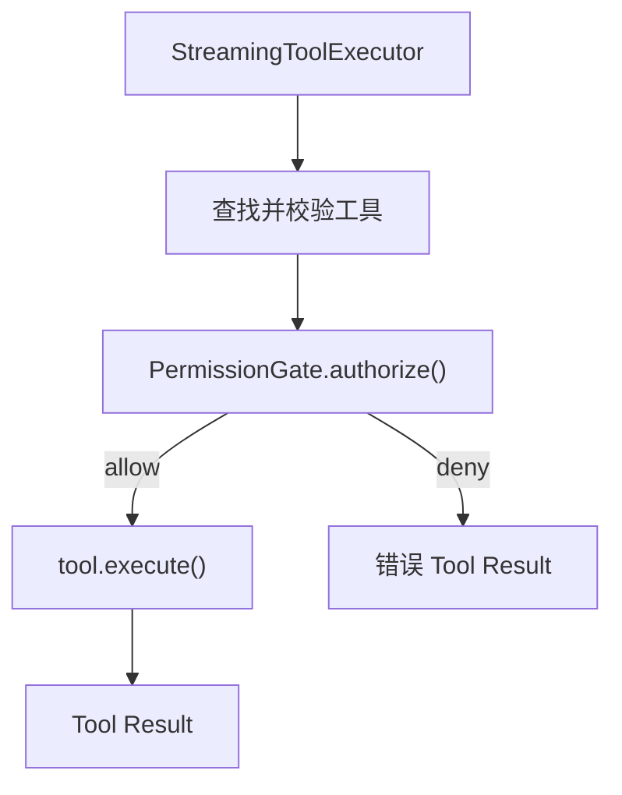

# 本期变更说明

0.6 聚焦 Agent 的权限与安全：让所有工具调用在执行前经过统一的权限判断，并通过权限模式、配置规则和用户确认控制 Agent 可以做什么。

本期仍以快速复现核心功能和关键技术为目标。具体匹配算法、交互细节和代码结构将在各目标开始实现前分别对齐，不在目标阶段提前展开。

# 对齐基线

本期以当前 [Claude Code 权限系统](https://code.claude.com/docs/en/permissions) 和 [权限模式](https://code.claude.com/docs/en/permission-modes) 的公开行为为主要基线

# 目标

1. 实现统一的工具权限门禁：所有工具调用在执行前先得到允许、询问或拒绝的权限结论。
2. 实现权限模式：支持 `default`、`acceptEdits`、`plan`、`dontAsk` 和 `bypassPermissions`。
3. 实现可配置权限规则：支持 `allow`、`ask`、`deny`，以及用户级、项目级和本地项目配置。
4. 实现基于工具语义的权限判断：区分读取、编辑、Shell 和网络访问，只自动放行能够确定安全的操作。
5. 实现用户确认与授权记忆：支持单次、会话级和持久授权，并把拒绝结果返回给模型继续处理。
6. 实现工作目录与保护路径边界：区分工作目录内外访问，并保护 Git 元数据和 Agent 配置等敏感路径。
7. 实现项目目录信任：首次进入项目时确认是否信任，未信任前不采用项目提供的自动授权配置。

# 1. 统一工具权限门禁

权限不能只依赖 System Prompt，也不能分散在 Agent Loop 和各个工具中。本阶段把 `executeTool()` 设为唯一的工具执行边界，所有工具在真正执行前都必须经过同一个 `PermissionGate`：



## 权限裁决与授权

`PermissionPolicy` 只根据工具请求返回原始结论，不执行工具，也不负责终端交互：

```ts
type PermissionDecision =
  | { behavior: "allow" }
  | { behavior: "ask"; reason: string }
  | { behavior: "deny"; reason: string };

type PermissionPolicy = {
  evaluate(request: PermissionRequest):
    | PermissionDecision
    | Promise<PermissionDecision>;
};
```

`PermissionGate.authorize()` 消费这个结论。`allow` 和 `deny` 可以直接得到最终结果；`ask` 则等待注入的 `PermissionPrompter`：

```ts
async authorize(request: PermissionRequest): Promise<PermissionAuthorization> {
  const decision = await waitForPermissionStep(
    () => this.policy.evaluate(request),
    request.signal,
  );

  if (decision.behavior === "allow") return { allowed: true };
  if (decision.behavior === "deny") {
    return { allowed: false, reason: decision.reason };
  }

  const confirmed = await waitForPermissionStep(
    () => this.prompter.confirm(request, decision.reason),
    request.signal,
  );
  return confirmed
    ? { allowed: true }
    : { allowed: false, reason: `User denied permission: ${decision.reason}` };
}
```

`waitForPermissionStep()` 让异步策略或确认器的等待过程也响应当前轮次的 `AbortSignal`，因此用户中断时不会卡在尚未完成的权限判断上。

Policy 与 Prompter 分开后，权限规则不依赖终端，单元测试也可以注入固定结论和确认结果。真实确认界面和授权记忆将在目标 5 实现；当前没有确认器时，`ask` 默认拒绝，不会静默放行。

## Agent 持有门禁

每个 Agent 持有自己的 `PermissionGate`，再通过 `ToolContext` 传入工具执行链：

```ts
type ToolContext = {
  cwd: string;
  permissionGate: PermissionGate;
  readFileState: Map<string, number>;
  signal?: AbortSignal;
};
```

门禁是必填依赖，`executeTool()` 在缺少门禁时直接报错，避免出现“没有配置权限系统就默认执行”的旁路。本阶段后续策略尚未实现，因此 Agent 使用显式创建的 Allow-All Gate，保持原有 CLI 行为；后续目标只需替换 Policy，不需要再次改造工具链。

原始 `tools` 数组不再从 `src/tools/index.ts` 导出，业务代码只能调用 `executeTool()`

## 校验、授权和执行顺序

`executeTool()` 先完成无副作用的输入校验，再检查权限，最后才调用可能读写文件、访问网络或执行 Shell 的 handler：

```ts
const tool = toolMap.get(name);
if (!tool) return errorResult(`Unknown tool: ${name}`);

const validation = await tool.validateInput?.(input, context);
if (validation && !validation.ok) return errorResult(validation.message);

const authorization = await context.permissionGate.authorize({
  toolName: name,
  input,
  cwd: context.cwd,
  signal: context.signal,
});
if (!authorization.allowed) {
  return errorResult(`Permission denied: ${authorization.reason}`);
}

const result = await tool.execute(input, context);
```

无效参数本来就不能执行，因此不会触发无意义的权限确认；通过校验并获得授权后才会产生工具副作用。

## 结构化工具结果

`executeTool()` 不再只返回字符串，而是统一返回：

```ts
type ToolExecutionResult = {
  content: string;
  isError: boolean;
};
```

权限拒绝、未知工具和校验失败使用 `isError: true`，`StreamingToolExecutor` 将其转换成 Anthropic 的 `is_error: true`。错误仍作为 `tool_result` 加入历史，模型可以换一种方案，Agent Loop 不会因为正常的工具失败退出。

`run_shell` 同步采用结构化结果：退出码为 0 时返回成功；非零退出码、超时和进程启动错误保留 stdout、stderr 与错误原因，并标记为工具错误。

用户中断仍由现有 Signal 流程单独处理。这个行为与 Claude Code 把 Bash 非零退出码归入工具执行失败、随后继续 Agent Loop 的语义一致，参见 [PostToolUseFailure](https://code.claude.com/docs/en/hooks#posttoolusefailure)。

提前执行的工具把包含权限检查在内的完整 Promise 保存在 `earlyExecutions`，`finish()` 复用同一个 Promise，因此每个 `tool_use` 只授权并执行一次。异步 Prompter 也为后续把真实确认延迟到模型流结束后展示保留了接口。

# 本期不实现

## OS 级沙箱

Claude Code 的沙箱使用操作系统能力限制 Bash 及其子进程能够访问的文件和网络，与应用层权限判断是互补但独立的安全层。本期只实现应用层权限系统，不实现 macOS Seatbelt、Linux namespace 等 OS 级隔离，避免把工作扩展成跨平台执行基础设施。

## Auto Mode 安全分类模型

Claude Code 的 Auto Mode 会使用独立的安全分类模型在后台审查工具调用，从而在减少确认弹窗的同时阻止超出用户意图的操作。它需要额外的模型请求、分类上下文、故障降级和安全评估，会增加费用、延迟与实现复杂度，而且当前仍属于 research preview。

0.6 先完成确定性的权限规则、模式和边界。Auto Mode 更适合在后续“Agent 自主执行”阶段单独实现，不能代替明确的 `deny` 规则和路径保护。

## 企业托管策略

Claude Code 还支持由组织管理员统一下发的 managed settings。它的优先级高于命令行、项目和用户配置，普通用户只能在管理员允许的范围内补充或收紧权限，不能通过项目 `allow` 规则覆盖组织 `deny`，也不能重新开启被管理员禁用的 `bypassPermissions`。

这套机制主要用于统一禁止生产部署、敏感目录访问，或限制可使用的 MCP、插件和 Hook。本项目当前面向本地单用户快速复现，没有组织管理员和策略下发渠道，因此本期不实现企业策略分发、管理员锁定和相关配置来源。
